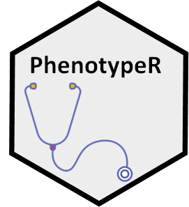

<!-- README.md is generated from README.Rmd. Please edit that file -->

# PhenotypeR 

<!-- badges: start -->

[](https://CRAN.R-project.org/package=PhenotypeR)
[](https://github.com/ohdsi/PhenotypeR/actions/workflows/R-CMD-check.yaml)
[](https://lifecycle.r-lib.org/articles/stages.html#experimental)

<!-- badges: end -->

The PhenotypeR package helps us to assess the research-readiness of a
set of cohorts we have defined. This assessment includes:

- ***Database diagnostics*** which help us to better understand the
  database in which they have been created. This includes information
  about the size of the data, the time period covered, the number of
  people in the data as a whole. More granular information that may
  influence analytic decisions, such as the number of observation
  periods per person, is also described.  
- ***Codelist diagnostics*** which help to answer questions like what
  concepts from our codelist are used in the database? What concepts
  were present led to individuals’ entry in the cohort? Are there any
  concepts being used in the database that we didn’t include in our
  codelist but maybe we should have?  
- ***Cohort diagnostics*** which help to answer questions like how many
  individuals did we include in our cohort and how many were excluded
  because of our inclusion criteria? If we have multiple cohorts, is
  there overlap between them and when do people enter one cohort
  relative to another? What is the incidence of cohort entry and what is
  the prevalence of the cohort in the database?  
- ***Matched diagnostics*** which compares our study cohorts to the
  overall population in the database. By matching people in the cohorts
  to people with a similar age and sex in the database we can see how
  our cohorts differ from the general database population.  
- ***Population diagnostics*** which estimates the frequency of our
  study cohorts in the database in terms of their incidence rates and
  prevalence.

## Installation

You can install PhenotypeR from CRAN:

``` r
install.packages("PhenotypeR")
```

Or you can install the development version from GitHub:

``` r
# install.packages("remotes")
remotes::install_github("OHDSI/PhenotypeR")
```

## Example usage

To illustrate the functionalities of PhenotypeR, let’s create two
cohorts using the Eunomia dataset. We’ll first load the required
packages and create the cdm reference for the data.

``` r

library(CDMConnector)
library(PhenotypeR)
library(CodelistGenerator)
library(CohortConstructor)
library(dplyr)
library(OmopSketch)
```

``` r
# Connect to the database and create the cdm object
con <- DBI::dbConnect(duckdb::duckdb(), eunomiaDir("synpuf-1k", "5.3"))
cdm <- cdmFromCon(con = con, 
                  cdmSchema   = "main",
                  writeSchema = "main", 
                  achillesSchema = "main")

# Create a code lists
meds_codes <- CodelistGenerator::getDrugIngredientCodes(
  cdm = cdm,
  name = c("acetaminophen", "morphine", "warfarin"))

cond_codes <- list("gastrointestinal_hemorrhage" = c(192671, 4338544, 4100660, 4307661),
                                                     "asthma" = c(317009, 257581))
# Instantiate cohorts with CohortConstructor
cdm$medicines <- conceptCohort(cdm = cdm, 
                               conceptSet = meds_codes, 
                               exit = "event_end_date", 
                               overlap = "merge", 
                               name = "medicines")

cdm$conditions <- conceptCohort(cdm = cdm,
                                conceptSet = cond_codes, 
                                exit = "event_end_date",
                                overlap = "merge",
                                name = "conditions")
```

## Database diagnostics

We’ll first run the database diagnostics parts, which will help us to
have a general overview of our database.

``` r

database_diagnostics <- databaseDiagnostics(cdm)

# See the result types obtained:
database_diagnostics |> 
  settings()
#> # A tibble: 2 × 8
#>   result_id result_type     package_name package_version group strata additional
#>       <int> <chr>           <chr>        <chr>           <chr> <chr>  <chr>     
#> 1         1 summarise_omop… OmopSketch   0.2.1           ""    ""     ""        
#> 2         2 summarise_obse… OmopSketch   0.2.1           "obs… ""     ""        
#> # ℹ 1 more variable: min_cell_count <chr>
```

Notice that `databaseDiagnostics()` has generated two different results:
**summarise_omop_snapshot** and **summarise_observation_period**. The
first one gives us information about general characteristics of the
database. We’ll use OmopSketch to create a nice GT table and visualise
the results:

``` r

tableOmopSnapshot(database_diagnostics)
```

<div id="rwmdiizsxm" style="padding-left:0px;padding-right:0px;padding-top:10px;padding-bottom:10px;overflow-x:auto;overflow-y:auto;width:auto;height:auto;">
<style>#rwmdiizsxm table {
  font-family: system-ui, 'Segoe UI', Roboto, Helvetica, Arial, sans-serif, 'Apple Color Emoji', 'Segoe UI Emoji', 'Segoe UI Symbol', 'Noto Color Emoji';
  -webkit-font-smoothing: antialiased;
  -moz-osx-font-smoothing: grayscale;
}
&#10;#rwmdiizsxm thead, #rwmdiizsxm tbody, #rwmdiizsxm tfoot, #rwmdiizsxm tr, #rwmdiizsxm td, #rwmdiizsxm th {
  border-style: none;
}
&#10;#rwmdiizsxm p {
  margin: 0;
  padding: 0;
}
&#10;#rwmdiizsxm .gt_table {
  display: table;
  border-collapse: collapse;
  line-height: normal;
  margin-left: auto;
  margin-right: auto;
  color: #333333;
  font-size: 16px;
  font-weight: normal;
  font-style: normal;
  background-color: #FFFFFF;
  width: auto;
  border-top-style: solid;
  border-top-width: 2px;
  border-top-color: #A8A8A8;
  border-right-style: none;
  border-right-width: 2px;
  border-right-color: #D3D3D3;
  border-bottom-style: solid;
  border-bottom-width: 2px;
  border-bottom-color: #A8A8A8;
  border-left-style: none;
  border-left-width: 2px;
  border-left-color: #D3D3D3;
}
&#10;#rwmdiizsxm .gt_caption {
  padding-top: 4px;
  padding-bottom: 4px;
}
&#10;#rwmdiizsxm .gt_title {
  color: #333333;
  font-size: 125%;
  font-weight: initial;
  padding-top: 4px;
  padding-bottom: 4px;
  padding-left: 5px;
  padding-right: 5px;
  border-bottom-color: #FFFFFF;
  border-bottom-width: 0;
}
&#10;#rwmdiizsxm .gt_subtitle {
  color: #333333;
  font-size: 85%;
  font-weight: initial;
  padding-top: 3px;
  padding-bottom: 5px;
  padding-left: 5px;
  padding-right: 5px;
  border-top-color: #FFFFFF;
  border-top-width: 0;
}
&#10;#rwmdiizsxm .gt_heading {
  background-color: #FFFFFF;
  text-align: center;
  border-bottom-color: #FFFFFF;
  border-left-style: none;
  border-left-width: 1px;
  border-left-color: #D3D3D3;
  border-right-style: none;
  border-right-width: 1px;
  border-right-color: #D3D3D3;
}
&#10;#rwmdiizsxm .gt_bottom_border {
  border-bottom-style: solid;
  border-bottom-width: 2px;
  border-bottom-color: #D3D3D3;
}
&#10;#rwmdiizsxm .gt_col_headings {
  border-top-style: solid;
  border-top-width: 2px;
  border-top-color: #D3D3D3;
  border-bottom-style: solid;
  border-bottom-width: 2px;
  border-bottom-color: #D3D3D3;
  border-left-style: none;
  border-left-width: 1px;
  border-left-color: #D3D3D3;
  border-right-style: none;
  border-right-width: 1px;
  border-right-color: #D3D3D3;
}
&#10;#rwmdiizsxm .gt_col_heading {
  color: #333333;
  background-color: #FFFFFF;
  font-size: 100%;
  font-weight: normal;
  text-transform: inherit;
  border-left-style: none;
  border-left-width: 1px;
  border-left-color: #D3D3D3;
  border-right-style: none;
  border-right-width: 1px;
  border-right-color: #D3D3D3;
  vertical-align: bottom;
  padding-top: 5px;
  padding-bottom: 6px;
  padding-left: 5px;
  padding-right: 5px;
  overflow-x: hidden;
}
&#10;#rwmdiizsxm .gt_column_spanner_outer {
  color: #333333;
  background-color: #FFFFFF;
  font-size: 100%;
  font-weight: normal;
  text-transform: inherit;
  padding-top: 0;
  padding-bottom: 0;
  padding-left: 4px;
  padding-right: 4px;
}
&#10;#rwmdiizsxm .gt_column_spanner_outer:first-child {
  padding-left: 0;
}
&#10;#rwmdiizsxm .gt_column_spanner_outer:last-child {
  padding-right: 0;
}
&#10;#rwmdiizsxm .gt_column_spanner {
  border-bottom-style: solid;
  border-bottom-width: 2px;
  border-bottom-color: #D3D3D3;
  vertical-align: bottom;
  padding-top: 5px;
  padding-bottom: 5px;
  overflow-x: hidden;
  display: inline-block;
  width: 100%;
}
&#10;#rwmdiizsxm .gt_spanner_row {
  border-bottom-style: hidden;
}
&#10;#rwmdiizsxm .gt_group_heading {
  padding-top: 8px;
  padding-bottom: 8px;
  padding-left: 5px;
  padding-right: 5px;
  color: #333333;
  background-color: #FFFFFF;
  font-size: 100%;
  font-weight: initial;
  text-transform: inherit;
  border-top-style: solid;
  border-top-width: 2px;
  border-top-color: #D3D3D3;
  border-bottom-style: solid;
  border-bottom-width: 2px;
  border-bottom-color: #D3D3D3;
  border-left-style: none;
  border-left-width: 1px;
  border-left-color: #D3D3D3;
  border-right-style: none;
  border-right-width: 1px;
  border-right-color: #D3D3D3;
  vertical-align: middle;
  text-align: left;
}
&#10;#rwmdiizsxm .gt_empty_group_heading {
  padding: 0.5px;
  color: #333333;
  background-color: #FFFFFF;
  font-size: 100%;
  font-weight: initial;
  border-top-style: solid;
  border-top-width: 2px;
  border-top-color: #D3D3D3;
  border-bottom-style: solid;
  border-bottom-width: 2px;
  border-bottom-color: #D3D3D3;
  vertical-align: middle;
}
&#10;#rwmdiizsxm .gt_from_md > :first-child {
  margin-top: 0;
}
&#10;#rwmdiizsxm .gt_from_md > :last-child {
  margin-bottom: 0;
}
&#10;#rwmdiizsxm .gt_row {
  padding-top: 8px;
  padding-bottom: 8px;
  padding-left: 5px;
  padding-right: 5px;
  margin: 10px;
  border-top-style: solid;
  border-top-width: 1px;
  border-top-color: #D3D3D3;
  border-left-style: none;
  border-left-width: 1px;
  border-left-color: #D3D3D3;
  border-right-style: none;
  border-right-width: 1px;
  border-right-color: #D3D3D3;
  vertical-align: middle;
  overflow-x: hidden;
}
&#10;#rwmdiizsxm .gt_stub {
  color: #333333;
  background-color: #FFFFFF;
  font-size: 100%;
  font-weight: initial;
  text-transform: inherit;
  border-right-style: solid;
  border-right-width: 2px;
  border-right-color: #D3D3D3;
  padding-left: 5px;
  padding-right: 5px;
}
&#10;#rwmdiizsxm .gt_stub_row_group {
  color: #333333;
  background-color: #FFFFFF;
  font-size: 100%;
  font-weight: initial;
  text-transform: inherit;
  border-right-style: solid;
  border-right-width: 2px;
  border-right-color: #D3D3D3;
  padding-left: 5px;
  padding-right: 5px;
  vertical-align: top;
}
&#10;#rwmdiizsxm .gt_row_group_first td {
  border-top-width: 2px;
}
&#10;#rwmdiizsxm .gt_row_group_first th {
  border-top-width: 2px;
}
&#10;#rwmdiizsxm .gt_summary_row {
  color: #333333;
  background-color: #FFFFFF;
  text-transform: inherit;
  padding-top: 8px;
  padding-bottom: 8px;
  padding-left: 5px;
  padding-right: 5px;
}
&#10;#rwmdiizsxm .gt_first_summary_row {
  border-top-style: solid;
  border-top-color: #D3D3D3;
}
&#10;#rwmdiizsxm .gt_first_summary_row.thick {
  border-top-width: 2px;
}
&#10;#rwmdiizsxm .gt_last_summary_row {
  padding-top: 8px;
  padding-bottom: 8px;
  padding-left: 5px;
  padding-right: 5px;
  border-bottom-style: solid;
  border-bottom-width: 2px;
  border-bottom-color: #D3D3D3;
}
&#10;#rwmdiizsxm .gt_grand_summary_row {
  color: #333333;
  background-color: #FFFFFF;
  text-transform: inherit;
  padding-top: 8px;
  padding-bottom: 8px;
  padding-left: 5px;
  padding-right: 5px;
}
&#10;#rwmdiizsxm .gt_first_grand_summary_row {
  padding-top: 8px;
  padding-bottom: 8px;
  padding-left: 5px;
  padding-right: 5px;
  border-top-style: double;
  border-top-width: 6px;
  border-top-color: #D3D3D3;
}
&#10;#rwmdiizsxm .gt_last_grand_summary_row_top {
  padding-top: 8px;
  padding-bottom: 8px;
  padding-left: 5px;
  padding-right: 5px;
  border-bottom-style: double;
  border-bottom-width: 6px;
  border-bottom-color: #D3D3D3;
}
&#10;#rwmdiizsxm .gt_striped {
  background-color: rgba(128, 128, 128, 0.05);
}
&#10;#rwmdiizsxm .gt_table_body {
  border-top-style: solid;
  border-top-width: 2px;
  border-top-color: #D3D3D3;
  border-bottom-style: solid;
  border-bottom-width: 2px;
  border-bottom-color: #D3D3D3;
}
&#10;#rwmdiizsxm .gt_footnotes {
  color: #333333;
  background-color: #FFFFFF;
  border-bottom-style: none;
  border-bottom-width: 2px;
  border-bottom-color: #D3D3D3;
  border-left-style: none;
  border-left-width: 2px;
  border-left-color: #D3D3D3;
  border-right-style: none;
  border-right-width: 2px;
  border-right-color: #D3D3D3;
}
&#10;#rwmdiizsxm .gt_footnote {
  margin: 0px;
  font-size: 90%;
  padding-top: 4px;
  padding-bottom: 4px;
  padding-left: 5px;
  padding-right: 5px;
}
&#10;#rwmdiizsxm .gt_sourcenotes {
  color: #333333;
  background-color: #FFFFFF;
  border-bottom-style: none;
  border-bottom-width: 2px;
  border-bottom-color: #D3D3D3;
  border-left-style: none;
  border-left-width: 2px;
  border-left-color: #D3D3D3;
  border-right-style: none;
  border-right-width: 2px;
  border-right-color: #D3D3D3;
}
&#10;#rwmdiizsxm .gt_sourcenote {
  font-size: 90%;
  padding-top: 4px;
  padding-bottom: 4px;
  padding-left: 5px;
  padding-right: 5px;
}
&#10;#rwmdiizsxm .gt_left {
  text-align: left;
}
&#10;#rwmdiizsxm .gt_center {
  text-align: center;
}
&#10;#rwmdiizsxm .gt_right {
  text-align: right;
  font-variant-numeric: tabular-nums;
}
&#10;#rwmdiizsxm .gt_font_normal {
  font-weight: normal;
}
&#10;#rwmdiizsxm .gt_font_bold {
  font-weight: bold;
}
&#10;#rwmdiizsxm .gt_font_italic {
  font-style: italic;
}
&#10;#rwmdiizsxm .gt_super {
  font-size: 65%;
}
&#10;#rwmdiizsxm .gt_footnote_marks {
  font-size: 75%;
  vertical-align: 0.4em;
  position: initial;
}
&#10;#rwmdiizsxm .gt_asterisk {
  font-size: 100%;
  vertical-align: 0;
}
&#10;#rwmdiizsxm .gt_indent_1 {
  text-indent: 5px;
}
&#10;#rwmdiizsxm .gt_indent_2 {
  text-indent: 10px;
}
&#10;#rwmdiizsxm .gt_indent_3 {
  text-indent: 15px;
}
&#10;#rwmdiizsxm .gt_indent_4 {
  text-indent: 20px;
}
&#10;#rwmdiizsxm .gt_indent_5 {
  text-indent: 25px;
}
&#10;#rwmdiizsxm .katex-display {
  display: inline-flex !important;
  margin-bottom: 0.75em !important;
}
&#10;#rwmdiizsxm div.Reactable > div.rt-table > div.rt-thead > div.rt-tr.rt-tr-group-header > div.rt-th-group:after {
  height: 0px !important;
}
</style>
<table class="gt_table" data-quarto-disable-processing="false" data-quarto-bootstrap="false">
  <thead>
    <tr class="gt_col_headings gt_spanner_row">
      <th class="gt_col_heading gt_columns_bottom_border gt_left" rowspan="2" colspan="1" style="text-align: center; font-weight: bold;" scope="col" id="Estimate">Estimate</th>
      <th class="gt_center gt_columns_top_border gt_column_spanner_outer" rowspan="1" colspan="1" style="background-color: #D9D9D9; text-align: center; font-weight: bold;" scope="col" id="spanner-[header_name]Database name&#10;[header_level]An OMOP CDM database">
        <div class="gt_column_spanner">Database name</div>
      </th>
    </tr>
    <tr class="gt_col_headings">
      <th class="gt_col_heading gt_columns_bottom_border gt_left" rowspan="1" colspan="1" style="background-color: #E1E1E1; text-align: center; font-weight: bold;" scope="col" id="[header_name]Database-name-[header_level]An-OMOP-CDM-database">An OMOP CDM database</th>
    </tr>
  </thead>
  <tbody class="gt_table_body">
    <tr class="gt_group_heading_row">
      <th colspan="2" class="gt_group_heading" style="background-color: #E9E9E9; font-weight: bold;" scope="colgroup" id="General">General</th>
    </tr>
    <tr class="gt_row_group_first"><td headers="General  Estimate" class="gt_row gt_left" style="text-align: left; border-left-width: 1px; border-left-style: solid; border-left-color: #D3D3D3; border-right-width: 1px; border-right-style: solid; border-right-color: #D3D3D3; border-top-width: 1px; border-top-style: solid; border-top-color: #D3D3D3; border-bottom-width: 1px; border-bottom-style: solid; border-bottom-color: #D3D3D3;">Snapshot date</td>
<td headers="General  [header_name]Database name
[header_level]An OMOP CDM database" class="gt_row gt_left" style="text-align: right;">2025-01-28</td></tr>
    <tr><td headers="General  Estimate" class="gt_row gt_left" style="text-align: left; border-left-width: 1px; border-left-style: solid; border-left-color: #D3D3D3; border-right-width: 1px; border-right-style: solid; border-right-color: #D3D3D3; border-top-width: 1px; border-top-style: solid; border-top-color: #D3D3D3; border-bottom-width: 1px; border-bottom-style: solid; border-bottom-color: #D3D3D3;">Person count</td>
<td headers="General  [header_name]Database name
[header_level]An OMOP CDM database" class="gt_row gt_left" style="text-align: right;">1,000</td></tr>
    <tr><td headers="General  Estimate" class="gt_row gt_left" style="text-align: left; border-left-width: 1px; border-left-style: solid; border-left-color: #D3D3D3; border-right-width: 1px; border-right-style: solid; border-right-color: #D3D3D3; border-top-width: 1px; border-top-style: solid; border-top-color: #D3D3D3; border-bottom-width: 1px; border-bottom-style: solid; border-bottom-color: #D3D3D3;">Vocabulary version</td>
<td headers="General  [header_name]Database name
[header_level]An OMOP CDM database" class="gt_row gt_left" style="text-align: right;">v5.0 06-AUG-21</td></tr>
    <tr class="gt_group_heading_row">
      <th colspan="2" class="gt_group_heading" style="background-color: #E9E9E9; font-weight: bold;" scope="colgroup" id="Observation period">Observation period</th>
    </tr>
    <tr class="gt_row_group_first"><td headers="Observation period  Estimate" class="gt_row gt_left" style="text-align: left; border-left-width: 1px; border-left-style: solid; border-left-color: #D3D3D3; border-right-width: 1px; border-right-style: solid; border-right-color: #D3D3D3; border-top-width: 1px; border-top-style: solid; border-top-color: #D3D3D3; border-bottom-width: 1px; border-bottom-style: solid; border-bottom-color: #D3D3D3;">N</td>
<td headers="Observation period  [header_name]Database name
[header_level]An OMOP CDM database" class="gt_row gt_left" style="text-align: right;">1,048</td></tr>
    <tr><td headers="Observation period  Estimate" class="gt_row gt_left" style="text-align: left; border-left-width: 1px; border-left-style: solid; border-left-color: #D3D3D3; border-right-width: 1px; border-right-style: solid; border-right-color: #D3D3D3; border-top-width: 1px; border-top-style: solid; border-top-color: #D3D3D3; border-bottom-width: 1px; border-bottom-style: solid; border-bottom-color: #D3D3D3;">Start date</td>
<td headers="Observation period  [header_name]Database name
[header_level]An OMOP CDM database" class="gt_row gt_left" style="text-align: right;">2008-01-01</td></tr>
    <tr><td headers="Observation period  Estimate" class="gt_row gt_left" style="text-align: left; border-left-width: 1px; border-left-style: solid; border-left-color: #D3D3D3; border-right-width: 1px; border-right-style: solid; border-right-color: #D3D3D3; border-top-width: 1px; border-top-style: solid; border-top-color: #D3D3D3; border-bottom-width: 1px; border-bottom-style: solid; border-bottom-color: #D3D3D3;">End date</td>
<td headers="Observation period  [header_name]Database name
[header_level]An OMOP CDM database" class="gt_row gt_left" style="text-align: right;">2010-12-31</td></tr>
    <tr class="gt_group_heading_row">
      <th colspan="2" class="gt_group_heading" style="background-color: #E9E9E9; font-weight: bold;" scope="colgroup" id="Cdm">Cdm</th>
    </tr>
    <tr class="gt_row_group_first"><td headers="Cdm  Estimate" class="gt_row gt_left" style="text-align: left; border-left-width: 1px; border-left-style: solid; border-left-color: #D3D3D3; border-right-width: 1px; border-right-style: solid; border-right-color: #D3D3D3; border-top-width: 1px; border-top-style: solid; border-top-color: #D3D3D3; border-bottom-width: 1px; border-bottom-style: solid; border-bottom-color: #D3D3D3;">Source name</td>
<td headers="Cdm  [header_name]Database name
[header_level]An OMOP CDM database" class="gt_row gt_left" style="text-align: right;">Synpuf</td></tr>
    <tr><td headers="Cdm  Estimate" class="gt_row gt_left" style="text-align: left; border-left-width: 1px; border-left-style: solid; border-left-color: #D3D3D3; border-right-width: 1px; border-right-style: solid; border-right-color: #D3D3D3; border-top-width: 1px; border-top-style: solid; border-top-color: #D3D3D3; border-bottom-width: 1px; border-bottom-style: solid; border-bottom-color: #D3D3D3;">Version</td>
<td headers="Cdm  [header_name]Database name
[header_level]An OMOP CDM database" class="gt_row gt_left" style="text-align: right;">v5.3.1</td></tr>
    <tr><td headers="Cdm  Estimate" class="gt_row gt_left" style="text-align: left; border-left-width: 1px; border-left-style: solid; border-left-color: #D3D3D3; border-right-width: 1px; border-right-style: solid; border-right-color: #D3D3D3; border-top-width: 1px; border-top-style: solid; border-top-color: #D3D3D3; border-bottom-width: 1px; border-bottom-style: solid; border-bottom-color: #D3D3D3;">Holder name</td>
<td headers="Cdm  [header_name]Database name
[header_level]An OMOP CDM database" class="gt_row gt_left" style="text-align: right;">ohdsi</td></tr>
    <tr><td headers="Cdm  Estimate" class="gt_row gt_left" style="text-align: left; border-left-width: 1px; border-left-style: solid; border-left-color: #D3D3D3; border-right-width: 1px; border-right-style: solid; border-right-color: #D3D3D3; border-top-width: 1px; border-top-style: solid; border-top-color: #D3D3D3; border-bottom-width: 1px; border-bottom-style: solid; border-bottom-color: #D3D3D3;">Release date</td>
<td headers="Cdm  [header_name]Database name
[header_level]An OMOP CDM database" class="gt_row gt_left" style="text-align: right;">2018-03-15</td></tr>
    <tr><td headers="Cdm  Estimate" class="gt_row gt_left" style="text-align: left; border-left-width: 1px; border-left-style: solid; border-left-color: #D3D3D3; border-right-width: 1px; border-right-style: solid; border-right-color: #D3D3D3; border-top-width: 1px; border-top-style: solid; border-top-color: #D3D3D3; border-bottom-width: 1px; border-bottom-style: solid; border-bottom-color: #D3D3D3;">Description</td>
<td headers="Cdm  [header_name]Database name
[header_level]An OMOP CDM database" class="gt_row gt_left" style="text-align: right;"></td></tr>
    <tr><td headers="Cdm  Estimate" class="gt_row gt_left" style="text-align: left; border-left-width: 1px; border-left-style: solid; border-left-color: #D3D3D3; border-right-width: 1px; border-right-style: solid; border-right-color: #D3D3D3; border-top-width: 1px; border-top-style: solid; border-top-color: #D3D3D3; border-bottom-width: 1px; border-bottom-style: solid; border-bottom-color: #D3D3D3;">Documentation reference</td>
<td headers="Cdm  [header_name]Database name
[header_level]An OMOP CDM database" class="gt_row gt_left" style="text-align: right;"></td></tr>
    <tr><td headers="Cdm  Estimate" class="gt_row gt_left" style="text-align: left; border-left-width: 1px; border-left-style: solid; border-left-color: #D3D3D3; border-right-width: 1px; border-right-style: solid; border-right-color: #D3D3D3; border-top-width: 1px; border-top-style: solid; border-top-color: #D3D3D3; border-bottom-width: 1px; border-bottom-style: solid; border-bottom-color: #D3D3D3;">Source type</td>
<td headers="Cdm  [header_name]Database name
[header_level]An OMOP CDM database" class="gt_row gt_left" style="text-align: right;">duckdb</td></tr>
  </tbody>
  &#10;  
</table>
</div>

The latter one gives us more detailed information about the database
observation period:

``` r
tableObservationPeriod(database_diagnostics)
```

<div id="vnszypvzas" style="padding-left:0px;padding-right:0px;padding-top:10px;padding-bottom:10px;overflow-x:auto;overflow-y:auto;width:auto;height:auto;">
<style>#vnszypvzas table {
  font-family: system-ui, 'Segoe UI', Roboto, Helvetica, Arial, sans-serif, 'Apple Color Emoji', 'Segoe UI Emoji', 'Segoe UI Symbol', 'Noto Color Emoji';
  -webkit-font-smoothing: antialiased;
  -moz-osx-font-smoothing: grayscale;
}
&#10;#vnszypvzas thead, #vnszypvzas tbody, #vnszypvzas tfoot, #vnszypvzas tr, #vnszypvzas td, #vnszypvzas th {
  border-style: none;
}
&#10;#vnszypvzas p {
  margin: 0;
  padding: 0;
}
&#10;#vnszypvzas .gt_table {
  display: table;
  border-collapse: collapse;
  line-height: normal;
  margin-left: auto;
  margin-right: auto;
  color: #333333;
  font-size: 16px;
  font-weight: normal;
  font-style: normal;
  background-color: #FFFFFF;
  width: auto;
  border-top-style: solid;
  border-top-width: 2px;
  border-top-color: #A8A8A8;
  border-right-style: none;
  border-right-width: 2px;
  border-right-color: #D3D3D3;
  border-bottom-style: solid;
  border-bottom-width: 2px;
  border-bottom-color: #A8A8A8;
  border-left-style: none;
  border-left-width: 2px;
  border-left-color: #D3D3D3;
}
&#10;#vnszypvzas .gt_caption {
  padding-top: 4px;
  padding-bottom: 4px;
}
&#10;#vnszypvzas .gt_title {
  color: #333333;
  font-size: 125%;
  font-weight: initial;
  padding-top: 4px;
  padding-bottom: 4px;
  padding-left: 5px;
  padding-right: 5px;
  border-bottom-color: #FFFFFF;
  border-bottom-width: 0;
}
&#10;#vnszypvzas .gt_subtitle {
  color: #333333;
  font-size: 85%;
  font-weight: initial;
  padding-top: 3px;
  padding-bottom: 5px;
  padding-left: 5px;
  padding-right: 5px;
  border-top-color: #FFFFFF;
  border-top-width: 0;
}
&#10;#vnszypvzas .gt_heading {
  background-color: #FFFFFF;
  text-align: center;
  border-bottom-color: #FFFFFF;
  border-left-style: none;
  border-left-width: 1px;
  border-left-color: #D3D3D3;
  border-right-style: none;
  border-right-width: 1px;
  border-right-color: #D3D3D3;
}
&#10;#vnszypvzas .gt_bottom_border {
  border-bottom-style: solid;
  border-bottom-width: 2px;
  border-bottom-color: #D3D3D3;
}
&#10;#vnszypvzas .gt_col_headings {
  border-top-style: solid;
  border-top-width: 2px;
  border-top-color: #D3D3D3;
  border-bottom-style: solid;
  border-bottom-width: 2px;
  border-bottom-color: #D3D3D3;
  border-left-style: none;
  border-left-width: 1px;
  border-left-color: #D3D3D3;
  border-right-style: none;
  border-right-width: 1px;
  border-right-color: #D3D3D3;
}
&#10;#vnszypvzas .gt_col_heading {
  color: #333333;
  background-color: #FFFFFF;
  font-size: 100%;
  font-weight: normal;
  text-transform: inherit;
  border-left-style: none;
  border-left-width: 1px;
  border-left-color: #D3D3D3;
  border-right-style: none;
  border-right-width: 1px;
  border-right-color: #D3D3D3;
  vertical-align: bottom;
  padding-top: 5px;
  padding-bottom: 6px;
  padding-left: 5px;
  padding-right: 5px;
  overflow-x: hidden;
}
&#10;#vnszypvzas .gt_column_spanner_outer {
  color: #333333;
  background-color: #FFFFFF;
  font-size: 100%;
  font-weight: normal;
  text-transform: inherit;
  padding-top: 0;
  padding-bottom: 0;
  padding-left: 4px;
  padding-right: 4px;
}
&#10;#vnszypvzas .gt_column_spanner_outer:first-child {
  padding-left: 0;
}
&#10;#vnszypvzas .gt_column_spanner_outer:last-child {
  padding-right: 0;
}
&#10;#vnszypvzas .gt_column_spanner {
  border-bottom-style: solid;
  border-bottom-width: 2px;
  border-bottom-color: #D3D3D3;
  vertical-align: bottom;
  padding-top: 5px;
  padding-bottom: 5px;
  overflow-x: hidden;
  display: inline-block;
  width: 100%;
}
&#10;#vnszypvzas .gt_spanner_row {
  border-bottom-style: hidden;
}
&#10;#vnszypvzas .gt_group_heading {
  padding-top: 8px;
  padding-bottom: 8px;
  padding-left: 5px;
  padding-right: 5px;
  color: #333333;
  background-color: #FFFFFF;
  font-size: 100%;
  font-weight: initial;
  text-transform: inherit;
  border-top-style: solid;
  border-top-width: 2px;
  border-top-color: #D3D3D3;
  border-bottom-style: solid;
  border-bottom-width: 2px;
  border-bottom-color: #D3D3D3;
  border-left-style: none;
  border-left-width: 1px;
  border-left-color: #D3D3D3;
  border-right-style: none;
  border-right-width: 1px;
  border-right-color: #D3D3D3;
  vertical-align: middle;
  text-align: left;
}
&#10;#vnszypvzas .gt_empty_group_heading {
  padding: 0.5px;
  color: #333333;
  background-color: #FFFFFF;
  font-size: 100%;
  font-weight: initial;
  border-top-style: solid;
  border-top-width: 2px;
  border-top-color: #D3D3D3;
  border-bottom-style: solid;
  border-bottom-width: 2px;
  border-bottom-color: #D3D3D3;
  vertical-align: middle;
}
&#10;#vnszypvzas .gt_from_md > :first-child {
  margin-top: 0;
}
&#10;#vnszypvzas .gt_from_md > :last-child {
  margin-bottom: 0;
}
&#10;#vnszypvzas .gt_row {
  padding-top: 8px;
  padding-bottom: 8px;
  padding-left: 5px;
  padding-right: 5px;
  margin: 10px;
  border-top-style: solid;
  border-top-width: 1px;
  border-top-color: #D3D3D3;
  border-left-style: none;
  border-left-width: 1px;
  border-left-color: #D3D3D3;
  border-right-style: none;
  border-right-width: 1px;
  border-right-color: #D3D3D3;
  vertical-align: middle;
  overflow-x: hidden;
}
&#10;#vnszypvzas .gt_stub {
  color: #333333;
  background-color: #FFFFFF;
  font-size: 100%;
  font-weight: initial;
  text-transform: inherit;
  border-right-style: solid;
  border-right-width: 2px;
  border-right-color: #D3D3D3;
  padding-left: 5px;
  padding-right: 5px;
}
&#10;#vnszypvzas .gt_stub_row_group {
  color: #333333;
  background-color: #FFFFFF;
  font-size: 100%;
  font-weight: initial;
  text-transform: inherit;
  border-right-style: solid;
  border-right-width: 2px;
  border-right-color: #D3D3D3;
  padding-left: 5px;
  padding-right: 5px;
  vertical-align: top;
}
&#10;#vnszypvzas .gt_row_group_first td {
  border-top-width: 2px;
}
&#10;#vnszypvzas .gt_row_group_first th {
  border-top-width: 2px;
}
&#10;#vnszypvzas .gt_summary_row {
  color: #333333;
  background-color: #FFFFFF;
  text-transform: inherit;
  padding-top: 8px;
  padding-bottom: 8px;
  padding-left: 5px;
  padding-right: 5px;
}
&#10;#vnszypvzas .gt_first_summary_row {
  border-top-style: solid;
  border-top-color: #D3D3D3;
}
&#10;#vnszypvzas .gt_first_summary_row.thick {
  border-top-width: 2px;
}
&#10;#vnszypvzas .gt_last_summary_row {
  padding-top: 8px;
  padding-bottom: 8px;
  padding-left: 5px;
  padding-right: 5px;
  border-bottom-style: solid;
  border-bottom-width: 2px;
  border-bottom-color: #D3D3D3;
}
&#10;#vnszypvzas .gt_grand_summary_row {
  color: #333333;
  background-color: #FFFFFF;
  text-transform: inherit;
  padding-top: 8px;
  padding-bottom: 8px;
  padding-left: 5px;
  padding-right: 5px;
}
&#10;#vnszypvzas .gt_first_grand_summary_row {
  padding-top: 8px;
  padding-bottom: 8px;
  padding-left: 5px;
  padding-right: 5px;
  border-top-style: double;
  border-top-width: 6px;
  border-top-color: #D3D3D3;
}
&#10;#vnszypvzas .gt_last_grand_summary_row_top {
  padding-top: 8px;
  padding-bottom: 8px;
  padding-left: 5px;
  padding-right: 5px;
  border-bottom-style: double;
  border-bottom-width: 6px;
  border-bottom-color: #D3D3D3;
}
&#10;#vnszypvzas .gt_striped {
  background-color: rgba(128, 128, 128, 0.05);
}
&#10;#vnszypvzas .gt_table_body {
  border-top-style: solid;
  border-top-width: 2px;
  border-top-color: #D3D3D3;
  border-bottom-style: solid;
  border-bottom-width: 2px;
  border-bottom-color: #D3D3D3;
}
&#10;#vnszypvzas .gt_footnotes {
  color: #333333;
  background-color: #FFFFFF;
  border-bottom-style: none;
  border-bottom-width: 2px;
  border-bottom-color: #D3D3D3;
  border-left-style: none;
  border-left-width: 2px;
  border-left-color: #D3D3D3;
  border-right-style: none;
  border-right-width: 2px;
  border-right-color: #D3D3D3;
}
&#10;#vnszypvzas .gt_footnote {
  margin: 0px;
  font-size: 90%;
  padding-top: 4px;
  padding-bottom: 4px;
  padding-left: 5px;
  padding-right: 5px;
}
&#10;#vnszypvzas .gt_sourcenotes {
  color: #333333;
  background-color: #FFFFFF;
  border-bottom-style: none;
  border-bottom-width: 2px;
  border-bottom-color: #D3D3D3;
  border-left-style: none;
  border-left-width: 2px;
  border-left-color: #D3D3D3;
  border-right-style: none;
  border-right-width: 2px;
  border-right-color: #D3D3D3;
}
&#10;#vnszypvzas .gt_sourcenote {
  font-size: 90%;
  padding-top: 4px;
  padding-bottom: 4px;
  padding-left: 5px;
  padding-right: 5px;
}
&#10;#vnszypvzas .gt_left {
  text-align: left;
}
&#10;#vnszypvzas .gt_center {
  text-align: center;
}
&#10;#vnszypvzas .gt_right {
  text-align: right;
  font-variant-numeric: tabular-nums;
}
&#10;#vnszypvzas .gt_font_normal {
  font-weight: normal;
}
&#10;#vnszypvzas .gt_font_bold {
  font-weight: bold;
}
&#10;#vnszypvzas .gt_font_italic {
  font-style: italic;
}
&#10;#vnszypvzas .gt_super {
  font-size: 65%;
}
&#10;#vnszypvzas .gt_footnote_marks {
  font-size: 75%;
  vertical-align: 0.4em;
  position: initial;
}
&#10;#vnszypvzas .gt_asterisk {
  font-size: 100%;
  vertical-align: 0;
}
&#10;#vnszypvzas .gt_indent_1 {
  text-indent: 5px;
}
&#10;#vnszypvzas .gt_indent_2 {
  text-indent: 10px;
}
&#10;#vnszypvzas .gt_indent_3 {
  text-indent: 15px;
}
&#10;#vnszypvzas .gt_indent_4 {
  text-indent: 20px;
}
&#10;#vnszypvzas .gt_indent_5 {
  text-indent: 25px;
}
&#10;#vnszypvzas .katex-display {
  display: inline-flex !important;
  margin-bottom: 0.75em !important;
}
&#10;#vnszypvzas div.Reactable > div.rt-table > div.rt-thead > div.rt-tr.rt-tr-group-header > div.rt-th-group:after {
  height: 0px !important;
}
</style>
<table class="gt_table" data-quarto-disable-processing="false" data-quarto-bootstrap="false">
  <thead>
    <tr class="gt_col_headings gt_spanner_row">
      <th class="gt_col_heading gt_columns_bottom_border gt_left" rowspan="2" colspan="1" style="text-align: center; font-weight: bold;" scope="col" id="Observation-period-ordinal">Observation period ordinal</th>
      <th class="gt_col_heading gt_columns_bottom_border gt_left" rowspan="2" colspan="1" style="text-align: center; font-weight: bold;" scope="col" id="Variable-name">Variable name</th>
      <th class="gt_col_heading gt_columns_bottom_border gt_left" rowspan="2" colspan="1" style="text-align: center; font-weight: bold;" scope="col" id="Estimate-name">Estimate name</th>
      <th class="gt_center gt_columns_top_border gt_column_spanner_outer" rowspan="1" colspan="1" style="background-color: #D9D9D9; text-align: center; font-weight: bold;" scope="col" id="spanner-[header_name]CDM name&#10;[header_level]An OMOP CDM database">
        <div class="gt_column_spanner">CDM name</div>
      </th>
    </tr>
    <tr class="gt_col_headings">
      <th class="gt_col_heading gt_columns_bottom_border gt_left" rowspan="1" colspan="1" style="background-color: #E1E1E1; text-align: center; font-weight: bold;" scope="col" id="[header_name]CDM-name-[header_level]An-OMOP-CDM-database">An OMOP CDM database</th>
    </tr>
  </thead>
  <tbody class="gt_table_body">
    <tr><td headers="Observation period ordinal" class="gt_row gt_left" style="text-align: left;">all</td>
<td headers="Variable name" class="gt_row gt_left" style="text-align: left; border-left-width: 1px; border-left-style: solid; border-left-color: #D3D3D3; border-right-width: 1px; border-right-style: solid; border-right-color: #D3D3D3; border-top-width: 1px; border-top-style: solid; border-top-color: #D3D3D3; border-bottom-width: 1px; border-bottom-style: solid; border-bottom-color: #D3D3D3;">Number records</td>
<td headers="Estimate name" class="gt_row gt_left" style="text-align: left; border-left-width: 1px; border-left-style: solid; border-left-color: #D3D3D3; border-right-width: 1px; border-right-style: solid; border-right-color: #D3D3D3; border-top-width: 1px; border-top-style: solid; border-top-color: #D3D3D3; border-bottom-width: 1px; border-bottom-style: solid; border-bottom-color: #D3D3D3;">N</td>
<td headers="[header_name]CDM name
[header_level]An OMOP CDM database" class="gt_row gt_left" style="text-align: right;">1,048</td></tr>
    <tr><td headers="Observation period ordinal" class="gt_row gt_left" style="text-align: left; border-top-width: 1px; border-top-style: hidden; border-top-color: #000000;"></td>
<td headers="Variable name" class="gt_row gt_left" style="text-align: left; border-left-width: 1px; border-left-style: solid; border-left-color: #D3D3D3; border-right-width: 1px; border-right-style: solid; border-right-color: #D3D3D3; border-top-width: 1px; border-top-style: solid; border-top-color: #D3D3D3; border-bottom-width: 1px; border-bottom-style: solid; border-bottom-color: #D3D3D3;">Number subjects</td>
<td headers="Estimate name" class="gt_row gt_left" style="text-align: left; border-left-width: 1px; border-left-style: solid; border-left-color: #D3D3D3; border-right-width: 1px; border-right-style: solid; border-right-color: #D3D3D3; border-top-width: 1px; border-top-style: solid; border-top-color: #D3D3D3; border-bottom-width: 1px; border-bottom-style: solid; border-bottom-color: #D3D3D3;">N</td>
<td headers="[header_name]CDM name
[header_level]An OMOP CDM database" class="gt_row gt_left" style="text-align: right;">1,000</td></tr>
    <tr><td headers="Observation period ordinal" class="gt_row gt_left" style="text-align: left; border-top-width: 1px; border-top-style: hidden; border-top-color: #000000;"></td>
<td headers="Variable name" class="gt_row gt_left" style="text-align: left; border-left-width: 1px; border-left-style: solid; border-left-color: #D3D3D3; border-right-width: 1px; border-right-style: solid; border-right-color: #D3D3D3; border-top-width: 1px; border-top-style: solid; border-top-color: #D3D3D3; border-bottom-width: 1px; border-bottom-style: solid; border-bottom-color: #D3D3D3;">Records per person</td>
<td headers="Estimate name" class="gt_row gt_left" style="text-align: left; border-left-width: 1px; border-left-style: solid; border-left-color: #D3D3D3; border-right-width: 1px; border-right-style: solid; border-right-color: #D3D3D3; border-top-width: 1px; border-top-style: solid; border-top-color: #D3D3D3; border-bottom-width: 1px; border-bottom-style: solid; border-bottom-color: #D3D3D3;">mean (sd)</td>
<td headers="[header_name]CDM name
[header_level]An OMOP CDM database" class="gt_row gt_left" style="text-align: right;">1.05 (0.21)</td></tr>
    <tr><td headers="Observation period ordinal" class="gt_row gt_left" style="text-align: left; border-top-width: 1px; border-top-style: hidden; border-top-color: #000000;"></td>
<td headers="Variable name" class="gt_row gt_left" style="text-align: left; border-left-width: 1px; border-left-style: solid; border-left-color: #D3D3D3; border-right-width: 1px; border-right-style: solid; border-right-color: #D3D3D3; border-top-width: 1px; border-top-style: hidden; border-top-color: #000000; border-bottom-width: 1px; border-bottom-style: solid; border-bottom-color: #D3D3D3;"></td>
<td headers="Estimate name" class="gt_row gt_left" style="text-align: left; border-left-width: 1px; border-left-style: solid; border-left-color: #D3D3D3; border-right-width: 1px; border-right-style: solid; border-right-color: #D3D3D3; border-top-width: 1px; border-top-style: solid; border-top-color: #D3D3D3; border-bottom-width: 1px; border-bottom-style: solid; border-bottom-color: #D3D3D3;">median [Q25 - Q75]</td>
<td headers="[header_name]CDM name
[header_level]An OMOP CDM database" class="gt_row gt_left" style="text-align: right;">1 [1 - 1]</td></tr>
    <tr><td headers="Observation period ordinal" class="gt_row gt_left" style="text-align: left; border-top-width: 1px; border-top-style: hidden; border-top-color: #000000;"></td>
<td headers="Variable name" class="gt_row gt_left" style="text-align: left; border-left-width: 1px; border-left-style: solid; border-left-color: #D3D3D3; border-right-width: 1px; border-right-style: solid; border-right-color: #D3D3D3; border-top-width: 1px; border-top-style: solid; border-top-color: #D3D3D3; border-bottom-width: 1px; border-bottom-style: solid; border-bottom-color: #D3D3D3;">Duration in days</td>
<td headers="Estimate name" class="gt_row gt_left" style="text-align: left; border-left-width: 1px; border-left-style: solid; border-left-color: #D3D3D3; border-right-width: 1px; border-right-style: solid; border-right-color: #D3D3D3; border-top-width: 1px; border-top-style: solid; border-top-color: #D3D3D3; border-bottom-width: 1px; border-bottom-style: solid; border-bottom-color: #D3D3D3;">mean (sd)</td>
<td headers="[header_name]CDM name
[header_level]An OMOP CDM database" class="gt_row gt_left" style="text-align: right;">979.71 (262.79)</td></tr>
    <tr><td headers="Observation period ordinal" class="gt_row gt_left" style="text-align: left; border-top-width: 1px; border-top-style: hidden; border-top-color: #000000;"></td>
<td headers="Variable name" class="gt_row gt_left" style="text-align: left; border-left-width: 1px; border-left-style: solid; border-left-color: #D3D3D3; border-right-width: 1px; border-right-style: solid; border-right-color: #D3D3D3; border-top-width: 1px; border-top-style: hidden; border-top-color: #000000; border-bottom-width: 1px; border-bottom-style: solid; border-bottom-color: #D3D3D3;"></td>
<td headers="Estimate name" class="gt_row gt_left" style="text-align: left; border-left-width: 1px; border-left-style: solid; border-left-color: #D3D3D3; border-right-width: 1px; border-right-style: solid; border-right-color: #D3D3D3; border-top-width: 1px; border-top-style: solid; border-top-color: #D3D3D3; border-bottom-width: 1px; border-bottom-style: solid; border-bottom-color: #D3D3D3;">median [Q25 - Q75]</td>
<td headers="[header_name]CDM name
[header_level]An OMOP CDM database" class="gt_row gt_left" style="text-align: right;">1,096 [1,096 - 1,096]</td></tr>
    <tr><td headers="Observation period ordinal" class="gt_row gt_left" style="text-align: left; border-top-width: 1px; border-top-style: hidden; border-top-color: #000000;"></td>
<td headers="Variable name" class="gt_row gt_left" style="text-align: left; border-left-width: 1px; border-left-style: solid; border-left-color: #D3D3D3; border-right-width: 1px; border-right-style: solid; border-right-color: #D3D3D3; border-top-width: 1px; border-top-style: solid; border-top-color: #D3D3D3; border-bottom-width: 1px; border-bottom-style: solid; border-bottom-color: #D3D3D3;">Days to next observation period</td>
<td headers="Estimate name" class="gt_row gt_left" style="text-align: left; border-left-width: 1px; border-left-style: solid; border-left-color: #D3D3D3; border-right-width: 1px; border-right-style: solid; border-right-color: #D3D3D3; border-top-width: 1px; border-top-style: solid; border-top-color: #D3D3D3; border-bottom-width: 1px; border-bottom-style: solid; border-bottom-color: #D3D3D3;">mean (sd)</td>
<td headers="[header_name]CDM name
[header_level]An OMOP CDM database" class="gt_row gt_left" style="text-align: right;">172.17 (108.35)</td></tr>
    <tr><td headers="Observation period ordinal" class="gt_row gt_left" style="text-align: left; border-top-width: 1px; border-top-style: hidden; border-top-color: #000000;"></td>
<td headers="Variable name" class="gt_row gt_left" style="text-align: left; border-left-width: 1px; border-left-style: solid; border-left-color: #D3D3D3; border-right-width: 1px; border-right-style: solid; border-right-color: #D3D3D3; border-top-width: 1px; border-top-style: hidden; border-top-color: #000000; border-bottom-width: 1px; border-bottom-style: solid; border-bottom-color: #D3D3D3;"></td>
<td headers="Estimate name" class="gt_row gt_left" style="text-align: left; border-left-width: 1px; border-left-style: solid; border-left-color: #D3D3D3; border-right-width: 1px; border-right-style: solid; border-right-color: #D3D3D3; border-top-width: 1px; border-top-style: solid; border-top-color: #D3D3D3; border-bottom-width: 1px; border-bottom-style: solid; border-bottom-color: #D3D3D3;">median [Q25 - Q75]</td>
<td headers="[header_name]CDM name
[header_level]An OMOP CDM database" class="gt_row gt_left" style="text-align: right;">138 [93 - 254]</td></tr>
    <tr><td headers="Observation period ordinal" class="gt_row gt_left" style="text-align: left;">1st</td>
<td headers="Variable name" class="gt_row gt_left" style="text-align: left; border-left-width: 1px; border-left-style: solid; border-left-color: #D3D3D3; border-right-width: 1px; border-right-style: solid; border-right-color: #D3D3D3; border-top-width: 1px; border-top-style: solid; border-top-color: #D3D3D3; border-bottom-width: 1px; border-bottom-style: solid; border-bottom-color: #D3D3D3;">Number subjects</td>
<td headers="Estimate name" class="gt_row gt_left" style="text-align: left; border-left-width: 1px; border-left-style: solid; border-left-color: #D3D3D3; border-right-width: 1px; border-right-style: solid; border-right-color: #D3D3D3; border-top-width: 1px; border-top-style: solid; border-top-color: #D3D3D3; border-bottom-width: 1px; border-bottom-style: solid; border-bottom-color: #D3D3D3;">N</td>
<td headers="[header_name]CDM name
[header_level]An OMOP CDM database" class="gt_row gt_left" style="text-align: right;">1,000</td></tr>
    <tr><td headers="Observation period ordinal" class="gt_row gt_left" style="text-align: left; border-top-width: 1px; border-top-style: hidden; border-top-color: #000000;"></td>
<td headers="Variable name" class="gt_row gt_left" style="text-align: left; border-left-width: 1px; border-left-style: solid; border-left-color: #D3D3D3; border-right-width: 1px; border-right-style: solid; border-right-color: #D3D3D3; border-top-width: 1px; border-top-style: solid; border-top-color: #D3D3D3; border-bottom-width: 1px; border-bottom-style: solid; border-bottom-color: #D3D3D3;">Duration in days</td>
<td headers="Estimate name" class="gt_row gt_left" style="text-align: left; border-left-width: 1px; border-left-style: solid; border-left-color: #D3D3D3; border-right-width: 1px; border-right-style: solid; border-right-color: #D3D3D3; border-top-width: 1px; border-top-style: solid; border-top-color: #D3D3D3; border-bottom-width: 1px; border-bottom-style: solid; border-bottom-color: #D3D3D3;">mean (sd)</td>
<td headers="[header_name]CDM name
[header_level]An OMOP CDM database" class="gt_row gt_left" style="text-align: right;">994.16 (257.95)</td></tr>
    <tr><td headers="Observation period ordinal" class="gt_row gt_left" style="text-align: left; border-top-width: 1px; border-top-style: hidden; border-top-color: #000000;"></td>
<td headers="Variable name" class="gt_row gt_left" style="text-align: left; border-left-width: 1px; border-left-style: solid; border-left-color: #D3D3D3; border-right-width: 1px; border-right-style: solid; border-right-color: #D3D3D3; border-top-width: 1px; border-top-style: hidden; border-top-color: #000000; border-bottom-width: 1px; border-bottom-style: solid; border-bottom-color: #D3D3D3;"></td>
<td headers="Estimate name" class="gt_row gt_left" style="text-align: left; border-left-width: 1px; border-left-style: solid; border-left-color: #D3D3D3; border-right-width: 1px; border-right-style: solid; border-right-color: #D3D3D3; border-top-width: 1px; border-top-style: solid; border-top-color: #D3D3D3; border-bottom-width: 1px; border-bottom-style: solid; border-bottom-color: #D3D3D3;">median [Q25 - Q75]</td>
<td headers="[header_name]CDM name
[header_level]An OMOP CDM database" class="gt_row gt_left" style="text-align: right;">1,096 [1,096 - 1,096]</td></tr>
    <tr><td headers="Observation period ordinal" class="gt_row gt_left" style="text-align: left; border-top-width: 1px; border-top-style: hidden; border-top-color: #000000;"></td>
<td headers="Variable name" class="gt_row gt_left" style="text-align: left; border-left-width: 1px; border-left-style: solid; border-left-color: #D3D3D3; border-right-width: 1px; border-right-style: solid; border-right-color: #D3D3D3; border-top-width: 1px; border-top-style: solid; border-top-color: #D3D3D3; border-bottom-width: 1px; border-bottom-style: solid; border-bottom-color: #D3D3D3;">Days to next observation period</td>
<td headers="Estimate name" class="gt_row gt_left" style="text-align: left; border-left-width: 1px; border-left-style: solid; border-left-color: #D3D3D3; border-right-width: 1px; border-right-style: solid; border-right-color: #D3D3D3; border-top-width: 1px; border-top-style: solid; border-top-color: #D3D3D3; border-bottom-width: 1px; border-bottom-style: solid; border-bottom-color: #D3D3D3;">mean (sd)</td>
<td headers="[header_name]CDM name
[header_level]An OMOP CDM database" class="gt_row gt_left" style="text-align: right;">172.17 (108.35)</td></tr>
    <tr><td headers="Observation period ordinal" class="gt_row gt_left" style="text-align: left; border-top-width: 1px; border-top-style: hidden; border-top-color: #000000;"></td>
<td headers="Variable name" class="gt_row gt_left" style="text-align: left; border-left-width: 1px; border-left-style: solid; border-left-color: #D3D3D3; border-right-width: 1px; border-right-style: solid; border-right-color: #D3D3D3; border-top-width: 1px; border-top-style: hidden; border-top-color: #000000; border-bottom-width: 1px; border-bottom-style: solid; border-bottom-color: #D3D3D3;"></td>
<td headers="Estimate name" class="gt_row gt_left" style="text-align: left; border-left-width: 1px; border-left-style: solid; border-left-color: #D3D3D3; border-right-width: 1px; border-right-style: solid; border-right-color: #D3D3D3; border-top-width: 1px; border-top-style: solid; border-top-color: #D3D3D3; border-bottom-width: 1px; border-bottom-style: solid; border-bottom-color: #D3D3D3;">median [Q25 - Q75]</td>
<td headers="[header_name]CDM name
[header_level]An OMOP CDM database" class="gt_row gt_left" style="text-align: right;">138 [93 - 254]</td></tr>
    <tr><td headers="Observation period ordinal" class="gt_row gt_left" style="text-align: left;">2nd</td>
<td headers="Variable name" class="gt_row gt_left" style="text-align: left; border-left-width: 1px; border-left-style: solid; border-left-color: #D3D3D3; border-right-width: 1px; border-right-style: solid; border-right-color: #D3D3D3; border-top-width: 1px; border-top-style: solid; border-top-color: #D3D3D3; border-bottom-width: 1px; border-bottom-style: solid; border-bottom-color: #D3D3D3;">Number subjects</td>
<td headers="Estimate name" class="gt_row gt_left" style="text-align: left; border-left-width: 1px; border-left-style: solid; border-left-color: #D3D3D3; border-right-width: 1px; border-right-style: solid; border-right-color: #D3D3D3; border-top-width: 1px; border-top-style: solid; border-top-color: #D3D3D3; border-bottom-width: 1px; border-bottom-style: solid; border-bottom-color: #D3D3D3;">N</td>
<td headers="[header_name]CDM name
[header_level]An OMOP CDM database" class="gt_row gt_left" style="text-align: right;">48</td></tr>
    <tr><td headers="Observation period ordinal" class="gt_row gt_left" style="text-align: left; border-top-width: 1px; border-top-style: hidden; border-top-color: #000000;"></td>
<td headers="Variable name" class="gt_row gt_left" style="text-align: left; border-left-width: 1px; border-left-style: solid; border-left-color: #D3D3D3; border-right-width: 1px; border-right-style: solid; border-right-color: #D3D3D3; border-top-width: 1px; border-top-style: solid; border-top-color: #D3D3D3; border-bottom-width: 1px; border-bottom-style: solid; border-bottom-color: #D3D3D3;">Duration in days</td>
<td headers="Estimate name" class="gt_row gt_left" style="text-align: left; border-left-width: 1px; border-left-style: solid; border-left-color: #D3D3D3; border-right-width: 1px; border-right-style: solid; border-right-color: #D3D3D3; border-top-width: 1px; border-top-style: solid; border-top-color: #D3D3D3; border-bottom-width: 1px; border-bottom-style: solid; border-bottom-color: #D3D3D3;">mean (sd)</td>
<td headers="[header_name]CDM name
[header_level]An OMOP CDM database" class="gt_row gt_left" style="text-align: right;">678.60 (164.50)</td></tr>
    <tr><td headers="Observation period ordinal" class="gt_row gt_left" style="text-align: left; border-top-width: 1px; border-top-style: hidden; border-top-color: #000000;"></td>
<td headers="Variable name" class="gt_row gt_left" style="text-align: left; border-left-width: 1px; border-left-style: solid; border-left-color: #D3D3D3; border-right-width: 1px; border-right-style: solid; border-right-color: #D3D3D3; border-top-width: 1px; border-top-style: hidden; border-top-color: #000000; border-bottom-width: 1px; border-bottom-style: solid; border-bottom-color: #D3D3D3;"></td>
<td headers="Estimate name" class="gt_row gt_left" style="text-align: left; border-left-width: 1px; border-left-style: solid; border-left-color: #D3D3D3; border-right-width: 1px; border-right-style: solid; border-right-color: #D3D3D3; border-top-width: 1px; border-top-style: solid; border-top-color: #D3D3D3; border-bottom-width: 1px; border-bottom-style: solid; border-bottom-color: #D3D3D3;">median [Q25 - Q75]</td>
<td headers="[header_name]CDM name
[header_level]An OMOP CDM database" class="gt_row gt_left" style="text-align: right;">730 [730 - 730]</td></tr>
    <tr><td headers="Observation period ordinal" class="gt_row gt_left" style="text-align: left; border-top-width: 1px; border-top-style: hidden; border-top-color: #000000;"></td>
<td headers="Variable name" class="gt_row gt_left" style="text-align: left; border-left-width: 1px; border-left-style: solid; border-left-color: #D3D3D3; border-right-width: 1px; border-right-style: solid; border-right-color: #D3D3D3; border-top-width: 1px; border-top-style: solid; border-top-color: #D3D3D3; border-bottom-width: 1px; border-bottom-style: solid; border-bottom-color: #D3D3D3;">Days to next observation period</td>
<td headers="Estimate name" class="gt_row gt_left" style="text-align: left; border-left-width: 1px; border-left-style: solid; border-left-color: #D3D3D3; border-right-width: 1px; border-right-style: solid; border-right-color: #D3D3D3; border-top-width: 1px; border-top-style: solid; border-top-color: #D3D3D3; border-bottom-width: 1px; border-bottom-style: solid; border-bottom-color: #D3D3D3;">mean (sd)</td>
<td headers="[header_name]CDM name
[header_level]An OMOP CDM database" class="gt_row gt_left" style="text-align: right;">-</td></tr>
    <tr><td headers="Observation period ordinal" class="gt_row gt_left" style="text-align: left; border-top-width: 1px; border-top-style: hidden; border-top-color: #000000;"></td>
<td headers="Variable name" class="gt_row gt_left" style="text-align: left; border-left-width: 1px; border-left-style: solid; border-left-color: #D3D3D3; border-right-width: 1px; border-right-style: solid; border-right-color: #D3D3D3; border-top-width: 1px; border-top-style: hidden; border-top-color: #000000; border-bottom-width: 1px; border-bottom-style: solid; border-bottom-color: #D3D3D3;"></td>
<td headers="Estimate name" class="gt_row gt_left" style="text-align: left; border-left-width: 1px; border-left-style: solid; border-left-color: #D3D3D3; border-right-width: 1px; border-right-style: solid; border-right-color: #D3D3D3; border-top-width: 1px; border-top-style: solid; border-top-color: #D3D3D3; border-bottom-width: 1px; border-bottom-style: solid; border-bottom-color: #D3D3D3;">median [Q25 - Q75]</td>
<td headers="[header_name]CDM name
[header_level]An OMOP CDM database" class="gt_row gt_left" style="text-align: right;">-</td></tr>
  </tbody>
  &#10;  
</table>
</div>

## Codelist diagnostics

Now let’s explore the codes included in our cohort *medicines* to ensure
that we have phenotype it correctly. We’ll use `codelistDiagnostics()`
for this.

``` r

codelist_diagnostics <- codelistDiagnostics(cdm$conditions)
#> • Getting codelists from cohorts
#> • Getting index event breakdown
#> Getting counts of asthma codes for cohort asthma
#> Getting counts of gastrointestinal_hemorrhage codes for cohort
#> • Getting code counts in database based on achilles
#> 
#> Using achilles results from version 1.7.2 which was run on 2024-08-26
#> • Getting orphan concepts
#> 
#> PHOEBE results not available
#> ℹ The concept_recommended table is not present in the cdm.
#> Getting orphan codes for asthma
#> Getting orphan codes for gastrointestinal_hemorrhage
#> Using achilles results from version 1.7.2 which was run on 2024-08-26

# See the result types obtained:
codelist_diagnostics |> 
  settings()
#> # A tibble: 3 × 9
#>   result_id result_type     package_name package_version group strata additional
#>       <int> <chr>           <chr>        <chr>           <chr> <chr>  <chr>     
#> 1         1 cohort_code_use CodelistGen… 3.3.1           coho… ""     source_co…
#> 2         2 achilles_code_… CodelistGen… 3.3.1           code… "doma… standard_…
#> 3         3 orphan_code_use CodelistGen… 3.3.1           code… "doma… standard_…
#> # ℹ 2 more variables: min_cell_count <chr>, timing <chr>
```

Let’s now explore each one of the results obtained. The first one,
**cohort_code_use** gives us granular information on how many people in
our cohort has each one of the concepts included:

``` r

# tableCohortCodeUse(codelist_diagnostics)
```

The second one, uses [Achilles](https://ohdsi.github.io/Achilles/)
tables to provide us with how many people there are in the database with
each one of the codes.

``` r

tableAchillesCodeUse(codelist_diagnostics)
```

<div id="dmieffnqjr" style="padding-left:0px;padding-right:0px;padding-top:10px;padding-bottom:10px;overflow-x:auto;overflow-y:auto;width:auto;height:auto;">
<style>#dmieffnqjr table {
  font-family: system-ui, 'Segoe UI', Roboto, Helvetica, Arial, sans-serif, 'Apple Color Emoji', 'Segoe UI Emoji', 'Segoe UI Symbol', 'Noto Color Emoji';
  -webkit-font-smoothing: antialiased;
  -moz-osx-font-smoothing: grayscale;
}
&#10;#dmieffnqjr thead, #dmieffnqjr tbody, #dmieffnqjr tfoot, #dmieffnqjr tr, #dmieffnqjr td, #dmieffnqjr th {
  border-style: none;
}
&#10;#dmieffnqjr p {
  margin: 0;
  padding: 0;
}
&#10;#dmieffnqjr .gt_table {
  display: table;
  border-collapse: collapse;
  line-height: normal;
  margin-left: auto;
  margin-right: auto;
  color: #333333;
  font-size: 16px;
  font-weight: normal;
  font-style: normal;
  background-color: #FFFFFF;
  width: auto;
  border-top-style: solid;
  border-top-width: 2px;
  border-top-color: #A8A8A8;
  border-right-style: none;
  border-right-width: 2px;
  border-right-color: #D3D3D3;
  border-bottom-style: solid;
  border-bottom-width: 2px;
  border-bottom-color: #A8A8A8;
  border-left-style: none;
  border-left-width: 2px;
  border-left-color: #D3D3D3;
}
&#10;#dmieffnqjr .gt_caption {
  padding-top: 4px;
  padding-bottom: 4px;
}
&#10;#dmieffnqjr .gt_title {
  color: #333333;
  font-size: 125%;
  font-weight: initial;
  padding-top: 4px;
  padding-bottom: 4px;
  padding-left: 5px;
  padding-right: 5px;
  border-bottom-color: #FFFFFF;
  border-bottom-width: 0;
}
&#10;#dmieffnqjr .gt_subtitle {
  color: #333333;
  font-size: 85%;
  font-weight: initial;
  padding-top: 3px;
  padding-bottom: 5px;
  padding-left: 5px;
  padding-right: 5px;
  border-top-color: #FFFFFF;
  border-top-width: 0;
}
&#10;#dmieffnqjr .gt_heading {
  background-color: #FFFFFF;
  text-align: center;
  border-bottom-color: #FFFFFF;
  border-left-style: none;
  border-left-width: 1px;
  border-left-color: #D3D3D3;
  border-right-style: none;
  border-right-width: 1px;
  border-right-color: #D3D3D3;
}
&#10;#dmieffnqjr .gt_bottom_border {
  border-bottom-style: solid;
  border-bottom-width: 2px;
  border-bottom-color: #D3D3D3;
}
&#10;#dmieffnqjr .gt_col_headings {
  border-top-style: solid;
  border-top-width: 2px;
  border-top-color: #D3D3D3;
  border-bottom-style: solid;
  border-bottom-width: 2px;
  border-bottom-color: #D3D3D3;
  border-left-style: none;
  border-left-width: 1px;
  border-left-color: #D3D3D3;
  border-right-style: none;
  border-right-width: 1px;
  border-right-color: #D3D3D3;
}
&#10;#dmieffnqjr .gt_col_heading {
  color: #333333;
  background-color: #FFFFFF;
  font-size: 100%;
  font-weight: normal;
  text-transform: inherit;
  border-left-style: none;
  border-left-width: 1px;
  border-left-color: #D3D3D3;
  border-right-style: none;
  border-right-width: 1px;
  border-right-color: #D3D3D3;
  vertical-align: bottom;
  padding-top: 5px;
  padding-bottom: 6px;
  padding-left: 5px;
  padding-right: 5px;
  overflow-x: hidden;
}
&#10;#dmieffnqjr .gt_column_spanner_outer {
  color: #333333;
  background-color: #FFFFFF;
  font-size: 100%;
  font-weight: normal;
  text-transform: inherit;
  padding-top: 0;
  padding-bottom: 0;
  padding-left: 4px;
  padding-right: 4px;
}
&#10;#dmieffnqjr .gt_column_spanner_outer:first-child {
  padding-left: 0;
}
&#10;#dmieffnqjr .gt_column_spanner_outer:last-child {
  padding-right: 0;
}
&#10;#dmieffnqjr .gt_column_spanner {
  border-bottom-style: solid;
  border-bottom-width: 2px;
  border-bottom-color: #D3D3D3;
  vertical-align: bottom;
  padding-top: 5px;
  padding-bottom: 5px;
  overflow-x: hidden;
  display: inline-block;
  width: 100%;
}
&#10;#dmieffnqjr .gt_spanner_row {
  border-bottom-style: hidden;
}
&#10;#dmieffnqjr .gt_group_heading {
  padding-top: 8px;
  padding-bottom: 8px;
  padding-left: 5px;
  padding-right: 5px;
  color: #333333;
  background-color: #FFFFFF;
  font-size: 100%;
  font-weight: initial;
  text-transform: inherit;
  border-top-style: solid;
  border-top-width: 2px;
  border-top-color: #D3D3D3;
  border-bottom-style: solid;
  border-bottom-width: 2px;
  border-bottom-color: #D3D3D3;
  border-left-style: none;
  border-left-width: 1px;
  border-left-color: #D3D3D3;
  border-right-style: none;
  border-right-width: 1px;
  border-right-color: #D3D3D3;
  vertical-align: middle;
  text-align: left;
}
&#10;#dmieffnqjr .gt_empty_group_heading {
  padding: 0.5px;
  color: #333333;
  background-color: #FFFFFF;
  font-size: 100%;
  font-weight: initial;
  border-top-style: solid;
  border-top-width: 2px;
  border-top-color: #D3D3D3;
  border-bottom-style: solid;
  border-bottom-width: 2px;
  border-bottom-color: #D3D3D3;
  vertical-align: middle;
}
&#10;#dmieffnqjr .gt_from_md > :first-child {
  margin-top: 0;
}
&#10;#dmieffnqjr .gt_from_md > :last-child {
  margin-bottom: 0;
}
&#10;#dmieffnqjr .gt_row {
  padding-top: 8px;
  padding-bottom: 8px;
  padding-left: 5px;
  padding-right: 5px;
  margin: 10px;
  border-top-style: solid;
  border-top-width: 1px;
  border-top-color: #D3D3D3;
  border-left-style: none;
  border-left-width: 1px;
  border-left-color: #D3D3D3;
  border-right-style: none;
  border-right-width: 1px;
  border-right-color: #D3D3D3;
  vertical-align: middle;
  overflow-x: hidden;
}
&#10;#dmieffnqjr .gt_stub {
  color: #333333;
  background-color: #FFFFFF;
  font-size: 100%;
  font-weight: initial;
  text-transform: inherit;
  border-right-style: solid;
  border-right-width: 2px;
  border-right-color: #D3D3D3;
  padding-left: 5px;
  padding-right: 5px;
}
&#10;#dmieffnqjr .gt_stub_row_group {
  color: #333333;
  background-color: #FFFFFF;
  font-size: 100%;
  font-weight: initial;
  text-transform: inherit;
  border-right-style: solid;
  border-right-width: 2px;
  border-right-color: #D3D3D3;
  padding-left: 5px;
  padding-right: 5px;
  vertical-align: top;
}
&#10;#dmieffnqjr .gt_row_group_first td {
  border-top-width: 2px;
}
&#10;#dmieffnqjr .gt_row_group_first th {
  border-top-width: 2px;
}
&#10;#dmieffnqjr .gt_summary_row {
  color: #333333;
  background-color: #FFFFFF;
  text-transform: inherit;
  padding-top: 8px;
  padding-bottom: 8px;
  padding-left: 5px;
  padding-right: 5px;
}
&#10;#dmieffnqjr .gt_first_summary_row {
  border-top-style: solid;
  border-top-color: #D3D3D3;
}
&#10;#dmieffnqjr .gt_first_summary_row.thick {
  border-top-width: 2px;
}
&#10;#dmieffnqjr .gt_last_summary_row {
  padding-top: 8px;
  padding-bottom: 8px;
  padding-left: 5px;
  padding-right: 5px;
  border-bottom-style: solid;
  border-bottom-width: 2px;
  border-bottom-color: #D3D3D3;
}
&#10;#dmieffnqjr .gt_grand_summary_row {
  color: #333333;
  background-color: #FFFFFF;
  text-transform: inherit;
  padding-top: 8px;
  padding-bottom: 8px;
  padding-left: 5px;
  padding-right: 5px;
}
&#10;#dmieffnqjr .gt_first_grand_summary_row {
  padding-top: 8px;
  padding-bottom: 8px;
  padding-left: 5px;
  padding-right: 5px;
  border-top-style: double;
  border-top-width: 6px;
  border-top-color: #D3D3D3;
}
&#10;#dmieffnqjr .gt_last_grand_summary_row_top {
  padding-top: 8px;
  padding-bottom: 8px;
  padding-left: 5px;
  padding-right: 5px;
  border-bottom-style: double;
  border-bottom-width: 6px;
  border-bottom-color: #D3D3D3;
}
&#10;#dmieffnqjr .gt_striped {
  background-color: rgba(128, 128, 128, 0.05);
}
&#10;#dmieffnqjr .gt_table_body {
  border-top-style: solid;
  border-top-width: 2px;
  border-top-color: #D3D3D3;
  border-bottom-style: solid;
  border-bottom-width: 2px;
  border-bottom-color: #D3D3D3;
}
&#10;#dmieffnqjr .gt_footnotes {
  color: #333333;
  background-color: #FFFFFF;
  border-bottom-style: none;
  border-bottom-width: 2px;
  border-bottom-color: #D3D3D3;
  border-left-style: none;
  border-left-width: 2px;
  border-left-color: #D3D3D3;
  border-right-style: none;
  border-right-width: 2px;
  border-right-color: #D3D3D3;
}
&#10;#dmieffnqjr .gt_footnote {
  margin: 0px;
  font-size: 90%;
  padding-top: 4px;
  padding-bottom: 4px;
  padding-left: 5px;
  padding-right: 5px;
}
&#10;#dmieffnqjr .gt_sourcenotes {
  color: #333333;
  background-color: #FFFFFF;
  border-bottom-style: none;
  border-bottom-width: 2px;
  border-bottom-color: #D3D3D3;
  border-left-style: none;
  border-left-width: 2px;
  border-left-color: #D3D3D3;
  border-right-style: none;
  border-right-width: 2px;
  border-right-color: #D3D3D3;
}
&#10;#dmieffnqjr .gt_sourcenote {
  font-size: 90%;
  padding-top: 4px;
  padding-bottom: 4px;
  padding-left: 5px;
  padding-right: 5px;
}
&#10;#dmieffnqjr .gt_left {
  text-align: left;
}
&#10;#dmieffnqjr .gt_center {
  text-align: center;
}
&#10;#dmieffnqjr .gt_right {
  text-align: right;
  font-variant-numeric: tabular-nums;
}
&#10;#dmieffnqjr .gt_font_normal {
  font-weight: normal;
}
&#10;#dmieffnqjr .gt_font_bold {
  font-weight: bold;
}
&#10;#dmieffnqjr .gt_font_italic {
  font-style: italic;
}
&#10;#dmieffnqjr .gt_super {
  font-size: 65%;
}
&#10;#dmieffnqjr .gt_footnote_marks {
  font-size: 75%;
  vertical-align: 0.4em;
  position: initial;
}
&#10;#dmieffnqjr .gt_asterisk {
  font-size: 100%;
  vertical-align: 0;
}
&#10;#dmieffnqjr .gt_indent_1 {
  text-indent: 5px;
}
&#10;#dmieffnqjr .gt_indent_2 {
  text-indent: 10px;
}
&#10;#dmieffnqjr .gt_indent_3 {
  text-indent: 15px;
}
&#10;#dmieffnqjr .gt_indent_4 {
  text-indent: 20px;
}
&#10;#dmieffnqjr .gt_indent_5 {
  text-indent: 25px;
}
&#10;#dmieffnqjr .katex-display {
  display: inline-flex !important;
  margin-bottom: 0.75em !important;
}
&#10;#dmieffnqjr div.Reactable > div.rt-table > div.rt-thead > div.rt-tr.rt-tr-group-header > div.rt-th-group:after {
  height: 0px !important;
}
</style>
<table class="gt_table" data-quarto-disable-processing="false" data-quarto-bootstrap="false">
  <thead>
    <tr class="gt_col_headings gt_spanner_row">
      <th class="gt_center gt_columns_top_border gt_column_spanner_outer" rowspan="1" colspan="6" style="background-color: #D9D9D9; text-align: center; font-weight: bold;" scope="colgroup"></th>
      <th class="gt_center gt_columns_top_border gt_column_spanner_outer" rowspan="1" colspan="2" style="background-color: #D9D9D9; text-align: center; font-weight: bold;" scope="colgroup" id="spanner-[header_name]Database name&#10;[header_level]An OMOP CDM database&#10;[header_name]Estimate name&#10;[header_level]Record count">
        <div class="gt_column_spanner">Database name</div>
      </th>
    </tr>
    <tr class="gt_col_headings gt_spanner_row">
      <th class="gt_center gt_columns_top_border gt_column_spanner_outer" rowspan="1" colspan="6" style="background-color: #E1E1E1; text-align: center; font-weight: bold;" scope="colgroup"></th>
      <th class="gt_center gt_columns_top_border gt_column_spanner_outer" rowspan="1" colspan="2" style="background-color: #E1E1E1; text-align: center; font-weight: bold;" scope="colgroup" id="spanner-[header_level]An OMOP CDM database&#10;[header_name]Estimate name&#10;[header_level]Record count">
        <div class="gt_column_spanner">An OMOP CDM database</div>
      </th>
    </tr>
    <tr class="gt_col_headings gt_spanner_row">
      <th class="gt_col_heading gt_columns_bottom_border gt_left" rowspan="2" colspan="1" style="text-align: center; font-weight: bold;" scope="col" id="Codelist-name">Codelist name</th>
      <th class="gt_col_heading gt_columns_bottom_border gt_left" rowspan="2" colspan="1" style="text-align: center; font-weight: bold;" scope="col" id="Domain-ID">Domain ID</th>
      <th class="gt_col_heading gt_columns_bottom_border gt_left" rowspan="2" colspan="1" style="text-align: center; font-weight: bold;" scope="col" id="Standard-concept-name">Standard concept name</th>
      <th class="gt_col_heading gt_columns_bottom_border gt_right" rowspan="2" colspan="1" style="text-align: center; font-weight: bold;" scope="col" id="Standard-concept-ID">Standard concept ID</th>
      <th class="gt_col_heading gt_columns_bottom_border gt_left" rowspan="2" colspan="1" style="text-align: center; font-weight: bold;" scope="col" id="Standard-concept">Standard concept</th>
      <th class="gt_col_heading gt_columns_bottom_border gt_left" rowspan="2" colspan="1" style="text-align: center; font-weight: bold;" scope="col" id="Vocabulary-ID">Vocabulary ID</th>
      <th class="gt_center gt_columns_top_border gt_column_spanner_outer" rowspan="1" colspan="2" style="background-color: #D9D9D9; text-align: center; font-weight: bold;" scope="colgroup" id="spanner-[header_name]Estimate name&#10;[header_level]Record count">
        <div class="gt_column_spanner">Estimate name</div>
      </th>
    </tr>
    <tr class="gt_col_headings">
      <th class="gt_col_heading gt_columns_bottom_border gt_right" rowspan="1" colspan="1" style="background-color: #E1E1E1; text-align: center; font-weight: bold;" scope="col" id="[header_name]Database-name-[header_level]An-OMOP-CDM-database-[header_name]Estimate-name-[header_level]Record-count">Record count</th>
      <th class="gt_col_heading gt_columns_bottom_border gt_right" rowspan="1" colspan="1" style="background-color: #E1E1E1; text-align: center; font-weight: bold;" scope="col" id="[header_name]Database-name-[header_level]An-OMOP-CDM-database-[header_name]Estimate-name-[header_level]Person-count">Person count</th>
    </tr>
  </thead>
  <tbody class="gt_table_body">
    <tr><td headers="Codelist name" class="gt_row gt_left" style="text-align: left;">asthma</td>
<td headers="Domain ID" class="gt_row gt_left" style="text-align: left; border-left-width: 1px; border-left-style: solid; border-left-color: #D3D3D3; border-right-width: 1px; border-right-style: solid; border-right-color: #D3D3D3; border-top-width: 1px; border-top-style: solid; border-top-color: #D3D3D3; border-bottom-width: 1px; border-bottom-style: solid; border-bottom-color: #D3D3D3;">condition</td>
<td headers="Standard concept name" class="gt_row gt_left" style="text-align: left; border-left-width: 1px; border-left-style: solid; border-left-color: #D3D3D3; border-right-width: 1px; border-right-style: solid; border-right-color: #D3D3D3; border-top-width: 1px; border-top-style: solid; border-top-color: #D3D3D3; border-bottom-width: 1px; border-bottom-style: solid; border-bottom-color: #D3D3D3;">Exacerbation of asthma</td>
<td headers="Standard concept ID" class="gt_row gt_right" style="text-align: left; border-left-width: 1px; border-left-style: solid; border-left-color: #D3D3D3; border-right-width: 1px; border-right-style: solid; border-right-color: #D3D3D3; border-top-width: 1px; border-top-style: solid; border-top-color: #D3D3D3; border-bottom-width: 1px; border-bottom-style: solid; border-bottom-color: #D3D3D3;">257581</td>
<td headers="Standard concept" class="gt_row gt_left" style="text-align: left; border-left-width: 1px; border-left-style: solid; border-left-color: #D3D3D3; border-right-width: 1px; border-right-style: solid; border-right-color: #D3D3D3; border-top-width: 1px; border-top-style: solid; border-top-color: #D3D3D3; border-bottom-width: 1px; border-bottom-style: solid; border-bottom-color: #D3D3D3;">standard</td>
<td headers="Vocabulary ID" class="gt_row gt_left" style="text-align: left; border-left-width: 1px; border-left-style: solid; border-left-color: #D3D3D3; border-right-width: 1px; border-right-style: solid; border-right-color: #D3D3D3; border-top-width: 1px; border-top-style: solid; border-top-color: #D3D3D3; border-bottom-width: 1px; border-bottom-style: solid; border-bottom-color: #D3D3D3;">SNOMED</td>
<td headers="[header_name]Database name
[header_level]An OMOP CDM database
[header_name]Estimate name
[header_level]Record count" class="gt_row gt_right" style="text-align: right; border-left-width: 1px; border-left-style: solid; border-left-color: #D3D3D3; border-right-width: 1px; border-right-style: solid; border-right-color: #D3D3D3; border-top-width: 1px; border-top-style: solid; border-top-color: #D3D3D3; border-bottom-width: 1px; border-bottom-style: solid; border-bottom-color: #D3D3D3;">49</td>
<td headers="[header_name]Database name
[header_level]An OMOP CDM database
[header_name]Estimate name
[header_level]Person count" class="gt_row gt_right" style="text-align: right;">40</td></tr>
    <tr><td headers="Codelist name" class="gt_row gt_left" style="text-align: left; border-top-width: 1px; border-top-style: hidden; border-top-color: #000000;"></td>
<td headers="Domain ID" class="gt_row gt_left" style="text-align: left; border-left-width: 1px; border-left-style: solid; border-left-color: #D3D3D3; border-right-width: 1px; border-right-style: solid; border-right-color: #D3D3D3; border-top-width: 1px; border-top-style: hidden; border-top-color: #000000; border-bottom-width: 1px; border-bottom-style: solid; border-bottom-color: #D3D3D3;"></td>
<td headers="Standard concept name" class="gt_row gt_left" style="text-align: left; border-left-width: 1px; border-left-style: solid; border-left-color: #D3D3D3; border-right-width: 1px; border-right-style: solid; border-right-color: #D3D3D3; border-top-width: 1px; border-top-style: solid; border-top-color: #D3D3D3; border-bottom-width: 1px; border-bottom-style: solid; border-bottom-color: #D3D3D3;">Asthma</td>
<td headers="Standard concept ID" class="gt_row gt_right" style="text-align: left; border-left-width: 1px; border-left-style: solid; border-left-color: #D3D3D3; border-right-width: 1px; border-right-style: solid; border-right-color: #D3D3D3; border-top-width: 1px; border-top-style: solid; border-top-color: #D3D3D3; border-bottom-width: 1px; border-bottom-style: solid; border-bottom-color: #D3D3D3;">317009</td>
<td headers="Standard concept" class="gt_row gt_left" style="text-align: left; border-left-width: 1px; border-left-style: solid; border-left-color: #D3D3D3; border-right-width: 1px; border-right-style: solid; border-right-color: #D3D3D3; border-top-width: 1px; border-top-style: solid; border-top-color: #D3D3D3; border-bottom-width: 1px; border-bottom-style: solid; border-bottom-color: #D3D3D3;">standard</td>
<td headers="Vocabulary ID" class="gt_row gt_left" style="text-align: left; border-left-width: 1px; border-left-style: solid; border-left-color: #D3D3D3; border-right-width: 1px; border-right-style: solid; border-right-color: #D3D3D3; border-top-width: 1px; border-top-style: solid; border-top-color: #D3D3D3; border-bottom-width: 1px; border-bottom-style: solid; border-bottom-color: #D3D3D3;">SNOMED</td>
<td headers="[header_name]Database name
[header_level]An OMOP CDM database
[header_name]Estimate name
[header_level]Record count" class="gt_row gt_right" style="text-align: right; border-left-width: 1px; border-left-style: solid; border-left-color: #D3D3D3; border-right-width: 1px; border-right-style: solid; border-right-color: #D3D3D3; border-top-width: 1px; border-top-style: solid; border-top-color: #D3D3D3; border-bottom-width: 1px; border-bottom-style: solid; border-bottom-color: #D3D3D3;">274</td>
<td headers="[header_name]Database name
[header_level]An OMOP CDM database
[header_name]Estimate name
[header_level]Person count" class="gt_row gt_right" style="text-align: right;">183</td></tr>
    <tr><td headers="Codelist name" class="gt_row gt_left" style="text-align: left;">gastrointestinal_hemorrhage</td>
<td headers="Domain ID" class="gt_row gt_left" style="text-align: left; border-left-width: 1px; border-left-style: solid; border-left-color: #D3D3D3; border-right-width: 1px; border-right-style: solid; border-right-color: #D3D3D3; border-top-width: 1px; border-top-style: solid; border-top-color: #D3D3D3; border-bottom-width: 1px; border-bottom-style: solid; border-bottom-color: #D3D3D3;">condition</td>
<td headers="Standard concept name" class="gt_row gt_left" style="text-align: left; border-left-width: 1px; border-left-style: solid; border-left-color: #D3D3D3; border-right-width: 1px; border-right-style: solid; border-right-color: #D3D3D3; border-top-width: 1px; border-top-style: solid; border-top-color: #D3D3D3; border-bottom-width: 1px; border-bottom-style: solid; border-bottom-color: #D3D3D3;">Gastrointestinal hemorrhage</td>
<td headers="Standard concept ID" class="gt_row gt_right" style="text-align: left; border-left-width: 1px; border-left-style: solid; border-left-color: #D3D3D3; border-right-width: 1px; border-right-style: solid; border-right-color: #D3D3D3; border-top-width: 1px; border-top-style: solid; border-top-color: #D3D3D3; border-bottom-width: 1px; border-bottom-style: solid; border-bottom-color: #D3D3D3;">192671</td>
<td headers="Standard concept" class="gt_row gt_left" style="text-align: left; border-left-width: 1px; border-left-style: solid; border-left-color: #D3D3D3; border-right-width: 1px; border-right-style: solid; border-right-color: #D3D3D3; border-top-width: 1px; border-top-style: solid; border-top-color: #D3D3D3; border-bottom-width: 1px; border-bottom-style: solid; border-bottom-color: #D3D3D3;">standard</td>
<td headers="Vocabulary ID" class="gt_row gt_left" style="text-align: left; border-left-width: 1px; border-left-style: solid; border-left-color: #D3D3D3; border-right-width: 1px; border-right-style: solid; border-right-color: #D3D3D3; border-top-width: 1px; border-top-style: solid; border-top-color: #D3D3D3; border-bottom-width: 1px; border-bottom-style: solid; border-bottom-color: #D3D3D3;">SNOMED</td>
<td headers="[header_name]Database name
[header_level]An OMOP CDM database
[header_name]Estimate name
[header_level]Record count" class="gt_row gt_right" style="text-align: right; border-left-width: 1px; border-left-style: solid; border-left-color: #D3D3D3; border-right-width: 1px; border-right-style: solid; border-right-color: #D3D3D3; border-top-width: 1px; border-top-style: solid; border-top-color: #D3D3D3; border-bottom-width: 1px; border-bottom-style: solid; border-bottom-color: #D3D3D3;">248</td>
<td headers="[header_name]Database name
[header_level]An OMOP CDM database
[header_name]Estimate name
[header_level]Person count" class="gt_row gt_right" style="text-align: right;">138</td></tr>
  </tbody>
  &#10;  
</table>
</div>

And finally, **orphan_code_use** will give us suggestions of codes that
may be related to our cohorts but that we have not include it:

``` r

tableOrphanCodes(codelist_diagnostics)
```

<div id="hnxksianpg" style="padding-left:0px;padding-right:0px;padding-top:10px;padding-bottom:10px;overflow-x:auto;overflow-y:auto;width:auto;height:auto;">
<style>#hnxksianpg table {
  font-family: system-ui, 'Segoe UI', Roboto, Helvetica, Arial, sans-serif, 'Apple Color Emoji', 'Segoe UI Emoji', 'Segoe UI Symbol', 'Noto Color Emoji';
  -webkit-font-smoothing: antialiased;
  -moz-osx-font-smoothing: grayscale;
}
&#10;#hnxksianpg thead, #hnxksianpg tbody, #hnxksianpg tfoot, #hnxksianpg tr, #hnxksianpg td, #hnxksianpg th {
  border-style: none;
}
&#10;#hnxksianpg p {
  margin: 0;
  padding: 0;
}
&#10;#hnxksianpg .gt_table {
  display: table;
  border-collapse: collapse;
  line-height: normal;
  margin-left: auto;
  margin-right: auto;
  color: #333333;
  font-size: 16px;
  font-weight: normal;
  font-style: normal;
  background-color: #FFFFFF;
  width: auto;
  border-top-style: solid;
  border-top-width: 2px;
  border-top-color: #A8A8A8;
  border-right-style: none;
  border-right-width: 2px;
  border-right-color: #D3D3D3;
  border-bottom-style: solid;
  border-bottom-width: 2px;
  border-bottom-color: #A8A8A8;
  border-left-style: none;
  border-left-width: 2px;
  border-left-color: #D3D3D3;
}
&#10;#hnxksianpg .gt_caption {
  padding-top: 4px;
  padding-bottom: 4px;
}
&#10;#hnxksianpg .gt_title {
  color: #333333;
  font-size: 125%;
  font-weight: initial;
  padding-top: 4px;
  padding-bottom: 4px;
  padding-left: 5px;
  padding-right: 5px;
  border-bottom-color: #FFFFFF;
  border-bottom-width: 0;
}
&#10;#hnxksianpg .gt_subtitle {
  color: #333333;
  font-size: 85%;
  font-weight: initial;
  padding-top: 3px;
  padding-bottom: 5px;
  padding-left: 5px;
  padding-right: 5px;
  border-top-color: #FFFFFF;
  border-top-width: 0;
}
&#10;#hnxksianpg .gt_heading {
  background-color: #FFFFFF;
  text-align: center;
  border-bottom-color: #FFFFFF;
  border-left-style: none;
  border-left-width: 1px;
  border-left-color: #D3D3D3;
  border-right-style: none;
  border-right-width: 1px;
  border-right-color: #D3D3D3;
}
&#10;#hnxksianpg .gt_bottom_border {
  border-bottom-style: solid;
  border-bottom-width: 2px;
  border-bottom-color: #D3D3D3;
}
&#10;#hnxksianpg .gt_col_headings {
  border-top-style: solid;
  border-top-width: 2px;
  border-top-color: #D3D3D3;
  border-bottom-style: solid;
  border-bottom-width: 2px;
  border-bottom-color: #D3D3D3;
  border-left-style: none;
  border-left-width: 1px;
  border-left-color: #D3D3D3;
  border-right-style: none;
  border-right-width: 1px;
  border-right-color: #D3D3D3;
}
&#10;#hnxksianpg .gt_col_heading {
  color: #333333;
  background-color: #FFFFFF;
  font-size: 100%;
  font-weight: normal;
  text-transform: inherit;
  border-left-style: none;
  border-left-width: 1px;
  border-left-color: #D3D3D3;
  border-right-style: none;
  border-right-width: 1px;
  border-right-color: #D3D3D3;
  vertical-align: bottom;
  padding-top: 5px;
  padding-bottom: 6px;
  padding-left: 5px;
  padding-right: 5px;
  overflow-x: hidden;
}
&#10;#hnxksianpg .gt_column_spanner_outer {
  color: #333333;
  background-color: #FFFFFF;
  font-size: 100%;
  font-weight: normal;
  text-transform: inherit;
  padding-top: 0;
  padding-bottom: 0;
  padding-left: 4px;
  padding-right: 4px;
}
&#10;#hnxksianpg .gt_column_spanner_outer:first-child {
  padding-left: 0;
}
&#10;#hnxksianpg .gt_column_spanner_outer:last-child {
  padding-right: 0;
}
&#10;#hnxksianpg .gt_column_spanner {
  border-bottom-style: solid;
  border-bottom-width: 2px;
  border-bottom-color: #D3D3D3;
  vertical-align: bottom;
  padding-top: 5px;
  padding-bottom: 5px;
  overflow-x: hidden;
  display: inline-block;
  width: 100%;
}
&#10;#hnxksianpg .gt_spanner_row {
  border-bottom-style: hidden;
}
&#10;#hnxksianpg .gt_group_heading {
  padding-top: 8px;
  padding-bottom: 8px;
  padding-left: 5px;
  padding-right: 5px;
  color: #333333;
  background-color: #FFFFFF;
  font-size: 100%;
  font-weight: initial;
  text-transform: inherit;
  border-top-style: solid;
  border-top-width: 2px;
  border-top-color: #D3D3D3;
  border-bottom-style: solid;
  border-bottom-width: 2px;
  border-bottom-color: #D3D3D3;
  border-left-style: none;
  border-left-width: 1px;
  border-left-color: #D3D3D3;
  border-right-style: none;
  border-right-width: 1px;
  border-right-color: #D3D3D3;
  vertical-align: middle;
  text-align: left;
}
&#10;#hnxksianpg .gt_empty_group_heading {
  padding: 0.5px;
  color: #333333;
  background-color: #FFFFFF;
  font-size: 100%;
  font-weight: initial;
  border-top-style: solid;
  border-top-width: 2px;
  border-top-color: #D3D3D3;
  border-bottom-style: solid;
  border-bottom-width: 2px;
  border-bottom-color: #D3D3D3;
  vertical-align: middle;
}
&#10;#hnxksianpg .gt_from_md > :first-child {
  margin-top: 0;
}
&#10;#hnxksianpg .gt_from_md > :last-child {
  margin-bottom: 0;
}
&#10;#hnxksianpg .gt_row {
  padding-top: 8px;
  padding-bottom: 8px;
  padding-left: 5px;
  padding-right: 5px;
  margin: 10px;
  border-top-style: solid;
  border-top-width: 1px;
  border-top-color: #D3D3D3;
  border-left-style: none;
  border-left-width: 1px;
  border-left-color: #D3D3D3;
  border-right-style: none;
  border-right-width: 1px;
  border-right-color: #D3D3D3;
  vertical-align: middle;
  overflow-x: hidden;
}
&#10;#hnxksianpg .gt_stub {
  color: #333333;
  background-color: #FFFFFF;
  font-size: 100%;
  font-weight: initial;
  text-transform: inherit;
  border-right-style: solid;
  border-right-width: 2px;
  border-right-color: #D3D3D3;
  padding-left: 5px;
  padding-right: 5px;
}
&#10;#hnxksianpg .gt_stub_row_group {
  color: #333333;
  background-color: #FFFFFF;
  font-size: 100%;
  font-weight: initial;
  text-transform: inherit;
  border-right-style: solid;
  border-right-width: 2px;
  border-right-color: #D3D3D3;
  padding-left: 5px;
  padding-right: 5px;
  vertical-align: top;
}
&#10;#hnxksianpg .gt_row_group_first td {
  border-top-width: 2px;
}
&#10;#hnxksianpg .gt_row_group_first th {
  border-top-width: 2px;
}
&#10;#hnxksianpg .gt_summary_row {
  color: #333333;
  background-color: #FFFFFF;
  text-transform: inherit;
  padding-top: 8px;
  padding-bottom: 8px;
  padding-left: 5px;
  padding-right: 5px;
}
&#10;#hnxksianpg .gt_first_summary_row {
  border-top-style: solid;
  border-top-color: #D3D3D3;
}
&#10;#hnxksianpg .gt_first_summary_row.thick {
  border-top-width: 2px;
}
&#10;#hnxksianpg .gt_last_summary_row {
  padding-top: 8px;
  padding-bottom: 8px;
  padding-left: 5px;
  padding-right: 5px;
  border-bottom-style: solid;
  border-bottom-width: 2px;
  border-bottom-color: #D3D3D3;
}
&#10;#hnxksianpg .gt_grand_summary_row {
  color: #333333;
  background-color: #FFFFFF;
  text-transform: inherit;
  padding-top: 8px;
  padding-bottom: 8px;
  padding-left: 5px;
  padding-right: 5px;
}
&#10;#hnxksianpg .gt_first_grand_summary_row {
  padding-top: 8px;
  padding-bottom: 8px;
  padding-left: 5px;
  padding-right: 5px;
  border-top-style: double;
  border-top-width: 6px;
  border-top-color: #D3D3D3;
}
&#10;#hnxksianpg .gt_last_grand_summary_row_top {
  padding-top: 8px;
  padding-bottom: 8px;
  padding-left: 5px;
  padding-right: 5px;
  border-bottom-style: double;
  border-bottom-width: 6px;
  border-bottom-color: #D3D3D3;
}
&#10;#hnxksianpg .gt_striped {
  background-color: rgba(128, 128, 128, 0.05);
}
&#10;#hnxksianpg .gt_table_body {
  border-top-style: solid;
  border-top-width: 2px;
  border-top-color: #D3D3D3;
  border-bottom-style: solid;
  border-bottom-width: 2px;
  border-bottom-color: #D3D3D3;
}
&#10;#hnxksianpg .gt_footnotes {
  color: #333333;
  background-color: #FFFFFF;
  border-bottom-style: none;
  border-bottom-width: 2px;
  border-bottom-color: #D3D3D3;
  border-left-style: none;
  border-left-width: 2px;
  border-left-color: #D3D3D3;
  border-right-style: none;
  border-right-width: 2px;
  border-right-color: #D3D3D3;
}
&#10;#hnxksianpg .gt_footnote {
  margin: 0px;
  font-size: 90%;
  padding-top: 4px;
  padding-bottom: 4px;
  padding-left: 5px;
  padding-right: 5px;
}
&#10;#hnxksianpg .gt_sourcenotes {
  color: #333333;
  background-color: #FFFFFF;
  border-bottom-style: none;
  border-bottom-width: 2px;
  border-bottom-color: #D3D3D3;
  border-left-style: none;
  border-left-width: 2px;
  border-left-color: #D3D3D3;
  border-right-style: none;
  border-right-width: 2px;
  border-right-color: #D3D3D3;
}
&#10;#hnxksianpg .gt_sourcenote {
  font-size: 90%;
  padding-top: 4px;
  padding-bottom: 4px;
  padding-left: 5px;
  padding-right: 5px;
}
&#10;#hnxksianpg .gt_left {
  text-align: left;
}
&#10;#hnxksianpg .gt_center {
  text-align: center;
}
&#10;#hnxksianpg .gt_right {
  text-align: right;
  font-variant-numeric: tabular-nums;
}
&#10;#hnxksianpg .gt_font_normal {
  font-weight: normal;
}
&#10;#hnxksianpg .gt_font_bold {
  font-weight: bold;
}
&#10;#hnxksianpg .gt_font_italic {
  font-style: italic;
}
&#10;#hnxksianpg .gt_super {
  font-size: 65%;
}
&#10;#hnxksianpg .gt_footnote_marks {
  font-size: 75%;
  vertical-align: 0.4em;
  position: initial;
}
&#10;#hnxksianpg .gt_asterisk {
  font-size: 100%;
  vertical-align: 0;
}
&#10;#hnxksianpg .gt_indent_1 {
  text-indent: 5px;
}
&#10;#hnxksianpg .gt_indent_2 {
  text-indent: 10px;
}
&#10;#hnxksianpg .gt_indent_3 {
  text-indent: 15px;
}
&#10;#hnxksianpg .gt_indent_4 {
  text-indent: 20px;
}
&#10;#hnxksianpg .gt_indent_5 {
  text-indent: 25px;
}
&#10;#hnxksianpg .katex-display {
  display: inline-flex !important;
  margin-bottom: 0.75em !important;
}
&#10;#hnxksianpg div.Reactable > div.rt-table > div.rt-thead > div.rt-tr.rt-tr-group-header > div.rt-th-group:after {
  height: 0px !important;
}
</style>
<table class="gt_table" data-quarto-disable-processing="false" data-quarto-bootstrap="false">
  <thead>
    <tr class="gt_col_headings gt_spanner_row">
      <th class="gt_center gt_columns_top_border gt_column_spanner_outer" rowspan="1" colspan="6" style="background-color: #D9D9D9; text-align: center; font-weight: bold;" scope="colgroup"></th>
      <th class="gt_center gt_columns_top_border gt_column_spanner_outer" rowspan="1" colspan="2" style="background-color: #D9D9D9; text-align: center; font-weight: bold;" scope="colgroup" id="spanner-[header_name]Database name&#10;[header_level]An OMOP CDM database&#10;[header_name]Estimate name&#10;[header_level]Record count">
        <div class="gt_column_spanner">Database name</div>
      </th>
    </tr>
    <tr class="gt_col_headings gt_spanner_row">
      <th class="gt_center gt_columns_top_border gt_column_spanner_outer" rowspan="1" colspan="6" style="background-color: #E1E1E1; text-align: center; font-weight: bold;" scope="colgroup"></th>
      <th class="gt_center gt_columns_top_border gt_column_spanner_outer" rowspan="1" colspan="2" style="background-color: #E1E1E1; text-align: center; font-weight: bold;" scope="colgroup" id="spanner-[header_level]An OMOP CDM database&#10;[header_name]Estimate name&#10;[header_level]Record count">
        <div class="gt_column_spanner">An OMOP CDM database</div>
      </th>
    </tr>
    <tr class="gt_col_headings gt_spanner_row">
      <th class="gt_col_heading gt_columns_bottom_border gt_left" rowspan="2" colspan="1" style="text-align: center; font-weight: bold;" scope="col" id="Codelist-name">Codelist name</th>
      <th class="gt_col_heading gt_columns_bottom_border gt_left" rowspan="2" colspan="1" style="text-align: center; font-weight: bold;" scope="col" id="Domain-ID">Domain ID</th>
      <th class="gt_col_heading gt_columns_bottom_border gt_left" rowspan="2" colspan="1" style="text-align: center; font-weight: bold;" scope="col" id="Standard-concept-name">Standard concept name</th>
      <th class="gt_col_heading gt_columns_bottom_border gt_right" rowspan="2" colspan="1" style="text-align: center; font-weight: bold;" scope="col" id="Standard-concept-ID">Standard concept ID</th>
      <th class="gt_col_heading gt_columns_bottom_border gt_left" rowspan="2" colspan="1" style="text-align: center; font-weight: bold;" scope="col" id="Standard-concept">Standard concept</th>
      <th class="gt_col_heading gt_columns_bottom_border gt_left" rowspan="2" colspan="1" style="text-align: center; font-weight: bold;" scope="col" id="Vocabulary-ID">Vocabulary ID</th>
      <th class="gt_center gt_columns_top_border gt_column_spanner_outer" rowspan="1" colspan="2" style="background-color: #D9D9D9; text-align: center; font-weight: bold;" scope="colgroup" id="spanner-[header_name]Estimate name&#10;[header_level]Record count">
        <div class="gt_column_spanner">Estimate name</div>
      </th>
    </tr>
    <tr class="gt_col_headings">
      <th class="gt_col_heading gt_columns_bottom_border gt_right" rowspan="1" colspan="1" style="background-color: #E1E1E1; text-align: center; font-weight: bold;" scope="col" id="[header_name]Database-name-[header_level]An-OMOP-CDM-database-[header_name]Estimate-name-[header_level]Record-count">Record count</th>
      <th class="gt_col_heading gt_columns_bottom_border gt_right" rowspan="1" colspan="1" style="background-color: #E1E1E1; text-align: center; font-weight: bold;" scope="col" id="[header_name]Database-name-[header_level]An-OMOP-CDM-database-[header_name]Estimate-name-[header_level]Person-count">Person count</th>
    </tr>
  </thead>
  <tbody class="gt_table_body">
    <tr><td headers="Codelist name" class="gt_row gt_left" style="text-align: left;">asthma</td>
<td headers="Domain ID" class="gt_row gt_left" style="text-align: left; border-left-width: 1px; border-left-style: solid; border-left-color: #D3D3D3; border-right-width: 1px; border-right-style: solid; border-right-color: #D3D3D3; border-top-width: 1px; border-top-style: solid; border-top-color: #D3D3D3; border-bottom-width: 1px; border-bottom-style: solid; border-bottom-color: #D3D3D3;">condition</td>
<td headers="Standard concept name" class="gt_row gt_left" style="text-align: left; border-left-width: 1px; border-left-style: solid; border-left-color: #D3D3D3; border-right-width: 1px; border-right-style: solid; border-right-color: #D3D3D3; border-top-width: 1px; border-top-style: solid; border-top-color: #D3D3D3; border-bottom-width: 1px; border-bottom-style: solid; border-bottom-color: #D3D3D3;">Intrinsic asthma without status asthmaticus</td>
<td headers="Standard concept ID" class="gt_row gt_right" style="text-align: left; border-left-width: 1px; border-left-style: solid; border-left-color: #D3D3D3; border-right-width: 1px; border-right-style: solid; border-right-color: #D3D3D3; border-top-width: 1px; border-top-style: solid; border-top-color: #D3D3D3; border-bottom-width: 1px; border-bottom-style: solid; border-bottom-color: #D3D3D3;">252658</td>
<td headers="Standard concept" class="gt_row gt_left" style="text-align: left; border-left-width: 1px; border-left-style: solid; border-left-color: #D3D3D3; border-right-width: 1px; border-right-style: solid; border-right-color: #D3D3D3; border-top-width: 1px; border-top-style: solid; border-top-color: #D3D3D3; border-bottom-width: 1px; border-bottom-style: solid; border-bottom-color: #D3D3D3;">standard</td>
<td headers="Vocabulary ID" class="gt_row gt_left" style="text-align: left; border-left-width: 1px; border-left-style: solid; border-left-color: #D3D3D3; border-right-width: 1px; border-right-style: solid; border-right-color: #D3D3D3; border-top-width: 1px; border-top-style: solid; border-top-color: #D3D3D3; border-bottom-width: 1px; border-bottom-style: solid; border-bottom-color: #D3D3D3;">SNOMED</td>
<td headers="[header_name]Database name
[header_level]An OMOP CDM database
[header_name]Estimate name
[header_level]Record count" class="gt_row gt_right" style="text-align: right; border-left-width: 1px; border-left-style: solid; border-left-color: #D3D3D3; border-right-width: 1px; border-right-style: solid; border-right-color: #D3D3D3; border-top-width: 1px; border-top-style: solid; border-top-color: #D3D3D3; border-bottom-width: 1px; border-bottom-style: solid; border-bottom-color: #D3D3D3;">39</td>
<td headers="[header_name]Database name
[header_level]An OMOP CDM database
[header_name]Estimate name
[header_level]Person count" class="gt_row gt_right" style="text-align: right;">25</td></tr>
    <tr><td headers="Codelist name" class="gt_row gt_left" style="text-align: left; border-top-width: 1px; border-top-style: hidden; border-top-color: #000000;"></td>
<td headers="Domain ID" class="gt_row gt_left" style="text-align: left; border-left-width: 1px; border-left-style: solid; border-left-color: #D3D3D3; border-right-width: 1px; border-right-style: solid; border-right-color: #D3D3D3; border-top-width: 1px; border-top-style: hidden; border-top-color: #000000; border-bottom-width: 1px; border-bottom-style: solid; border-bottom-color: #D3D3D3;"></td>
<td headers="Standard concept name" class="gt_row gt_left" style="text-align: left; border-left-width: 1px; border-left-style: solid; border-left-color: #D3D3D3; border-right-width: 1px; border-right-style: solid; border-right-color: #D3D3D3; border-top-width: 1px; border-top-style: solid; border-top-color: #D3D3D3; border-bottom-width: 1px; border-bottom-style: solid; border-bottom-color: #D3D3D3;">Chronic asthmatic bronchitis</td>
<td headers="Standard concept ID" class="gt_row gt_right" style="text-align: left; border-left-width: 1px; border-left-style: solid; border-left-color: #D3D3D3; border-right-width: 1px; border-right-style: solid; border-right-color: #D3D3D3; border-top-width: 1px; border-top-style: solid; border-top-color: #D3D3D3; border-bottom-width: 1px; border-bottom-style: solid; border-bottom-color: #D3D3D3;">256448</td>
<td headers="Standard concept" class="gt_row gt_left" style="text-align: left; border-left-width: 1px; border-left-style: solid; border-left-color: #D3D3D3; border-right-width: 1px; border-right-style: solid; border-right-color: #D3D3D3; border-top-width: 1px; border-top-style: solid; border-top-color: #D3D3D3; border-bottom-width: 1px; border-bottom-style: solid; border-bottom-color: #D3D3D3;">standard</td>
<td headers="Vocabulary ID" class="gt_row gt_left" style="text-align: left; border-left-width: 1px; border-left-style: solid; border-left-color: #D3D3D3; border-right-width: 1px; border-right-style: solid; border-right-color: #D3D3D3; border-top-width: 1px; border-top-style: solid; border-top-color: #D3D3D3; border-bottom-width: 1px; border-bottom-style: solid; border-bottom-color: #D3D3D3;">SNOMED</td>
<td headers="[header_name]Database name
[header_level]An OMOP CDM database
[header_name]Estimate name
[header_level]Record count" class="gt_row gt_right" style="text-align: right; border-left-width: 1px; border-left-style: solid; border-left-color: #D3D3D3; border-right-width: 1px; border-right-style: solid; border-right-color: #D3D3D3; border-top-width: 1px; border-top-style: solid; border-top-color: #D3D3D3; border-bottom-width: 1px; border-bottom-style: solid; border-bottom-color: #D3D3D3;">74</td>
<td headers="[header_name]Database name
[header_level]An OMOP CDM database
[header_name]Estimate name
[header_level]Person count" class="gt_row gt_right" style="text-align: right;">63</td></tr>
    <tr><td headers="Codelist name" class="gt_row gt_left" style="text-align: left; border-top-width: 1px; border-top-style: hidden; border-top-color: #000000;"></td>
<td headers="Domain ID" class="gt_row gt_left" style="text-align: left; border-left-width: 1px; border-left-style: solid; border-left-color: #D3D3D3; border-right-width: 1px; border-right-style: solid; border-right-color: #D3D3D3; border-top-width: 1px; border-top-style: hidden; border-top-color: #000000; border-bottom-width: 1px; border-bottom-style: solid; border-bottom-color: #D3D3D3;"></td>
<td headers="Standard concept name" class="gt_row gt_left" style="text-align: left; border-left-width: 1px; border-left-style: solid; border-left-color: #D3D3D3; border-right-width: 1px; border-right-style: solid; border-right-color: #D3D3D3; border-top-width: 1px; border-top-style: solid; border-top-color: #D3D3D3; border-bottom-width: 1px; border-bottom-style: solid; border-bottom-color: #D3D3D3;">Allergic bronchopulmonary aspergillosis</td>
<td headers="Standard concept ID" class="gt_row gt_right" style="text-align: left; border-left-width: 1px; border-left-style: solid; border-left-color: #D3D3D3; border-right-width: 1px; border-right-style: solid; border-right-color: #D3D3D3; border-top-width: 1px; border-top-style: solid; border-top-color: #D3D3D3; border-bottom-width: 1px; border-bottom-style: solid; border-bottom-color: #D3D3D3;">257583</td>
<td headers="Standard concept" class="gt_row gt_left" style="text-align: left; border-left-width: 1px; border-left-style: solid; border-left-color: #D3D3D3; border-right-width: 1px; border-right-style: solid; border-right-color: #D3D3D3; border-top-width: 1px; border-top-style: solid; border-top-color: #D3D3D3; border-bottom-width: 1px; border-bottom-style: solid; border-bottom-color: #D3D3D3;">standard</td>
<td headers="Vocabulary ID" class="gt_row gt_left" style="text-align: left; border-left-width: 1px; border-left-style: solid; border-left-color: #D3D3D3; border-right-width: 1px; border-right-style: solid; border-right-color: #D3D3D3; border-top-width: 1px; border-top-style: solid; border-top-color: #D3D3D3; border-bottom-width: 1px; border-bottom-style: solid; border-bottom-color: #D3D3D3;">SNOMED</td>
<td headers="[header_name]Database name
[header_level]An OMOP CDM database
[header_name]Estimate name
[header_level]Record count" class="gt_row gt_right" style="text-align: right; border-left-width: 1px; border-left-style: solid; border-left-color: #D3D3D3; border-right-width: 1px; border-right-style: solid; border-right-color: #D3D3D3; border-top-width: 1px; border-top-style: solid; border-top-color: #D3D3D3; border-bottom-width: 1px; border-bottom-style: solid; border-bottom-color: #D3D3D3;">5</td>
<td headers="[header_name]Database name
[header_level]An OMOP CDM database
[header_name]Estimate name
[header_level]Person count" class="gt_row gt_right" style="text-align: right;">5</td></tr>
    <tr><td headers="Codelist name" class="gt_row gt_left" style="text-align: left; border-top-width: 1px; border-top-style: hidden; border-top-color: #000000;"></td>
<td headers="Domain ID" class="gt_row gt_left" style="text-align: left; border-left-width: 1px; border-left-style: solid; border-left-color: #D3D3D3; border-right-width: 1px; border-right-style: solid; border-right-color: #D3D3D3; border-top-width: 1px; border-top-style: hidden; border-top-color: #000000; border-bottom-width: 1px; border-bottom-style: solid; border-bottom-color: #D3D3D3;"></td>
<td headers="Standard concept name" class="gt_row gt_left" style="text-align: left; border-left-width: 1px; border-left-style: solid; border-left-color: #D3D3D3; border-right-width: 1px; border-right-style: solid; border-right-color: #D3D3D3; border-top-width: 1px; border-top-style: solid; border-top-color: #D3D3D3; border-bottom-width: 1px; border-bottom-style: solid; border-bottom-color: #D3D3D3;">IgE-mediated allergic asthma</td>
<td headers="Standard concept ID" class="gt_row gt_right" style="text-align: left; border-left-width: 1px; border-left-style: solid; border-left-color: #D3D3D3; border-right-width: 1px; border-right-style: solid; border-right-color: #D3D3D3; border-top-width: 1px; border-top-style: solid; border-top-color: #D3D3D3; border-bottom-width: 1px; border-bottom-style: solid; border-bottom-color: #D3D3D3;">312950</td>
<td headers="Standard concept" class="gt_row gt_left" style="text-align: left; border-left-width: 1px; border-left-style: solid; border-left-color: #D3D3D3; border-right-width: 1px; border-right-style: solid; border-right-color: #D3D3D3; border-top-width: 1px; border-top-style: solid; border-top-color: #D3D3D3; border-bottom-width: 1px; border-bottom-style: solid; border-bottom-color: #D3D3D3;">standard</td>
<td headers="Vocabulary ID" class="gt_row gt_left" style="text-align: left; border-left-width: 1px; border-left-style: solid; border-left-color: #D3D3D3; border-right-width: 1px; border-right-style: solid; border-right-color: #D3D3D3; border-top-width: 1px; border-top-style: solid; border-top-color: #D3D3D3; border-bottom-width: 1px; border-bottom-style: solid; border-bottom-color: #D3D3D3;">SNOMED</td>
<td headers="[header_name]Database name
[header_level]An OMOP CDM database
[header_name]Estimate name
[header_level]Record count" class="gt_row gt_right" style="text-align: right; border-left-width: 1px; border-left-style: solid; border-left-color: #D3D3D3; border-right-width: 1px; border-right-style: solid; border-right-color: #D3D3D3; border-top-width: 1px; border-top-style: solid; border-top-color: #D3D3D3; border-bottom-width: 1px; border-bottom-style: solid; border-bottom-color: #D3D3D3;">67</td>
<td headers="[header_name]Database name
[header_level]An OMOP CDM database
[header_name]Estimate name
[header_level]Person count" class="gt_row gt_right" style="text-align: right;">45</td></tr>
    <tr><td headers="Codelist name" class="gt_row gt_left" style="text-align: left; border-top-width: 1px; border-top-style: hidden; border-top-color: #000000;"></td>
<td headers="Domain ID" class="gt_row gt_left" style="text-align: left; border-left-width: 1px; border-left-style: solid; border-left-color: #D3D3D3; border-right-width: 1px; border-right-style: solid; border-right-color: #D3D3D3; border-top-width: 1px; border-top-style: hidden; border-top-color: #000000; border-bottom-width: 1px; border-bottom-style: solid; border-bottom-color: #D3D3D3;"></td>
<td headers="Standard concept name" class="gt_row gt_left" style="text-align: left; border-left-width: 1px; border-left-style: solid; border-left-color: #D3D3D3; border-right-width: 1px; border-right-style: solid; border-right-color: #D3D3D3; border-top-width: 1px; border-top-style: solid; border-top-color: #D3D3D3; border-bottom-width: 1px; border-bottom-style: solid; border-bottom-color: #D3D3D3;">Cough variant asthma</td>
<td headers="Standard concept ID" class="gt_row gt_right" style="text-align: left; border-left-width: 1px; border-left-style: solid; border-left-color: #D3D3D3; border-right-width: 1px; border-right-style: solid; border-right-color: #D3D3D3; border-top-width: 1px; border-top-style: solid; border-top-color: #D3D3D3; border-bottom-width: 1px; border-bottom-style: solid; border-bottom-color: #D3D3D3;">313236</td>
<td headers="Standard concept" class="gt_row gt_left" style="text-align: left; border-left-width: 1px; border-left-style: solid; border-left-color: #D3D3D3; border-right-width: 1px; border-right-style: solid; border-right-color: #D3D3D3; border-top-width: 1px; border-top-style: solid; border-top-color: #D3D3D3; border-bottom-width: 1px; border-bottom-style: solid; border-bottom-color: #D3D3D3;">standard</td>
<td headers="Vocabulary ID" class="gt_row gt_left" style="text-align: left; border-left-width: 1px; border-left-style: solid; border-left-color: #D3D3D3; border-right-width: 1px; border-right-style: solid; border-right-color: #D3D3D3; border-top-width: 1px; border-top-style: solid; border-top-color: #D3D3D3; border-bottom-width: 1px; border-bottom-style: solid; border-bottom-color: #D3D3D3;">SNOMED</td>
<td headers="[header_name]Database name
[header_level]An OMOP CDM database
[header_name]Estimate name
[header_level]Record count" class="gt_row gt_right" style="text-align: right; border-left-width: 1px; border-left-style: solid; border-left-color: #D3D3D3; border-right-width: 1px; border-right-style: solid; border-right-color: #D3D3D3; border-top-width: 1px; border-top-style: solid; border-top-color: #D3D3D3; border-bottom-width: 1px; border-bottom-style: solid; border-bottom-color: #D3D3D3;">11</td>
<td headers="[header_name]Database name
[header_level]An OMOP CDM database
[header_name]Estimate name
[header_level]Person count" class="gt_row gt_right" style="text-align: right;">10</td></tr>
    <tr><td headers="Codelist name" class="gt_row gt_left" style="text-align: left; border-top-width: 1px; border-top-style: hidden; border-top-color: #000000;"></td>
<td headers="Domain ID" class="gt_row gt_left" style="text-align: left; border-left-width: 1px; border-left-style: solid; border-left-color: #D3D3D3; border-right-width: 1px; border-right-style: solid; border-right-color: #D3D3D3; border-top-width: 1px; border-top-style: hidden; border-top-color: #000000; border-bottom-width: 1px; border-bottom-style: solid; border-bottom-color: #D3D3D3;"></td>
<td headers="Standard concept name" class="gt_row gt_left" style="text-align: left; border-left-width: 1px; border-left-style: solid; border-left-color: #D3D3D3; border-right-width: 1px; border-right-style: solid; border-right-color: #D3D3D3; border-top-width: 1px; border-top-style: solid; border-top-color: #D3D3D3; border-bottom-width: 1px; border-bottom-style: solid; border-bottom-color: #D3D3D3;">Disorder of respiratory system</td>
<td headers="Standard concept ID" class="gt_row gt_right" style="text-align: left; border-left-width: 1px; border-left-style: solid; border-left-color: #D3D3D3; border-right-width: 1px; border-right-style: solid; border-right-color: #D3D3D3; border-top-width: 1px; border-top-style: solid; border-top-color: #D3D3D3; border-bottom-width: 1px; border-bottom-style: solid; border-bottom-color: #D3D3D3;">320136</td>
<td headers="Standard concept" class="gt_row gt_left" style="text-align: left; border-left-width: 1px; border-left-style: solid; border-left-color: #D3D3D3; border-right-width: 1px; border-right-style: solid; border-right-color: #D3D3D3; border-top-width: 1px; border-top-style: solid; border-top-color: #D3D3D3; border-bottom-width: 1px; border-bottom-style: solid; border-bottom-color: #D3D3D3;">standard</td>
<td headers="Vocabulary ID" class="gt_row gt_left" style="text-align: left; border-left-width: 1px; border-left-style: solid; border-left-color: #D3D3D3; border-right-width: 1px; border-right-style: solid; border-right-color: #D3D3D3; border-top-width: 1px; border-top-style: solid; border-top-color: #D3D3D3; border-bottom-width: 1px; border-bottom-style: solid; border-bottom-color: #D3D3D3;">SNOMED</td>
<td headers="[header_name]Database name
[header_level]An OMOP CDM database
[header_name]Estimate name
[header_level]Record count" class="gt_row gt_right" style="text-align: right; border-left-width: 1px; border-left-style: solid; border-left-color: #D3D3D3; border-right-width: 1px; border-right-style: solid; border-right-color: #D3D3D3; border-top-width: 1px; border-top-style: solid; border-top-color: #D3D3D3; border-bottom-width: 1px; border-bottom-style: solid; border-bottom-color: #D3D3D3;">79</td>
<td headers="[header_name]Database name
[header_level]An OMOP CDM database
[header_name]Estimate name
[header_level]Person count" class="gt_row gt_right" style="text-align: right;">75</td></tr>
    <tr><td headers="Codelist name" class="gt_row gt_left" style="text-align: left; border-top-width: 1px; border-top-style: hidden; border-top-color: #000000;"></td>
<td headers="Domain ID" class="gt_row gt_left" style="text-align: left; border-left-width: 1px; border-left-style: solid; border-left-color: #D3D3D3; border-right-width: 1px; border-right-style: solid; border-right-color: #D3D3D3; border-top-width: 1px; border-top-style: hidden; border-top-color: #000000; border-bottom-width: 1px; border-bottom-style: solid; border-bottom-color: #D3D3D3;"></td>
<td headers="Standard concept name" class="gt_row gt_left" style="text-align: left; border-left-width: 1px; border-left-style: solid; border-left-color: #D3D3D3; border-right-width: 1px; border-right-style: solid; border-right-color: #D3D3D3; border-top-width: 1px; border-top-style: solid; border-top-color: #D3D3D3; border-bottom-width: 1px; border-bottom-style: solid; border-bottom-color: #D3D3D3;">Acute exacerbation of chronic asthmatic bronchitis</td>
<td headers="Standard concept ID" class="gt_row gt_right" style="text-align: left; border-left-width: 1px; border-left-style: solid; border-left-color: #D3D3D3; border-right-width: 1px; border-right-style: solid; border-right-color: #D3D3D3; border-top-width: 1px; border-top-style: solid; border-top-color: #D3D3D3; border-bottom-width: 1px; border-bottom-style: solid; border-bottom-color: #D3D3D3;">40481763</td>
<td headers="Standard concept" class="gt_row gt_left" style="text-align: left; border-left-width: 1px; border-left-style: solid; border-left-color: #D3D3D3; border-right-width: 1px; border-right-style: solid; border-right-color: #D3D3D3; border-top-width: 1px; border-top-style: solid; border-top-color: #D3D3D3; border-bottom-width: 1px; border-bottom-style: solid; border-bottom-color: #D3D3D3;">standard</td>
<td headers="Vocabulary ID" class="gt_row gt_left" style="text-align: left; border-left-width: 1px; border-left-style: solid; border-left-color: #D3D3D3; border-right-width: 1px; border-right-style: solid; border-right-color: #D3D3D3; border-top-width: 1px; border-top-style: solid; border-top-color: #D3D3D3; border-bottom-width: 1px; border-bottom-style: solid; border-bottom-color: #D3D3D3;">SNOMED</td>
<td headers="[header_name]Database name
[header_level]An OMOP CDM database
[header_name]Estimate name
[header_level]Record count" class="gt_row gt_right" style="text-align: right; border-left-width: 1px; border-left-style: solid; border-left-color: #D3D3D3; border-right-width: 1px; border-right-style: solid; border-right-color: #D3D3D3; border-top-width: 1px; border-top-style: solid; border-top-color: #D3D3D3; border-bottom-width: 1px; border-bottom-style: solid; border-bottom-color: #D3D3D3;">33</td>
<td headers="[header_name]Database name
[header_level]An OMOP CDM database
[header_name]Estimate name
[header_level]Person count" class="gt_row gt_right" style="text-align: right;">29</td></tr>
    <tr><td headers="Codelist name" class="gt_row gt_left" style="text-align: left; border-top-width: 1px; border-top-style: hidden; border-top-color: #000000;"></td>
<td headers="Domain ID" class="gt_row gt_left" style="text-align: left; border-left-width: 1px; border-left-style: solid; border-left-color: #D3D3D3; border-right-width: 1px; border-right-style: solid; border-right-color: #D3D3D3; border-top-width: 1px; border-top-style: hidden; border-top-color: #000000; border-bottom-width: 1px; border-bottom-style: solid; border-bottom-color: #D3D3D3;"></td>
<td headers="Standard concept name" class="gt_row gt_left" style="text-align: left; border-left-width: 1px; border-left-style: solid; border-left-color: #D3D3D3; border-right-width: 1px; border-right-style: solid; border-right-color: #D3D3D3; border-top-width: 1px; border-top-style: solid; border-top-color: #D3D3D3; border-bottom-width: 1px; border-bottom-style: solid; border-bottom-color: #D3D3D3;">Exercise-induced asthma</td>
<td headers="Standard concept ID" class="gt_row gt_right" style="text-align: left; border-left-width: 1px; border-left-style: solid; border-left-color: #D3D3D3; border-right-width: 1px; border-right-style: solid; border-right-color: #D3D3D3; border-top-width: 1px; border-top-style: solid; border-top-color: #D3D3D3; border-bottom-width: 1px; border-bottom-style: solid; border-bottom-color: #D3D3D3;">443801</td>
<td headers="Standard concept" class="gt_row gt_left" style="text-align: left; border-left-width: 1px; border-left-style: solid; border-left-color: #D3D3D3; border-right-width: 1px; border-right-style: solid; border-right-color: #D3D3D3; border-top-width: 1px; border-top-style: solid; border-top-color: #D3D3D3; border-bottom-width: 1px; border-bottom-style: solid; border-bottom-color: #D3D3D3;">standard</td>
<td headers="Vocabulary ID" class="gt_row gt_left" style="text-align: left; border-left-width: 1px; border-left-style: solid; border-left-color: #D3D3D3; border-right-width: 1px; border-right-style: solid; border-right-color: #D3D3D3; border-top-width: 1px; border-top-style: solid; border-top-color: #D3D3D3; border-bottom-width: 1px; border-bottom-style: solid; border-bottom-color: #D3D3D3;">SNOMED</td>
<td headers="[header_name]Database name
[header_level]An OMOP CDM database
[header_name]Estimate name
[header_level]Record count" class="gt_row gt_right" style="text-align: right; border-left-width: 1px; border-left-style: solid; border-left-color: #D3D3D3; border-right-width: 1px; border-right-style: solid; border-right-color: #D3D3D3; border-top-width: 1px; border-top-style: solid; border-top-color: #D3D3D3; border-bottom-width: 1px; border-bottom-style: solid; border-bottom-color: #D3D3D3;">8</td>
<td headers="[header_name]Database name
[header_level]An OMOP CDM database
[header_name]Estimate name
[header_level]Person count" class="gt_row gt_right" style="text-align: right;">8</td></tr>
    <tr><td headers="Codelist name" class="gt_row gt_left" style="text-align: left; border-top-width: 1px; border-top-style: hidden; border-top-color: #000000;"></td>
<td headers="Domain ID" class="gt_row gt_left" style="text-align: left; border-left-width: 1px; border-left-style: solid; border-left-color: #D3D3D3; border-right-width: 1px; border-right-style: solid; border-right-color: #D3D3D3; border-top-width: 1px; border-top-style: hidden; border-top-color: #000000; border-bottom-width: 1px; border-bottom-style: solid; border-bottom-color: #D3D3D3;"></td>
<td headers="Standard concept name" class="gt_row gt_left" style="text-align: left; border-left-width: 1px; border-left-style: solid; border-left-color: #D3D3D3; border-right-width: 1px; border-right-style: solid; border-right-color: #D3D3D3; border-top-width: 1px; border-top-style: solid; border-top-color: #D3D3D3; border-bottom-width: 1px; border-bottom-style: solid; border-bottom-color: #D3D3D3;">Acute severe exacerbation of asthma</td>
<td headers="Standard concept ID" class="gt_row gt_right" style="text-align: left; border-left-width: 1px; border-left-style: solid; border-left-color: #D3D3D3; border-right-width: 1px; border-right-style: solid; border-right-color: #D3D3D3; border-top-width: 1px; border-top-style: solid; border-top-color: #D3D3D3; border-bottom-width: 1px; border-bottom-style: solid; border-bottom-color: #D3D3D3;">45769438</td>
<td headers="Standard concept" class="gt_row gt_left" style="text-align: left; border-left-width: 1px; border-left-style: solid; border-left-color: #D3D3D3; border-right-width: 1px; border-right-style: solid; border-right-color: #D3D3D3; border-top-width: 1px; border-top-style: solid; border-top-color: #D3D3D3; border-bottom-width: 1px; border-bottom-style: solid; border-bottom-color: #D3D3D3;">standard</td>
<td headers="Vocabulary ID" class="gt_row gt_left" style="text-align: left; border-left-width: 1px; border-left-style: solid; border-left-color: #D3D3D3; border-right-width: 1px; border-right-style: solid; border-right-color: #D3D3D3; border-top-width: 1px; border-top-style: solid; border-top-color: #D3D3D3; border-bottom-width: 1px; border-bottom-style: solid; border-bottom-color: #D3D3D3;">SNOMED</td>
<td headers="[header_name]Database name
[header_level]An OMOP CDM database
[header_name]Estimate name
[header_level]Record count" class="gt_row gt_right" style="text-align: right; border-left-width: 1px; border-left-style: solid; border-left-color: #D3D3D3; border-right-width: 1px; border-right-style: solid; border-right-color: #D3D3D3; border-top-width: 1px; border-top-style: solid; border-top-color: #D3D3D3; border-bottom-width: 1px; border-bottom-style: solid; border-bottom-color: #D3D3D3;">11</td>
<td headers="[header_name]Database name
[header_level]An OMOP CDM database
[header_name]Estimate name
[header_level]Person count" class="gt_row gt_right" style="text-align: right;">10</td></tr>
    <tr><td headers="Codelist name" class="gt_row gt_left" style="text-align: left; border-top-width: 1px; border-top-style: hidden; border-top-color: #000000;"></td>
<td headers="Domain ID" class="gt_row gt_left" style="text-align: left; border-left-width: 1px; border-left-style: solid; border-left-color: #D3D3D3; border-right-width: 1px; border-right-style: solid; border-right-color: #D3D3D3; border-top-width: 1px; border-top-style: hidden; border-top-color: #000000; border-bottom-width: 1px; border-bottom-style: solid; border-bottom-color: #D3D3D3;"></td>
<td headers="Standard concept name" class="gt_row gt_left" style="text-align: left; border-left-width: 1px; border-left-style: solid; border-left-color: #D3D3D3; border-right-width: 1px; border-right-style: solid; border-right-color: #D3D3D3; border-top-width: 1px; border-top-style: solid; border-top-color: #D3D3D3; border-bottom-width: 1px; border-bottom-style: solid; border-bottom-color: #D3D3D3;">Acute exacerbation of allergic asthma</td>
<td headers="Standard concept ID" class="gt_row gt_right" style="text-align: left; border-left-width: 1px; border-left-style: solid; border-left-color: #D3D3D3; border-right-width: 1px; border-right-style: solid; border-right-color: #D3D3D3; border-top-width: 1px; border-top-style: solid; border-top-color: #D3D3D3; border-bottom-width: 1px; border-bottom-style: solid; border-bottom-color: #D3D3D3;">45769441</td>
<td headers="Standard concept" class="gt_row gt_left" style="text-align: left; border-left-width: 1px; border-left-style: solid; border-left-color: #D3D3D3; border-right-width: 1px; border-right-style: solid; border-right-color: #D3D3D3; border-top-width: 1px; border-top-style: solid; border-top-color: #D3D3D3; border-bottom-width: 1px; border-bottom-style: solid; border-bottom-color: #D3D3D3;">standard</td>
<td headers="Vocabulary ID" class="gt_row gt_left" style="text-align: left; border-left-width: 1px; border-left-style: solid; border-left-color: #D3D3D3; border-right-width: 1px; border-right-style: solid; border-right-color: #D3D3D3; border-top-width: 1px; border-top-style: solid; border-top-color: #D3D3D3; border-bottom-width: 1px; border-bottom-style: solid; border-bottom-color: #D3D3D3;">SNOMED</td>
<td headers="[header_name]Database name
[header_level]An OMOP CDM database
[header_name]Estimate name
[header_level]Record count" class="gt_row gt_right" style="text-align: right; border-left-width: 1px; border-left-style: solid; border-left-color: #D3D3D3; border-right-width: 1px; border-right-style: solid; border-right-color: #D3D3D3; border-top-width: 1px; border-top-style: solid; border-top-color: #D3D3D3; border-bottom-width: 1px; border-bottom-style: solid; border-bottom-color: #D3D3D3;">7</td>
<td headers="[header_name]Database name
[header_level]An OMOP CDM database
[header_name]Estimate name
[header_level]Person count" class="gt_row gt_right" style="text-align: right;">7</td></tr>
    <tr><td headers="Codelist name" class="gt_row gt_left" style="text-align: left; border-top-width: 1px; border-top-style: hidden; border-top-color: #000000;"></td>
<td headers="Domain ID" class="gt_row gt_left" style="text-align: left; border-left-width: 1px; border-left-style: solid; border-left-color: #D3D3D3; border-right-width: 1px; border-right-style: solid; border-right-color: #D3D3D3; border-top-width: 1px; border-top-style: hidden; border-top-color: #000000; border-bottom-width: 1px; border-bottom-style: solid; border-bottom-color: #D3D3D3;"></td>
<td headers="Standard concept name" class="gt_row gt_left" style="text-align: left; border-left-width: 1px; border-left-style: solid; border-left-color: #D3D3D3; border-right-width: 1px; border-right-style: solid; border-right-color: #D3D3D3; border-top-width: 1px; border-top-style: solid; border-top-color: #D3D3D3; border-bottom-width: 1px; border-bottom-style: solid; border-bottom-color: #D3D3D3;">Acute severe exacerbation of immunoglobin E-mediated allergic asthma</td>
<td headers="Standard concept ID" class="gt_row gt_right" style="text-align: left; border-left-width: 1px; border-left-style: solid; border-left-color: #D3D3D3; border-right-width: 1px; border-right-style: solid; border-right-color: #D3D3D3; border-top-width: 1px; border-top-style: solid; border-top-color: #D3D3D3; border-bottom-width: 1px; border-bottom-style: solid; border-bottom-color: #D3D3D3;">45769442</td>
<td headers="Standard concept" class="gt_row gt_left" style="text-align: left; border-left-width: 1px; border-left-style: solid; border-left-color: #D3D3D3; border-right-width: 1px; border-right-style: solid; border-right-color: #D3D3D3; border-top-width: 1px; border-top-style: solid; border-top-color: #D3D3D3; border-bottom-width: 1px; border-bottom-style: solid; border-bottom-color: #D3D3D3;">standard</td>
<td headers="Vocabulary ID" class="gt_row gt_left" style="text-align: left; border-left-width: 1px; border-left-style: solid; border-left-color: #D3D3D3; border-right-width: 1px; border-right-style: solid; border-right-color: #D3D3D3; border-top-width: 1px; border-top-style: solid; border-top-color: #D3D3D3; border-bottom-width: 1px; border-bottom-style: solid; border-bottom-color: #D3D3D3;">SNOMED</td>
<td headers="[header_name]Database name
[header_level]An OMOP CDM database
[header_name]Estimate name
[header_level]Record count" class="gt_row gt_right" style="text-align: right; border-left-width: 1px; border-left-style: solid; border-left-color: #D3D3D3; border-right-width: 1px; border-right-style: solid; border-right-color: #D3D3D3; border-top-width: 1px; border-top-style: solid; border-top-color: #D3D3D3; border-bottom-width: 1px; border-bottom-style: solid; border-bottom-color: #D3D3D3;">12</td>
<td headers="[header_name]Database name
[header_level]An OMOP CDM database
[header_name]Estimate name
[header_level]Person count" class="gt_row gt_right" style="text-align: right;">12</td></tr>
    <tr><td headers="Codelist name" class="gt_row gt_left" style="text-align: left; border-top-width: 1px; border-top-style: hidden; border-top-color: #000000;"></td>
<td headers="Domain ID" class="gt_row gt_left" style="text-align: left; border-left-width: 1px; border-left-style: solid; border-left-color: #D3D3D3; border-right-width: 1px; border-right-style: solid; border-right-color: #D3D3D3; border-top-width: 1px; border-top-style: hidden; border-top-color: #000000; border-bottom-width: 1px; border-bottom-style: solid; border-bottom-color: #D3D3D3;"></td>
<td headers="Standard concept name" class="gt_row gt_left" style="text-align: left; border-left-width: 1px; border-left-style: solid; border-left-color: #D3D3D3; border-right-width: 1px; border-right-style: solid; border-right-color: #D3D3D3; border-top-width: 1px; border-top-style: solid; border-top-color: #D3D3D3; border-bottom-width: 1px; border-bottom-style: solid; border-bottom-color: #D3D3D3;">Acute severe exacerbation of intrinsic asthma</td>
<td headers="Standard concept ID" class="gt_row gt_right" style="text-align: left; border-left-width: 1px; border-left-style: solid; border-left-color: #D3D3D3; border-right-width: 1px; border-right-style: solid; border-right-color: #D3D3D3; border-top-width: 1px; border-top-style: solid; border-top-color: #D3D3D3; border-bottom-width: 1px; border-bottom-style: solid; border-bottom-color: #D3D3D3;">45769443</td>
<td headers="Standard concept" class="gt_row gt_left" style="text-align: left; border-left-width: 1px; border-left-style: solid; border-left-color: #D3D3D3; border-right-width: 1px; border-right-style: solid; border-right-color: #D3D3D3; border-top-width: 1px; border-top-style: solid; border-top-color: #D3D3D3; border-bottom-width: 1px; border-bottom-style: solid; border-bottom-color: #D3D3D3;">standard</td>
<td headers="Vocabulary ID" class="gt_row gt_left" style="text-align: left; border-left-width: 1px; border-left-style: solid; border-left-color: #D3D3D3; border-right-width: 1px; border-right-style: solid; border-right-color: #D3D3D3; border-top-width: 1px; border-top-style: solid; border-top-color: #D3D3D3; border-bottom-width: 1px; border-bottom-style: solid; border-bottom-color: #D3D3D3;">SNOMED</td>
<td headers="[header_name]Database name
[header_level]An OMOP CDM database
[header_name]Estimate name
[header_level]Record count" class="gt_row gt_right" style="text-align: right; border-left-width: 1px; border-left-style: solid; border-left-color: #D3D3D3; border-right-width: 1px; border-right-style: solid; border-right-color: #D3D3D3; border-top-width: 1px; border-top-style: solid; border-top-color: #D3D3D3; border-bottom-width: 1px; border-bottom-style: solid; border-bottom-color: #D3D3D3;">7</td>
<td headers="[header_name]Database name
[header_level]An OMOP CDM database
[header_name]Estimate name
[header_level]Person count" class="gt_row gt_right" style="text-align: right;">7</td></tr>
    <tr><td headers="Codelist name" class="gt_row gt_left" style="text-align: left; border-top-width: 1px; border-top-style: hidden; border-top-color: #000000;"></td>
<td headers="Domain ID" class="gt_row gt_left" style="text-align: left; border-left-width: 1px; border-left-style: solid; border-left-color: #D3D3D3; border-right-width: 1px; border-right-style: solid; border-right-color: #D3D3D3; border-top-width: 1px; border-top-style: hidden; border-top-color: #000000; border-bottom-width: 1px; border-bottom-style: solid; border-bottom-color: #D3D3D3;"></td>
<td headers="Standard concept name" class="gt_row gt_left" style="text-align: left; border-left-width: 1px; border-left-style: solid; border-left-color: #D3D3D3; border-right-width: 1px; border-right-style: solid; border-right-color: #D3D3D3; border-top-width: 1px; border-top-style: solid; border-top-color: #D3D3D3; border-bottom-width: 1px; border-bottom-style: solid; border-bottom-color: #D3D3D3;">Acute exacerbation of intrinsic asthma</td>
<td headers="Standard concept ID" class="gt_row gt_right" style="text-align: left; border-left-width: 1px; border-left-style: solid; border-left-color: #D3D3D3; border-right-width: 1px; border-right-style: solid; border-right-color: #D3D3D3; border-top-width: 1px; border-top-style: solid; border-top-color: #D3D3D3; border-bottom-width: 1px; border-bottom-style: solid; border-bottom-color: #D3D3D3;">45773005</td>
<td headers="Standard concept" class="gt_row gt_left" style="text-align: left; border-left-width: 1px; border-left-style: solid; border-left-color: #D3D3D3; border-right-width: 1px; border-right-style: solid; border-right-color: #D3D3D3; border-top-width: 1px; border-top-style: solid; border-top-color: #D3D3D3; border-bottom-width: 1px; border-bottom-style: solid; border-bottom-color: #D3D3D3;">standard</td>
<td headers="Vocabulary ID" class="gt_row gt_left" style="text-align: left; border-left-width: 1px; border-left-style: solid; border-left-color: #D3D3D3; border-right-width: 1px; border-right-style: solid; border-right-color: #D3D3D3; border-top-width: 1px; border-top-style: solid; border-top-color: #D3D3D3; border-bottom-width: 1px; border-bottom-style: solid; border-bottom-color: #D3D3D3;">SNOMED</td>
<td headers="[header_name]Database name
[header_level]An OMOP CDM database
[header_name]Estimate name
[header_level]Record count" class="gt_row gt_right" style="text-align: right; border-left-width: 1px; border-left-style: solid; border-left-color: #D3D3D3; border-right-width: 1px; border-right-style: solid; border-right-color: #D3D3D3; border-top-width: 1px; border-top-style: solid; border-top-color: #D3D3D3; border-bottom-width: 1px; border-bottom-style: solid; border-bottom-color: #D3D3D3;">18</td>
<td headers="[header_name]Database name
[header_level]An OMOP CDM database
[header_name]Estimate name
[header_level]Person count" class="gt_row gt_right" style="text-align: right;">13</td></tr>
    <tr><td headers="Codelist name" class="gt_row gt_left" style="text-align: left;">gastrointestinal_hemorrhage</td>
<td headers="Domain ID" class="gt_row gt_left" style="text-align: left; border-left-width: 1px; border-left-style: solid; border-left-color: #D3D3D3; border-right-width: 1px; border-right-style: solid; border-right-color: #D3D3D3; border-top-width: 1px; border-top-style: solid; border-top-color: #D3D3D3; border-bottom-width: 1px; border-bottom-style: solid; border-bottom-color: #D3D3D3;">condition</td>
<td headers="Standard concept name" class="gt_row gt_left" style="text-align: left; border-left-width: 1px; border-left-style: solid; border-left-color: #D3D3D3; border-right-width: 1px; border-right-style: solid; border-right-color: #D3D3D3; border-top-width: 1px; border-top-style: solid; border-top-color: #D3D3D3; border-bottom-width: 1px; border-bottom-style: solid; border-bottom-color: #D3D3D3;">Acute hemorrhagic gastritis</td>
<td headers="Standard concept ID" class="gt_row gt_right" style="text-align: left; border-left-width: 1px; border-left-style: solid; border-left-color: #D3D3D3; border-right-width: 1px; border-right-style: solid; border-right-color: #D3D3D3; border-top-width: 1px; border-top-style: solid; border-top-color: #D3D3D3; border-bottom-width: 1px; border-bottom-style: solid; border-bottom-color: #D3D3D3;">193249</td>
<td headers="Standard concept" class="gt_row gt_left" style="text-align: left; border-left-width: 1px; border-left-style: solid; border-left-color: #D3D3D3; border-right-width: 1px; border-right-style: solid; border-right-color: #D3D3D3; border-top-width: 1px; border-top-style: solid; border-top-color: #D3D3D3; border-bottom-width: 1px; border-bottom-style: solid; border-bottom-color: #D3D3D3;">standard</td>
<td headers="Vocabulary ID" class="gt_row gt_left" style="text-align: left; border-left-width: 1px; border-left-style: solid; border-left-color: #D3D3D3; border-right-width: 1px; border-right-style: solid; border-right-color: #D3D3D3; border-top-width: 1px; border-top-style: solid; border-top-color: #D3D3D3; border-bottom-width: 1px; border-bottom-style: solid; border-bottom-color: #D3D3D3;">SNOMED</td>
<td headers="[header_name]Database name
[header_level]An OMOP CDM database
[header_name]Estimate name
[header_level]Record count" class="gt_row gt_right" style="text-align: right; border-left-width: 1px; border-left-style: solid; border-left-color: #D3D3D3; border-right-width: 1px; border-right-style: solid; border-right-color: #D3D3D3; border-top-width: 1px; border-top-style: solid; border-top-color: #D3D3D3; border-bottom-width: 1px; border-bottom-style: solid; border-bottom-color: #D3D3D3;">5</td>
<td headers="[header_name]Database name
[header_level]An OMOP CDM database
[header_name]Estimate name
[header_level]Person count" class="gt_row gt_right" style="text-align: right;">5</td></tr>
    <tr><td headers="Codelist name" class="gt_row gt_left" style="text-align: left; border-top-width: 1px; border-top-style: hidden; border-top-color: #000000;"></td>
<td headers="Domain ID" class="gt_row gt_left" style="text-align: left; border-left-width: 1px; border-left-style: solid; border-left-color: #D3D3D3; border-right-width: 1px; border-right-style: solid; border-right-color: #D3D3D3; border-top-width: 1px; border-top-style: hidden; border-top-color: #000000; border-bottom-width: 1px; border-bottom-style: solid; border-bottom-color: #D3D3D3;"></td>
<td headers="Standard concept name" class="gt_row gt_left" style="text-align: left; border-left-width: 1px; border-left-style: solid; border-left-color: #D3D3D3; border-right-width: 1px; border-right-style: solid; border-right-color: #D3D3D3; border-top-width: 1px; border-top-style: solid; border-top-color: #D3D3D3; border-bottom-width: 1px; border-bottom-style: solid; border-bottom-color: #D3D3D3;">Gastric hemorrhage</td>
<td headers="Standard concept ID" class="gt_row gt_right" style="text-align: left; border-left-width: 1px; border-left-style: solid; border-left-color: #D3D3D3; border-right-width: 1px; border-right-style: solid; border-right-color: #D3D3D3; border-top-width: 1px; border-top-style: solid; border-top-color: #D3D3D3; border-bottom-width: 1px; border-bottom-style: solid; border-bottom-color: #D3D3D3;">193250</td>
<td headers="Standard concept" class="gt_row gt_left" style="text-align: left; border-left-width: 1px; border-left-style: solid; border-left-color: #D3D3D3; border-right-width: 1px; border-right-style: solid; border-right-color: #D3D3D3; border-top-width: 1px; border-top-style: solid; border-top-color: #D3D3D3; border-bottom-width: 1px; border-bottom-style: solid; border-bottom-color: #D3D3D3;">standard</td>
<td headers="Vocabulary ID" class="gt_row gt_left" style="text-align: left; border-left-width: 1px; border-left-style: solid; border-left-color: #D3D3D3; border-right-width: 1px; border-right-style: solid; border-right-color: #D3D3D3; border-top-width: 1px; border-top-style: solid; border-top-color: #D3D3D3; border-bottom-width: 1px; border-bottom-style: solid; border-bottom-color: #D3D3D3;">SNOMED</td>
<td headers="[header_name]Database name
[header_level]An OMOP CDM database
[header_name]Estimate name
[header_level]Record count" class="gt_row gt_right" style="text-align: right; border-left-width: 1px; border-left-style: solid; border-left-color: #D3D3D3; border-right-width: 1px; border-right-style: solid; border-right-color: #D3D3D3; border-top-width: 1px; border-top-style: solid; border-top-color: #D3D3D3; border-bottom-width: 1px; border-bottom-style: solid; border-bottom-color: #D3D3D3;">26</td>
<td headers="[header_name]Database name
[header_level]An OMOP CDM database
[header_name]Estimate name
[header_level]Person count" class="gt_row gt_right" style="text-align: right;">25</td></tr>
    <tr><td headers="Codelist name" class="gt_row gt_left" style="text-align: left; border-top-width: 1px; border-top-style: hidden; border-top-color: #000000;"></td>
<td headers="Domain ID" class="gt_row gt_left" style="text-align: left; border-left-width: 1px; border-left-style: solid; border-left-color: #D3D3D3; border-right-width: 1px; border-right-style: solid; border-right-color: #D3D3D3; border-top-width: 1px; border-top-style: hidden; border-top-color: #000000; border-bottom-width: 1px; border-bottom-style: solid; border-bottom-color: #D3D3D3;"></td>
<td headers="Standard concept name" class="gt_row gt_left" style="text-align: left; border-left-width: 1px; border-left-style: solid; border-left-color: #D3D3D3; border-right-width: 1px; border-right-style: solid; border-right-color: #D3D3D3; border-top-width: 1px; border-top-style: solid; border-top-color: #D3D3D3; border-bottom-width: 1px; border-bottom-style: solid; border-bottom-color: #D3D3D3;">Acute gastric ulcer with hemorrhage but without obstruction</td>
<td headers="Standard concept ID" class="gt_row gt_right" style="text-align: left; border-left-width: 1px; border-left-style: solid; border-left-color: #D3D3D3; border-right-width: 1px; border-right-style: solid; border-right-color: #D3D3D3; border-top-width: 1px; border-top-style: solid; border-top-color: #D3D3D3; border-bottom-width: 1px; border-bottom-style: solid; border-bottom-color: #D3D3D3;">193795</td>
<td headers="Standard concept" class="gt_row gt_left" style="text-align: left; border-left-width: 1px; border-left-style: solid; border-left-color: #D3D3D3; border-right-width: 1px; border-right-style: solid; border-right-color: #D3D3D3; border-top-width: 1px; border-top-style: solid; border-top-color: #D3D3D3; border-bottom-width: 1px; border-bottom-style: solid; border-bottom-color: #D3D3D3;">standard</td>
<td headers="Vocabulary ID" class="gt_row gt_left" style="text-align: left; border-left-width: 1px; border-left-style: solid; border-left-color: #D3D3D3; border-right-width: 1px; border-right-style: solid; border-right-color: #D3D3D3; border-top-width: 1px; border-top-style: solid; border-top-color: #D3D3D3; border-bottom-width: 1px; border-bottom-style: solid; border-bottom-color: #D3D3D3;">SNOMED</td>
<td headers="[header_name]Database name
[header_level]An OMOP CDM database
[header_name]Estimate name
[header_level]Record count" class="gt_row gt_right" style="text-align: right; border-left-width: 1px; border-left-style: solid; border-left-color: #D3D3D3; border-right-width: 1px; border-right-style: solid; border-right-color: #D3D3D3; border-top-width: 1px; border-top-style: solid; border-top-color: #D3D3D3; border-bottom-width: 1px; border-bottom-style: solid; border-bottom-color: #D3D3D3;">4</td>
<td headers="[header_name]Database name
[header_level]An OMOP CDM database
[header_name]Estimate name
[header_level]Person count" class="gt_row gt_right" style="text-align: right;">4</td></tr>
    <tr><td headers="Codelist name" class="gt_row gt_left" style="text-align: left; border-top-width: 1px; border-top-style: hidden; border-top-color: #000000;"></td>
<td headers="Domain ID" class="gt_row gt_left" style="text-align: left; border-left-width: 1px; border-left-style: solid; border-left-color: #D3D3D3; border-right-width: 1px; border-right-style: solid; border-right-color: #D3D3D3; border-top-width: 1px; border-top-style: hidden; border-top-color: #000000; border-bottom-width: 1px; border-bottom-style: solid; border-bottom-color: #D3D3D3;"></td>
<td headers="Standard concept name" class="gt_row gt_left" style="text-align: left; border-left-width: 1px; border-left-style: solid; border-left-color: #D3D3D3; border-right-width: 1px; border-right-style: solid; border-right-color: #D3D3D3; border-top-width: 1px; border-top-style: solid; border-top-color: #D3D3D3; border-bottom-width: 1px; border-bottom-style: solid; border-bottom-color: #D3D3D3;">Hemorrhage of large intestine with diverticular disease of large intestine</td>
<td headers="Standard concept ID" class="gt_row gt_right" style="text-align: left; border-left-width: 1px; border-left-style: solid; border-left-color: #D3D3D3; border-right-width: 1px; border-right-style: solid; border-right-color: #D3D3D3; border-top-width: 1px; border-top-style: solid; border-top-color: #D3D3D3; border-bottom-width: 1px; border-bottom-style: solid; border-bottom-color: #D3D3D3;">194395</td>
<td headers="Standard concept" class="gt_row gt_left" style="text-align: left; border-left-width: 1px; border-left-style: solid; border-left-color: #D3D3D3; border-right-width: 1px; border-right-style: solid; border-right-color: #D3D3D3; border-top-width: 1px; border-top-style: solid; border-top-color: #D3D3D3; border-bottom-width: 1px; border-bottom-style: solid; border-bottom-color: #D3D3D3;">standard</td>
<td headers="Vocabulary ID" class="gt_row gt_left" style="text-align: left; border-left-width: 1px; border-left-style: solid; border-left-color: #D3D3D3; border-right-width: 1px; border-right-style: solid; border-right-color: #D3D3D3; border-top-width: 1px; border-top-style: solid; border-top-color: #D3D3D3; border-bottom-width: 1px; border-bottom-style: solid; border-bottom-color: #D3D3D3;">SNOMED</td>
<td headers="[header_name]Database name
[header_level]An OMOP CDM database
[header_name]Estimate name
[header_level]Record count" class="gt_row gt_right" style="text-align: right; border-left-width: 1px; border-left-style: solid; border-left-color: #D3D3D3; border-right-width: 1px; border-right-style: solid; border-right-color: #D3D3D3; border-top-width: 1px; border-top-style: solid; border-top-color: #D3D3D3; border-bottom-width: 1px; border-bottom-style: solid; border-bottom-color: #D3D3D3;">43</td>
<td headers="[header_name]Database name
[header_level]An OMOP CDM database
[header_name]Estimate name
[header_level]Person count" class="gt_row gt_right" style="text-align: right;">42</td></tr>
    <tr><td headers="Codelist name" class="gt_row gt_left" style="text-align: left; border-top-width: 1px; border-top-style: hidden; border-top-color: #000000;"></td>
<td headers="Domain ID" class="gt_row gt_left" style="text-align: left; border-left-width: 1px; border-left-style: solid; border-left-color: #D3D3D3; border-right-width: 1px; border-right-style: solid; border-right-color: #D3D3D3; border-top-width: 1px; border-top-style: hidden; border-top-color: #000000; border-bottom-width: 1px; border-bottom-style: solid; border-bottom-color: #D3D3D3;"></td>
<td headers="Standard concept name" class="gt_row gt_left" style="text-align: left; border-left-width: 1px; border-left-style: solid; border-left-color: #D3D3D3; border-right-width: 1px; border-right-style: solid; border-right-color: #D3D3D3; border-top-width: 1px; border-top-style: solid; border-top-color: #D3D3D3; border-bottom-width: 1px; border-bottom-style: solid; border-bottom-color: #D3D3D3;">Acute peptic ulcer with hemorrhage, with perforation AND with obstruction</td>
<td headers="Standard concept ID" class="gt_row gt_right" style="text-align: left; border-left-width: 1px; border-left-style: solid; border-left-color: #D3D3D3; border-right-width: 1px; border-right-style: solid; border-right-color: #D3D3D3; border-top-width: 1px; border-top-style: solid; border-top-color: #D3D3D3; border-bottom-width: 1px; border-bottom-style: solid; border-bottom-color: #D3D3D3;">194986</td>
<td headers="Standard concept" class="gt_row gt_left" style="text-align: left; border-left-width: 1px; border-left-style: solid; border-left-color: #D3D3D3; border-right-width: 1px; border-right-style: solid; border-right-color: #D3D3D3; border-top-width: 1px; border-top-style: solid; border-top-color: #D3D3D3; border-bottom-width: 1px; border-bottom-style: solid; border-bottom-color: #D3D3D3;">standard</td>
<td headers="Vocabulary ID" class="gt_row gt_left" style="text-align: left; border-left-width: 1px; border-left-style: solid; border-left-color: #D3D3D3; border-right-width: 1px; border-right-style: solid; border-right-color: #D3D3D3; border-top-width: 1px; border-top-style: solid; border-top-color: #D3D3D3; border-bottom-width: 1px; border-bottom-style: solid; border-bottom-color: #D3D3D3;">SNOMED</td>
<td headers="[header_name]Database name
[header_level]An OMOP CDM database
[header_name]Estimate name
[header_level]Record count" class="gt_row gt_right" style="text-align: right; border-left-width: 1px; border-left-style: solid; border-left-color: #D3D3D3; border-right-width: 1px; border-right-style: solid; border-right-color: #D3D3D3; border-top-width: 1px; border-top-style: solid; border-top-color: #D3D3D3; border-bottom-width: 1px; border-bottom-style: solid; border-bottom-color: #D3D3D3;">1</td>
<td headers="[header_name]Database name
[header_level]An OMOP CDM database
[header_name]Estimate name
[header_level]Person count" class="gt_row gt_right" style="text-align: right;">1</td></tr>
    <tr><td headers="Codelist name" class="gt_row gt_left" style="text-align: left; border-top-width: 1px; border-top-style: hidden; border-top-color: #000000;"></td>
<td headers="Domain ID" class="gt_row gt_left" style="text-align: left; border-left-width: 1px; border-left-style: solid; border-left-color: #D3D3D3; border-right-width: 1px; border-right-style: solid; border-right-color: #D3D3D3; border-top-width: 1px; border-top-style: hidden; border-top-color: #000000; border-bottom-width: 1px; border-bottom-style: solid; border-bottom-color: #D3D3D3;"></td>
<td headers="Standard concept name" class="gt_row gt_left" style="text-align: left; border-left-width: 1px; border-left-style: solid; border-left-color: #D3D3D3; border-right-width: 1px; border-right-style: solid; border-right-color: #D3D3D3; border-top-width: 1px; border-top-style: solid; border-top-color: #D3D3D3; border-bottom-width: 1px; border-bottom-style: solid; border-bottom-color: #D3D3D3;">Acute gastric ulcer with hemorrhage, with perforation and with obstruction</td>
<td headers="Standard concept ID" class="gt_row gt_right" style="text-align: left; border-left-width: 1px; border-left-style: solid; border-left-color: #D3D3D3; border-right-width: 1px; border-right-style: solid; border-right-color: #D3D3D3; border-top-width: 1px; border-top-style: solid; border-top-color: #D3D3D3; border-bottom-width: 1px; border-bottom-style: solid; border-bottom-color: #D3D3D3;">195845</td>
<td headers="Standard concept" class="gt_row gt_left" style="text-align: left; border-left-width: 1px; border-left-style: solid; border-left-color: #D3D3D3; border-right-width: 1px; border-right-style: solid; border-right-color: #D3D3D3; border-top-width: 1px; border-top-style: solid; border-top-color: #D3D3D3; border-bottom-width: 1px; border-bottom-style: solid; border-bottom-color: #D3D3D3;">standard</td>
<td headers="Vocabulary ID" class="gt_row gt_left" style="text-align: left; border-left-width: 1px; border-left-style: solid; border-left-color: #D3D3D3; border-right-width: 1px; border-right-style: solid; border-right-color: #D3D3D3; border-top-width: 1px; border-top-style: solid; border-top-color: #D3D3D3; border-bottom-width: 1px; border-bottom-style: solid; border-bottom-color: #D3D3D3;">SNOMED</td>
<td headers="[header_name]Database name
[header_level]An OMOP CDM database
[header_name]Estimate name
[header_level]Record count" class="gt_row gt_right" style="text-align: right; border-left-width: 1px; border-left-style: solid; border-left-color: #D3D3D3; border-right-width: 1px; border-right-style: solid; border-right-color: #D3D3D3; border-top-width: 1px; border-top-style: solid; border-top-color: #D3D3D3; border-bottom-width: 1px; border-bottom-style: solid; border-bottom-color: #D3D3D3;">7</td>
<td headers="[header_name]Database name
[header_level]An OMOP CDM database
[header_name]Estimate name
[header_level]Person count" class="gt_row gt_right" style="text-align: right;">7</td></tr>
    <tr><td headers="Codelist name" class="gt_row gt_left" style="text-align: left; border-top-width: 1px; border-top-style: hidden; border-top-color: #000000;"></td>
<td headers="Domain ID" class="gt_row gt_left" style="text-align: left; border-left-width: 1px; border-left-style: solid; border-left-color: #D3D3D3; border-right-width: 1px; border-right-style: solid; border-right-color: #D3D3D3; border-top-width: 1px; border-top-style: hidden; border-top-color: #000000; border-bottom-width: 1px; border-bottom-style: solid; border-bottom-color: #D3D3D3;"></td>
<td headers="Standard concept name" class="gt_row gt_left" style="text-align: left; border-left-width: 1px; border-left-style: solid; border-left-color: #D3D3D3; border-right-width: 1px; border-right-style: solid; border-right-color: #D3D3D3; border-top-width: 1px; border-top-style: solid; border-top-color: #D3D3D3; border-bottom-width: 1px; border-bottom-style: solid; border-bottom-color: #D3D3D3;">Chronic gastric ulcer with hemorrhage AND with perforation but without obstruction</td>
<td headers="Standard concept ID" class="gt_row gt_right" style="text-align: left; border-left-width: 1px; border-left-style: solid; border-left-color: #D3D3D3; border-right-width: 1px; border-right-style: solid; border-right-color: #D3D3D3; border-top-width: 1px; border-top-style: solid; border-top-color: #D3D3D3; border-bottom-width: 1px; border-bottom-style: solid; border-bottom-color: #D3D3D3;">196442</td>
<td headers="Standard concept" class="gt_row gt_left" style="text-align: left; border-left-width: 1px; border-left-style: solid; border-left-color: #D3D3D3; border-right-width: 1px; border-right-style: solid; border-right-color: #D3D3D3; border-top-width: 1px; border-top-style: solid; border-top-color: #D3D3D3; border-bottom-width: 1px; border-bottom-style: solid; border-bottom-color: #D3D3D3;">standard</td>
<td headers="Vocabulary ID" class="gt_row gt_left" style="text-align: left; border-left-width: 1px; border-left-style: solid; border-left-color: #D3D3D3; border-right-width: 1px; border-right-style: solid; border-right-color: #D3D3D3; border-top-width: 1px; border-top-style: solid; border-top-color: #D3D3D3; border-bottom-width: 1px; border-bottom-style: solid; border-bottom-color: #D3D3D3;">SNOMED</td>
<td headers="[header_name]Database name
[header_level]An OMOP CDM database
[header_name]Estimate name
[header_level]Record count" class="gt_row gt_right" style="text-align: right; border-left-width: 1px; border-left-style: solid; border-left-color: #D3D3D3; border-right-width: 1px; border-right-style: solid; border-right-color: #D3D3D3; border-top-width: 1px; border-top-style: solid; border-top-color: #D3D3D3; border-bottom-width: 1px; border-bottom-style: solid; border-bottom-color: #D3D3D3;">1</td>
<td headers="[header_name]Database name
[header_level]An OMOP CDM database
[header_name]Estimate name
[header_level]Person count" class="gt_row gt_right" style="text-align: right;">1</td></tr>
    <tr><td headers="Codelist name" class="gt_row gt_left" style="text-align: left; border-top-width: 1px; border-top-style: hidden; border-top-color: #000000;"></td>
<td headers="Domain ID" class="gt_row gt_left" style="text-align: left; border-left-width: 1px; border-left-style: solid; border-left-color: #D3D3D3; border-right-width: 1px; border-right-style: solid; border-right-color: #D3D3D3; border-top-width: 1px; border-top-style: hidden; border-top-color: #000000; border-bottom-width: 1px; border-bottom-style: solid; border-bottom-color: #D3D3D3;"></td>
<td headers="Standard concept name" class="gt_row gt_left" style="text-align: left; border-left-width: 1px; border-left-style: solid; border-left-color: #D3D3D3; border-right-width: 1px; border-right-style: solid; border-right-color: #D3D3D3; border-top-width: 1px; border-top-style: solid; border-top-color: #D3D3D3; border-bottom-width: 1px; border-bottom-style: solid; border-bottom-color: #D3D3D3;">Chronic gastric ulcer with hemorrhage but without obstruction</td>
<td headers="Standard concept ID" class="gt_row gt_right" style="text-align: left; border-left-width: 1px; border-left-style: solid; border-left-color: #D3D3D3; border-right-width: 1px; border-right-style: solid; border-right-color: #D3D3D3; border-top-width: 1px; border-top-style: solid; border-top-color: #D3D3D3; border-bottom-width: 1px; border-bottom-style: solid; border-bottom-color: #D3D3D3;">197018</td>
<td headers="Standard concept" class="gt_row gt_left" style="text-align: left; border-left-width: 1px; border-left-style: solid; border-left-color: #D3D3D3; border-right-width: 1px; border-right-style: solid; border-right-color: #D3D3D3; border-top-width: 1px; border-top-style: solid; border-top-color: #D3D3D3; border-bottom-width: 1px; border-bottom-style: solid; border-bottom-color: #D3D3D3;">standard</td>
<td headers="Vocabulary ID" class="gt_row gt_left" style="text-align: left; border-left-width: 1px; border-left-style: solid; border-left-color: #D3D3D3; border-right-width: 1px; border-right-style: solid; border-right-color: #D3D3D3; border-top-width: 1px; border-top-style: solid; border-top-color: #D3D3D3; border-bottom-width: 1px; border-bottom-style: solid; border-bottom-color: #D3D3D3;">SNOMED</td>
<td headers="[header_name]Database name
[header_level]An OMOP CDM database
[header_name]Estimate name
[header_level]Record count" class="gt_row gt_right" style="text-align: right; border-left-width: 1px; border-left-style: solid; border-left-color: #D3D3D3; border-right-width: 1px; border-right-style: solid; border-right-color: #D3D3D3; border-top-width: 1px; border-top-style: solid; border-top-color: #D3D3D3; border-bottom-width: 1px; border-bottom-style: solid; border-bottom-color: #D3D3D3;">5</td>
<td headers="[header_name]Database name
[header_level]An OMOP CDM database
[header_name]Estimate name
[header_level]Person count" class="gt_row gt_right" style="text-align: right;">5</td></tr>
    <tr><td headers="Codelist name" class="gt_row gt_left" style="text-align: left; border-top-width: 1px; border-top-style: hidden; border-top-color: #000000;"></td>
<td headers="Domain ID" class="gt_row gt_left" style="text-align: left; border-left-width: 1px; border-left-style: solid; border-left-color: #D3D3D3; border-right-width: 1px; border-right-style: solid; border-right-color: #D3D3D3; border-top-width: 1px; border-top-style: hidden; border-top-color: #000000; border-bottom-width: 1px; border-bottom-style: solid; border-bottom-color: #D3D3D3;"></td>
<td headers="Standard concept name" class="gt_row gt_left" style="text-align: left; border-left-width: 1px; border-left-style: solid; border-left-color: #D3D3D3; border-right-width: 1px; border-right-style: solid; border-right-color: #D3D3D3; border-top-width: 1px; border-top-style: solid; border-top-color: #D3D3D3; border-bottom-width: 1px; border-bottom-style: solid; border-bottom-color: #D3D3D3;">Hemorrhage of rectum and anus</td>
<td headers="Standard concept ID" class="gt_row gt_right" style="text-align: left; border-left-width: 1px; border-left-style: solid; border-left-color: #D3D3D3; border-right-width: 1px; border-right-style: solid; border-right-color: #D3D3D3; border-top-width: 1px; border-top-style: solid; border-top-color: #D3D3D3; border-bottom-width: 1px; border-bottom-style: solid; border-bottom-color: #D3D3D3;">197925</td>
<td headers="Standard concept" class="gt_row gt_left" style="text-align: left; border-left-width: 1px; border-left-style: solid; border-left-color: #D3D3D3; border-right-width: 1px; border-right-style: solid; border-right-color: #D3D3D3; border-top-width: 1px; border-top-style: solid; border-top-color: #D3D3D3; border-bottom-width: 1px; border-bottom-style: solid; border-bottom-color: #D3D3D3;">standard</td>
<td headers="Vocabulary ID" class="gt_row gt_left" style="text-align: left; border-left-width: 1px; border-left-style: solid; border-left-color: #D3D3D3; border-right-width: 1px; border-right-style: solid; border-right-color: #D3D3D3; border-top-width: 1px; border-top-style: solid; border-top-color: #D3D3D3; border-bottom-width: 1px; border-bottom-style: solid; border-bottom-color: #D3D3D3;">SNOMED</td>
<td headers="[header_name]Database name
[header_level]An OMOP CDM database
[header_name]Estimate name
[header_level]Record count" class="gt_row gt_right" style="text-align: right; border-left-width: 1px; border-left-style: solid; border-left-color: #D3D3D3; border-right-width: 1px; border-right-style: solid; border-right-color: #D3D3D3; border-top-width: 1px; border-top-style: solid; border-top-color: #D3D3D3; border-bottom-width: 1px; border-bottom-style: solid; border-bottom-color: #D3D3D3;">77</td>
<td headers="[header_name]Database name
[header_level]An OMOP CDM database
[header_name]Estimate name
[header_level]Person count" class="gt_row gt_right" style="text-align: right;">63</td></tr>
    <tr><td headers="Codelist name" class="gt_row gt_left" style="text-align: left; border-top-width: 1px; border-top-style: hidden; border-top-color: #000000;"></td>
<td headers="Domain ID" class="gt_row gt_left" style="text-align: left; border-left-width: 1px; border-left-style: solid; border-left-color: #D3D3D3; border-right-width: 1px; border-right-style: solid; border-right-color: #D3D3D3; border-top-width: 1px; border-top-style: hidden; border-top-color: #000000; border-bottom-width: 1px; border-bottom-style: solid; border-bottom-color: #D3D3D3;"></td>
<td headers="Standard concept name" class="gt_row gt_left" style="text-align: left; border-left-width: 1px; border-left-style: solid; border-left-color: #D3D3D3; border-right-width: 1px; border-right-style: solid; border-right-color: #D3D3D3; border-top-width: 1px; border-top-style: solid; border-top-color: #D3D3D3; border-bottom-width: 1px; border-bottom-style: solid; border-bottom-color: #D3D3D3;">Acute gastric ulcer with hemorrhage and obstruction</td>
<td headers="Standard concept ID" class="gt_row gt_right" style="text-align: left; border-left-width: 1px; border-left-style: solid; border-left-color: #D3D3D3; border-right-width: 1px; border-right-style: solid; border-right-color: #D3D3D3; border-top-width: 1px; border-top-style: solid; border-top-color: #D3D3D3; border-bottom-width: 1px; border-bottom-style: solid; border-bottom-color: #D3D3D3;">198467</td>
<td headers="Standard concept" class="gt_row gt_left" style="text-align: left; border-left-width: 1px; border-left-style: solid; border-left-color: #D3D3D3; border-right-width: 1px; border-right-style: solid; border-right-color: #D3D3D3; border-top-width: 1px; border-top-style: solid; border-top-color: #D3D3D3; border-bottom-width: 1px; border-bottom-style: solid; border-bottom-color: #D3D3D3;">standard</td>
<td headers="Vocabulary ID" class="gt_row gt_left" style="text-align: left; border-left-width: 1px; border-left-style: solid; border-left-color: #D3D3D3; border-right-width: 1px; border-right-style: solid; border-right-color: #D3D3D3; border-top-width: 1px; border-top-style: solid; border-top-color: #D3D3D3; border-bottom-width: 1px; border-bottom-style: solid; border-bottom-color: #D3D3D3;">SNOMED</td>
<td headers="[header_name]Database name
[header_level]An OMOP CDM database
[header_name]Estimate name
[header_level]Record count" class="gt_row gt_right" style="text-align: right; border-left-width: 1px; border-left-style: solid; border-left-color: #D3D3D3; border-right-width: 1px; border-right-style: solid; border-right-color: #D3D3D3; border-top-width: 1px; border-top-style: solid; border-top-color: #D3D3D3; border-bottom-width: 1px; border-bottom-style: solid; border-bottom-color: #D3D3D3;">3</td>
<td headers="[header_name]Database name
[header_level]An OMOP CDM database
[header_name]Estimate name
[header_level]Person count" class="gt_row gt_right" style="text-align: right;">3</td></tr>
    <tr><td headers="Codelist name" class="gt_row gt_left" style="text-align: left; border-top-width: 1px; border-top-style: hidden; border-top-color: #000000;"></td>
<td headers="Domain ID" class="gt_row gt_left" style="text-align: left; border-left-width: 1px; border-left-style: solid; border-left-color: #D3D3D3; border-right-width: 1px; border-right-style: solid; border-right-color: #D3D3D3; border-top-width: 1px; border-top-style: hidden; border-top-color: #000000; border-bottom-width: 1px; border-bottom-style: solid; border-bottom-color: #D3D3D3;"></td>
<td headers="Standard concept name" class="gt_row gt_left" style="text-align: left; border-left-width: 1px; border-left-style: solid; border-left-color: #D3D3D3; border-right-width: 1px; border-right-style: solid; border-right-color: #D3D3D3; border-top-width: 1px; border-top-style: solid; border-top-color: #D3D3D3; border-bottom-width: 1px; border-bottom-style: solid; border-bottom-color: #D3D3D3;">Chronic gastric ulcer with hemorrhage, with perforation and with obstruction</td>
<td headers="Standard concept ID" class="gt_row gt_right" style="text-align: left; border-left-width: 1px; border-left-style: solid; border-left-color: #D3D3D3; border-right-width: 1px; border-right-style: solid; border-right-color: #D3D3D3; border-top-width: 1px; border-top-style: solid; border-top-color: #D3D3D3; border-bottom-width: 1px; border-bottom-style: solid; border-bottom-color: #D3D3D3;">198801</td>
<td headers="Standard concept" class="gt_row gt_left" style="text-align: left; border-left-width: 1px; border-left-style: solid; border-left-color: #D3D3D3; border-right-width: 1px; border-right-style: solid; border-right-color: #D3D3D3; border-top-width: 1px; border-top-style: solid; border-top-color: #D3D3D3; border-bottom-width: 1px; border-bottom-style: solid; border-bottom-color: #D3D3D3;">standard</td>
<td headers="Vocabulary ID" class="gt_row gt_left" style="text-align: left; border-left-width: 1px; border-left-style: solid; border-left-color: #D3D3D3; border-right-width: 1px; border-right-style: solid; border-right-color: #D3D3D3; border-top-width: 1px; border-top-style: solid; border-top-color: #D3D3D3; border-bottom-width: 1px; border-bottom-style: solid; border-bottom-color: #D3D3D3;">SNOMED</td>
<td headers="[header_name]Database name
[header_level]An OMOP CDM database
[header_name]Estimate name
[header_level]Record count" class="gt_row gt_right" style="text-align: right; border-left-width: 1px; border-left-style: solid; border-left-color: #D3D3D3; border-right-width: 1px; border-right-style: solid; border-right-color: #D3D3D3; border-top-width: 1px; border-top-style: solid; border-top-color: #D3D3D3; border-bottom-width: 1px; border-bottom-style: solid; border-bottom-color: #D3D3D3;">6</td>
<td headers="[header_name]Database name
[header_level]An OMOP CDM database
[header_name]Estimate name
[header_level]Person count" class="gt_row gt_right" style="text-align: right;">6</td></tr>
    <tr><td headers="Codelist name" class="gt_row gt_left" style="text-align: left; border-top-width: 1px; border-top-style: hidden; border-top-color: #000000;"></td>
<td headers="Domain ID" class="gt_row gt_left" style="text-align: left; border-left-width: 1px; border-left-style: solid; border-left-color: #D3D3D3; border-right-width: 1px; border-right-style: solid; border-right-color: #D3D3D3; border-top-width: 1px; border-top-style: hidden; border-top-color: #000000; border-bottom-width: 1px; border-bottom-style: solid; border-bottom-color: #D3D3D3;"></td>
<td headers="Standard concept name" class="gt_row gt_left" style="text-align: left; border-left-width: 1px; border-left-style: solid; border-left-color: #D3D3D3; border-right-width: 1px; border-right-style: solid; border-right-color: #D3D3D3; border-top-width: 1px; border-top-style: solid; border-top-color: #D3D3D3; border-bottom-width: 1px; border-bottom-style: solid; border-bottom-color: #D3D3D3;">Acute gastric ulcer with hemorrhage AND with perforation but without obstruction</td>
<td headers="Standard concept ID" class="gt_row gt_right" style="text-align: left; border-left-width: 1px; border-left-style: solid; border-left-color: #D3D3D3; border-right-width: 1px; border-right-style: solid; border-right-color: #D3D3D3; border-top-width: 1px; border-top-style: solid; border-top-color: #D3D3D3; border-bottom-width: 1px; border-bottom-style: solid; border-bottom-color: #D3D3D3;">199855</td>
<td headers="Standard concept" class="gt_row gt_left" style="text-align: left; border-left-width: 1px; border-left-style: solid; border-left-color: #D3D3D3; border-right-width: 1px; border-right-style: solid; border-right-color: #D3D3D3; border-top-width: 1px; border-top-style: solid; border-top-color: #D3D3D3; border-bottom-width: 1px; border-bottom-style: solid; border-bottom-color: #D3D3D3;">standard</td>
<td headers="Vocabulary ID" class="gt_row gt_left" style="text-align: left; border-left-width: 1px; border-left-style: solid; border-left-color: #D3D3D3; border-right-width: 1px; border-right-style: solid; border-right-color: #D3D3D3; border-top-width: 1px; border-top-style: solid; border-top-color: #D3D3D3; border-bottom-width: 1px; border-bottom-style: solid; border-bottom-color: #D3D3D3;">SNOMED</td>
<td headers="[header_name]Database name
[header_level]An OMOP CDM database
[header_name]Estimate name
[header_level]Record count" class="gt_row gt_right" style="text-align: right; border-left-width: 1px; border-left-style: solid; border-left-color: #D3D3D3; border-right-width: 1px; border-right-style: solid; border-right-color: #D3D3D3; border-top-width: 1px; border-top-style: solid; border-top-color: #D3D3D3; border-bottom-width: 1px; border-bottom-style: solid; border-bottom-color: #D3D3D3;">5</td>
<td headers="[header_name]Database name
[header_level]An OMOP CDM database
[header_name]Estimate name
[header_level]Person count" class="gt_row gt_right" style="text-align: right;">4</td></tr>
    <tr><td headers="Codelist name" class="gt_row gt_left" style="text-align: left; border-top-width: 1px; border-top-style: hidden; border-top-color: #000000;"></td>
<td headers="Domain ID" class="gt_row gt_left" style="text-align: left; border-left-width: 1px; border-left-style: solid; border-left-color: #D3D3D3; border-right-width: 1px; border-right-style: solid; border-right-color: #D3D3D3; border-top-width: 1px; border-top-style: hidden; border-top-color: #000000; border-bottom-width: 1px; border-bottom-style: solid; border-bottom-color: #D3D3D3;"></td>
<td headers="Standard concept name" class="gt_row gt_left" style="text-align: left; border-left-width: 1px; border-left-style: solid; border-left-color: #D3D3D3; border-right-width: 1px; border-right-style: solid; border-right-color: #D3D3D3; border-top-width: 1px; border-top-style: solid; border-top-color: #D3D3D3; border-bottom-width: 1px; border-bottom-style: solid; border-bottom-color: #D3D3D3;">Chronic gastric ulcer with hemorrhage and with obstruction</td>
<td headers="Standard concept ID" class="gt_row gt_right" style="text-align: left; border-left-width: 1px; border-left-style: solid; border-left-color: #D3D3D3; border-right-width: 1px; border-right-style: solid; border-right-color: #D3D3D3; border-top-width: 1px; border-top-style: solid; border-top-color: #D3D3D3; border-bottom-width: 1px; border-bottom-style: solid; border-bottom-color: #D3D3D3;">201885</td>
<td headers="Standard concept" class="gt_row gt_left" style="text-align: left; border-left-width: 1px; border-left-style: solid; border-left-color: #D3D3D3; border-right-width: 1px; border-right-style: solid; border-right-color: #D3D3D3; border-top-width: 1px; border-top-style: solid; border-top-color: #D3D3D3; border-bottom-width: 1px; border-bottom-style: solid; border-bottom-color: #D3D3D3;">standard</td>
<td headers="Vocabulary ID" class="gt_row gt_left" style="text-align: left; border-left-width: 1px; border-left-style: solid; border-left-color: #D3D3D3; border-right-width: 1px; border-right-style: solid; border-right-color: #D3D3D3; border-top-width: 1px; border-top-style: solid; border-top-color: #D3D3D3; border-bottom-width: 1px; border-bottom-style: solid; border-bottom-color: #D3D3D3;">SNOMED</td>
<td headers="[header_name]Database name
[header_level]An OMOP CDM database
[header_name]Estimate name
[header_level]Record count" class="gt_row gt_right" style="text-align: right; border-left-width: 1px; border-left-style: solid; border-left-color: #D3D3D3; border-right-width: 1px; border-right-style: solid; border-right-color: #D3D3D3; border-top-width: 1px; border-top-style: solid; border-top-color: #D3D3D3; border-bottom-width: 1px; border-bottom-style: solid; border-bottom-color: #D3D3D3;">6</td>
<td headers="[header_name]Database name
[header_level]An OMOP CDM database
[header_name]Estimate name
[header_level]Person count" class="gt_row gt_right" style="text-align: right;">6</td></tr>
    <tr><td headers="Codelist name" class="gt_row gt_left" style="text-align: left; border-top-width: 1px; border-top-style: hidden; border-top-color: #000000;"></td>
<td headers="Domain ID" class="gt_row gt_left" style="text-align: left; border-left-width: 1px; border-left-style: solid; border-left-color: #D3D3D3; border-right-width: 1px; border-right-style: solid; border-right-color: #D3D3D3; border-top-width: 1px; border-top-style: hidden; border-top-color: #000000; border-bottom-width: 1px; border-bottom-style: solid; border-bottom-color: #D3D3D3;"></td>
<td headers="Standard concept name" class="gt_row gt_left" style="text-align: left; border-left-width: 1px; border-left-style: solid; border-left-color: #D3D3D3; border-right-width: 1px; border-right-style: solid; border-right-color: #D3D3D3; border-top-width: 1px; border-top-style: solid; border-top-color: #D3D3D3; border-bottom-width: 1px; border-bottom-style: solid; border-bottom-color: #D3D3D3;">Chronic peptic ulcer with hemorrhage AND with perforation but without obstruction</td>
<td headers="Standard concept ID" class="gt_row gt_right" style="text-align: left; border-left-width: 1px; border-left-style: solid; border-left-color: #D3D3D3; border-right-width: 1px; border-right-style: solid; border-right-color: #D3D3D3; border-top-width: 1px; border-top-style: solid; border-top-color: #D3D3D3; border-bottom-width: 1px; border-bottom-style: solid; border-bottom-color: #D3D3D3;">22665</td>
<td headers="Standard concept" class="gt_row gt_left" style="text-align: left; border-left-width: 1px; border-left-style: solid; border-left-color: #D3D3D3; border-right-width: 1px; border-right-style: solid; border-right-color: #D3D3D3; border-top-width: 1px; border-top-style: solid; border-top-color: #D3D3D3; border-bottom-width: 1px; border-bottom-style: solid; border-bottom-color: #D3D3D3;">standard</td>
<td headers="Vocabulary ID" class="gt_row gt_left" style="text-align: left; border-left-width: 1px; border-left-style: solid; border-left-color: #D3D3D3; border-right-width: 1px; border-right-style: solid; border-right-color: #D3D3D3; border-top-width: 1px; border-top-style: solid; border-top-color: #D3D3D3; border-bottom-width: 1px; border-bottom-style: solid; border-bottom-color: #D3D3D3;">SNOMED</td>
<td headers="[header_name]Database name
[header_level]An OMOP CDM database
[header_name]Estimate name
[header_level]Record count" class="gt_row gt_right" style="text-align: right; border-left-width: 1px; border-left-style: solid; border-left-color: #D3D3D3; border-right-width: 1px; border-right-style: solid; border-right-color: #D3D3D3; border-top-width: 1px; border-top-style: solid; border-top-color: #D3D3D3; border-bottom-width: 1px; border-bottom-style: solid; border-bottom-color: #D3D3D3;">7</td>
<td headers="[header_name]Database name
[header_level]An OMOP CDM database
[header_name]Estimate name
[header_level]Person count" class="gt_row gt_right" style="text-align: right;">7</td></tr>
    <tr><td headers="Codelist name" class="gt_row gt_left" style="text-align: left; border-top-width: 1px; border-top-style: hidden; border-top-color: #000000;"></td>
<td headers="Domain ID" class="gt_row gt_left" style="text-align: left; border-left-width: 1px; border-left-style: solid; border-left-color: #D3D3D3; border-right-width: 1px; border-right-style: solid; border-right-color: #D3D3D3; border-top-width: 1px; border-top-style: hidden; border-top-color: #000000; border-bottom-width: 1px; border-bottom-style: solid; border-bottom-color: #D3D3D3;"></td>
<td headers="Standard concept name" class="gt_row gt_left" style="text-align: left; border-left-width: 1px; border-left-style: solid; border-left-color: #D3D3D3; border-right-width: 1px; border-right-style: solid; border-right-color: #D3D3D3; border-top-width: 1px; border-top-style: solid; border-top-color: #D3D3D3; border-bottom-width: 1px; border-bottom-style: solid; border-bottom-color: #D3D3D3;">Acute peptic ulcer with hemorrhage AND obstruction</td>
<td headers="Standard concept ID" class="gt_row gt_right" style="text-align: left; border-left-width: 1px; border-left-style: solid; border-left-color: #D3D3D3; border-right-width: 1px; border-right-style: solid; border-right-color: #D3D3D3; border-top-width: 1px; border-top-style: solid; border-top-color: #D3D3D3; border-bottom-width: 1px; border-bottom-style: solid; border-bottom-color: #D3D3D3;">23237</td>
<td headers="Standard concept" class="gt_row gt_left" style="text-align: left; border-left-width: 1px; border-left-style: solid; border-left-color: #D3D3D3; border-right-width: 1px; border-right-style: solid; border-right-color: #D3D3D3; border-top-width: 1px; border-top-style: solid; border-top-color: #D3D3D3; border-bottom-width: 1px; border-bottom-style: solid; border-bottom-color: #D3D3D3;">standard</td>
<td headers="Vocabulary ID" class="gt_row gt_left" style="text-align: left; border-left-width: 1px; border-left-style: solid; border-left-color: #D3D3D3; border-right-width: 1px; border-right-style: solid; border-right-color: #D3D3D3; border-top-width: 1px; border-top-style: solid; border-top-color: #D3D3D3; border-bottom-width: 1px; border-bottom-style: solid; border-bottom-color: #D3D3D3;">SNOMED</td>
<td headers="[header_name]Database name
[header_level]An OMOP CDM database
[header_name]Estimate name
[header_level]Record count" class="gt_row gt_right" style="text-align: right; border-left-width: 1px; border-left-style: solid; border-left-color: #D3D3D3; border-right-width: 1px; border-right-style: solid; border-right-color: #D3D3D3; border-top-width: 1px; border-top-style: solid; border-top-color: #D3D3D3; border-bottom-width: 1px; border-bottom-style: solid; border-bottom-color: #D3D3D3;">6</td>
<td headers="[header_name]Database name
[header_level]An OMOP CDM database
[header_name]Estimate name
[header_level]Person count" class="gt_row gt_right" style="text-align: right;">6</td></tr>
    <tr><td headers="Codelist name" class="gt_row gt_left" style="text-align: left; border-top-width: 1px; border-top-style: hidden; border-top-color: #000000;"></td>
<td headers="Domain ID" class="gt_row gt_left" style="text-align: left; border-left-width: 1px; border-left-style: solid; border-left-color: #D3D3D3; border-right-width: 1px; border-right-style: solid; border-right-color: #D3D3D3; border-top-width: 1px; border-top-style: hidden; border-top-color: #000000; border-bottom-width: 1px; border-bottom-style: solid; border-bottom-color: #D3D3D3;"></td>
<td headers="Standard concept name" class="gt_row gt_left" style="text-align: left; border-left-width: 1px; border-left-style: solid; border-left-color: #D3D3D3; border-right-width: 1px; border-right-style: solid; border-right-color: #D3D3D3; border-top-width: 1px; border-top-style: solid; border-top-color: #D3D3D3; border-bottom-width: 1px; border-bottom-style: solid; border-bottom-color: #D3D3D3;">Esophageal bleeding</td>
<td headers="Standard concept ID" class="gt_row gt_right" style="text-align: left; border-left-width: 1px; border-left-style: solid; border-left-color: #D3D3D3; border-right-width: 1px; border-right-style: solid; border-right-color: #D3D3D3; border-top-width: 1px; border-top-style: solid; border-top-color: #D3D3D3; border-bottom-width: 1px; border-bottom-style: solid; border-bottom-color: #D3D3D3;">23245</td>
<td headers="Standard concept" class="gt_row gt_left" style="text-align: left; border-left-width: 1px; border-left-style: solid; border-left-color: #D3D3D3; border-right-width: 1px; border-right-style: solid; border-right-color: #D3D3D3; border-top-width: 1px; border-top-style: solid; border-top-color: #D3D3D3; border-bottom-width: 1px; border-bottom-style: solid; border-bottom-color: #D3D3D3;">standard</td>
<td headers="Vocabulary ID" class="gt_row gt_left" style="text-align: left; border-left-width: 1px; border-left-style: solid; border-left-color: #D3D3D3; border-right-width: 1px; border-right-style: solid; border-right-color: #D3D3D3; border-top-width: 1px; border-top-style: solid; border-top-color: #D3D3D3; border-bottom-width: 1px; border-bottom-style: solid; border-bottom-color: #D3D3D3;">SNOMED</td>
<td headers="[header_name]Database name
[header_level]An OMOP CDM database
[header_name]Estimate name
[header_level]Record count" class="gt_row gt_right" style="text-align: right; border-left-width: 1px; border-left-style: solid; border-left-color: #D3D3D3; border-right-width: 1px; border-right-style: solid; border-right-color: #D3D3D3; border-top-width: 1px; border-top-style: solid; border-top-color: #D3D3D3; border-bottom-width: 1px; border-bottom-style: solid; border-bottom-color: #D3D3D3;">5</td>
<td headers="[header_name]Database name
[header_level]An OMOP CDM database
[header_name]Estimate name
[header_level]Person count" class="gt_row gt_right" style="text-align: right;">5</td></tr>
    <tr><td headers="Codelist name" class="gt_row gt_left" style="text-align: left; border-top-width: 1px; border-top-style: hidden; border-top-color: #000000;"></td>
<td headers="Domain ID" class="gt_row gt_left" style="text-align: left; border-left-width: 1px; border-left-style: solid; border-left-color: #D3D3D3; border-right-width: 1px; border-right-style: solid; border-right-color: #D3D3D3; border-top-width: 1px; border-top-style: hidden; border-top-color: #000000; border-bottom-width: 1px; border-bottom-style: solid; border-bottom-color: #D3D3D3;"></td>
<td headers="Standard concept name" class="gt_row gt_left" style="text-align: left; border-left-width: 1px; border-left-style: solid; border-left-color: #D3D3D3; border-right-width: 1px; border-right-style: solid; border-right-color: #D3D3D3; border-top-width: 1px; border-top-style: solid; border-top-color: #D3D3D3; border-bottom-width: 1px; border-bottom-style: solid; border-bottom-color: #D3D3D3;">Chronic peptic ulcer with hemorrhage AND obstruction</td>
<td headers="Standard concept ID" class="gt_row gt_right" style="text-align: left; border-left-width: 1px; border-left-style: solid; border-left-color: #D3D3D3; border-right-width: 1px; border-right-style: solid; border-right-color: #D3D3D3; border-top-width: 1px; border-top-style: solid; border-top-color: #D3D3D3; border-bottom-width: 1px; border-bottom-style: solid; border-bottom-color: #D3D3D3;">24076</td>
<td headers="Standard concept" class="gt_row gt_left" style="text-align: left; border-left-width: 1px; border-left-style: solid; border-left-color: #D3D3D3; border-right-width: 1px; border-right-style: solid; border-right-color: #D3D3D3; border-top-width: 1px; border-top-style: solid; border-top-color: #D3D3D3; border-bottom-width: 1px; border-bottom-style: solid; border-bottom-color: #D3D3D3;">standard</td>
<td headers="Vocabulary ID" class="gt_row gt_left" style="text-align: left; border-left-width: 1px; border-left-style: solid; border-left-color: #D3D3D3; border-right-width: 1px; border-right-style: solid; border-right-color: #D3D3D3; border-top-width: 1px; border-top-style: solid; border-top-color: #D3D3D3; border-bottom-width: 1px; border-bottom-style: solid; border-bottom-color: #D3D3D3;">SNOMED</td>
<td headers="[header_name]Database name
[header_level]An OMOP CDM database
[header_name]Estimate name
[header_level]Record count" class="gt_row gt_right" style="text-align: right; border-left-width: 1px; border-left-style: solid; border-left-color: #D3D3D3; border-right-width: 1px; border-right-style: solid; border-right-color: #D3D3D3; border-top-width: 1px; border-top-style: solid; border-top-color: #D3D3D3; border-bottom-width: 1px; border-bottom-style: solid; border-bottom-color: #D3D3D3;">5</td>
<td headers="[header_name]Database name
[header_level]An OMOP CDM database
[header_name]Estimate name
[header_level]Person count" class="gt_row gt_right" style="text-align: right;">5</td></tr>
    <tr><td headers="Codelist name" class="gt_row gt_left" style="text-align: left; border-top-width: 1px; border-top-style: hidden; border-top-color: #000000;"></td>
<td headers="Domain ID" class="gt_row gt_left" style="text-align: left; border-left-width: 1px; border-left-style: solid; border-left-color: #D3D3D3; border-right-width: 1px; border-right-style: solid; border-right-color: #D3D3D3; border-top-width: 1px; border-top-style: hidden; border-top-color: #000000; border-bottom-width: 1px; border-bottom-style: solid; border-bottom-color: #D3D3D3;"></td>
<td headers="Standard concept name" class="gt_row gt_left" style="text-align: left; border-left-width: 1px; border-left-style: solid; border-left-color: #D3D3D3; border-right-width: 1px; border-right-style: solid; border-right-color: #D3D3D3; border-top-width: 1px; border-top-style: solid; border-top-color: #D3D3D3; border-bottom-width: 1px; border-bottom-style: solid; border-bottom-color: #D3D3D3;">Chronic peptic ulcer with hemorrhage, with perforation AND with obstruction</td>
<td headers="Standard concept ID" class="gt_row gt_right" style="text-align: left; border-left-width: 1px; border-left-style: solid; border-left-color: #D3D3D3; border-right-width: 1px; border-right-style: solid; border-right-color: #D3D3D3; border-top-width: 1px; border-top-style: solid; border-top-color: #D3D3D3; border-bottom-width: 1px; border-bottom-style: solid; border-bottom-color: #D3D3D3;">24397</td>
<td headers="Standard concept" class="gt_row gt_left" style="text-align: left; border-left-width: 1px; border-left-style: solid; border-left-color: #D3D3D3; border-right-width: 1px; border-right-style: solid; border-right-color: #D3D3D3; border-top-width: 1px; border-top-style: solid; border-top-color: #D3D3D3; border-bottom-width: 1px; border-bottom-style: solid; border-bottom-color: #D3D3D3;">standard</td>
<td headers="Vocabulary ID" class="gt_row gt_left" style="text-align: left; border-left-width: 1px; border-left-style: solid; border-left-color: #D3D3D3; border-right-width: 1px; border-right-style: solid; border-right-color: #D3D3D3; border-top-width: 1px; border-top-style: solid; border-top-color: #D3D3D3; border-bottom-width: 1px; border-bottom-style: solid; border-bottom-color: #D3D3D3;">SNOMED</td>
<td headers="[header_name]Database name
[header_level]An OMOP CDM database
[header_name]Estimate name
[header_level]Record count" class="gt_row gt_right" style="text-align: right; border-left-width: 1px; border-left-style: solid; border-left-color: #D3D3D3; border-right-width: 1px; border-right-style: solid; border-right-color: #D3D3D3; border-top-width: 1px; border-top-style: solid; border-top-color: #D3D3D3; border-bottom-width: 1px; border-bottom-style: solid; border-bottom-color: #D3D3D3;">4</td>
<td headers="[header_name]Database name
[header_level]An OMOP CDM database
[header_name]Estimate name
[header_level]Person count" class="gt_row gt_right" style="text-align: right;">4</td></tr>
    <tr><td headers="Codelist name" class="gt_row gt_left" style="text-align: left; border-top-width: 1px; border-top-style: hidden; border-top-color: #000000;"></td>
<td headers="Domain ID" class="gt_row gt_left" style="text-align: left; border-left-width: 1px; border-left-style: solid; border-left-color: #D3D3D3; border-right-width: 1px; border-right-style: solid; border-right-color: #D3D3D3; border-top-width: 1px; border-top-style: hidden; border-top-color: #000000; border-bottom-width: 1px; border-bottom-style: solid; border-bottom-color: #D3D3D3;"></td>
<td headers="Standard concept name" class="gt_row gt_left" style="text-align: left; border-left-width: 1px; border-left-style: solid; border-left-color: #D3D3D3; border-right-width: 1px; border-right-style: solid; border-right-color: #D3D3D3; border-top-width: 1px; border-top-style: solid; border-top-color: #D3D3D3; border-bottom-width: 1px; border-bottom-style: solid; border-bottom-color: #D3D3D3;">Bleeding ulcer of esophagus</td>
<td headers="Standard concept ID" class="gt_row gt_right" style="text-align: left; border-left-width: 1px; border-left-style: solid; border-left-color: #D3D3D3; border-right-width: 1px; border-right-style: solid; border-right-color: #D3D3D3; border-top-width: 1px; border-top-style: solid; border-top-color: #D3D3D3; border-bottom-width: 1px; border-bottom-style: solid; border-bottom-color: #D3D3D3;">26441</td>
<td headers="Standard concept" class="gt_row gt_left" style="text-align: left; border-left-width: 1px; border-left-style: solid; border-left-color: #D3D3D3; border-right-width: 1px; border-right-style: solid; border-right-color: #D3D3D3; border-top-width: 1px; border-top-style: solid; border-top-color: #D3D3D3; border-bottom-width: 1px; border-bottom-style: solid; border-bottom-color: #D3D3D3;">standard</td>
<td headers="Vocabulary ID" class="gt_row gt_left" style="text-align: left; border-left-width: 1px; border-left-style: solid; border-left-color: #D3D3D3; border-right-width: 1px; border-right-style: solid; border-right-color: #D3D3D3; border-top-width: 1px; border-top-style: solid; border-top-color: #D3D3D3; border-bottom-width: 1px; border-bottom-style: solid; border-bottom-color: #D3D3D3;">SNOMED</td>
<td headers="[header_name]Database name
[header_level]An OMOP CDM database
[header_name]Estimate name
[header_level]Record count" class="gt_row gt_right" style="text-align: right; border-left-width: 1px; border-left-style: solid; border-left-color: #D3D3D3; border-right-width: 1px; border-right-style: solid; border-right-color: #D3D3D3; border-top-width: 1px; border-top-style: solid; border-top-color: #D3D3D3; border-bottom-width: 1px; border-bottom-style: solid; border-bottom-color: #D3D3D3;">18</td>
<td headers="[header_name]Database name
[header_level]An OMOP CDM database
[header_name]Estimate name
[header_level]Person count" class="gt_row gt_right" style="text-align: right;">15</td></tr>
    <tr><td headers="Codelist name" class="gt_row gt_left" style="text-align: left; border-top-width: 1px; border-top-style: hidden; border-top-color: #000000;"></td>
<td headers="Domain ID" class="gt_row gt_left" style="text-align: left; border-left-width: 1px; border-left-style: solid; border-left-color: #D3D3D3; border-right-width: 1px; border-right-style: solid; border-right-color: #D3D3D3; border-top-width: 1px; border-top-style: hidden; border-top-color: #000000; border-bottom-width: 1px; border-bottom-style: solid; border-bottom-color: #D3D3D3;"></td>
<td headers="Standard concept name" class="gt_row gt_left" style="text-align: left; border-left-width: 1px; border-left-style: solid; border-left-color: #D3D3D3; border-right-width: 1px; border-right-style: solid; border-right-color: #D3D3D3; border-top-width: 1px; border-top-style: solid; border-top-color: #D3D3D3; border-bottom-width: 1px; border-bottom-style: solid; border-bottom-color: #D3D3D3;">Hematemesis</td>
<td headers="Standard concept ID" class="gt_row gt_right" style="text-align: left; border-left-width: 1px; border-left-style: solid; border-left-color: #D3D3D3; border-right-width: 1px; border-right-style: solid; border-right-color: #D3D3D3; border-top-width: 1px; border-top-style: solid; border-top-color: #D3D3D3; border-bottom-width: 1px; border-bottom-style: solid; border-bottom-color: #D3D3D3;">26727</td>
<td headers="Standard concept" class="gt_row gt_left" style="text-align: left; border-left-width: 1px; border-left-style: solid; border-left-color: #D3D3D3; border-right-width: 1px; border-right-style: solid; border-right-color: #D3D3D3; border-top-width: 1px; border-top-style: solid; border-top-color: #D3D3D3; border-bottom-width: 1px; border-bottom-style: solid; border-bottom-color: #D3D3D3;">standard</td>
<td headers="Vocabulary ID" class="gt_row gt_left" style="text-align: left; border-left-width: 1px; border-left-style: solid; border-left-color: #D3D3D3; border-right-width: 1px; border-right-style: solid; border-right-color: #D3D3D3; border-top-width: 1px; border-top-style: solid; border-top-color: #D3D3D3; border-bottom-width: 1px; border-bottom-style: solid; border-bottom-color: #D3D3D3;">SNOMED</td>
<td headers="[header_name]Database name
[header_level]An OMOP CDM database
[header_name]Estimate name
[header_level]Record count" class="gt_row gt_right" style="text-align: right; border-left-width: 1px; border-left-style: solid; border-left-color: #D3D3D3; border-right-width: 1px; border-right-style: solid; border-right-color: #D3D3D3; border-top-width: 1px; border-top-style: solid; border-top-color: #D3D3D3; border-bottom-width: 1px; border-bottom-style: solid; border-bottom-color: #D3D3D3;">17</td>
<td headers="[header_name]Database name
[header_level]An OMOP CDM database
[header_name]Estimate name
[header_level]Person count" class="gt_row gt_right" style="text-align: right;">16</td></tr>
    <tr><td headers="Codelist name" class="gt_row gt_left" style="text-align: left; border-top-width: 1px; border-top-style: hidden; border-top-color: #000000;"></td>
<td headers="Domain ID" class="gt_row gt_left" style="text-align: left; border-left-width: 1px; border-left-style: solid; border-left-color: #D3D3D3; border-right-width: 1px; border-right-style: solid; border-right-color: #D3D3D3; border-top-width: 1px; border-top-style: hidden; border-top-color: #000000; border-bottom-width: 1px; border-bottom-style: solid; border-bottom-color: #D3D3D3;"></td>
<td headers="Standard concept name" class="gt_row gt_left" style="text-align: left; border-left-width: 1px; border-left-style: solid; border-left-color: #D3D3D3; border-right-width: 1px; border-right-style: solid; border-right-color: #D3D3D3; border-top-width: 1px; border-top-style: solid; border-top-color: #D3D3D3; border-bottom-width: 1px; border-bottom-style: solid; border-bottom-color: #D3D3D3;">Acute peptic ulcer with hemorrhage AND with perforation but without obstruction</td>
<td headers="Standard concept ID" class="gt_row gt_right" style="text-align: left; border-left-width: 1px; border-left-style: solid; border-left-color: #D3D3D3; border-right-width: 1px; border-right-style: solid; border-right-color: #D3D3D3; border-top-width: 1px; border-top-style: solid; border-top-color: #D3D3D3; border-bottom-width: 1px; border-bottom-style: solid; border-bottom-color: #D3D3D3;">27026</td>
<td headers="Standard concept" class="gt_row gt_left" style="text-align: left; border-left-width: 1px; border-left-style: solid; border-left-color: #D3D3D3; border-right-width: 1px; border-right-style: solid; border-right-color: #D3D3D3; border-top-width: 1px; border-top-style: solid; border-top-color: #D3D3D3; border-bottom-width: 1px; border-bottom-style: solid; border-bottom-color: #D3D3D3;">standard</td>
<td headers="Vocabulary ID" class="gt_row gt_left" style="text-align: left; border-left-width: 1px; border-left-style: solid; border-left-color: #D3D3D3; border-right-width: 1px; border-right-style: solid; border-right-color: #D3D3D3; border-top-width: 1px; border-top-style: solid; border-top-color: #D3D3D3; border-bottom-width: 1px; border-bottom-style: solid; border-bottom-color: #D3D3D3;">SNOMED</td>
<td headers="[header_name]Database name
[header_level]An OMOP CDM database
[header_name]Estimate name
[header_level]Record count" class="gt_row gt_right" style="text-align: right; border-left-width: 1px; border-left-style: solid; border-left-color: #D3D3D3; border-right-width: 1px; border-right-style: solid; border-right-color: #D3D3D3; border-top-width: 1px; border-top-style: solid; border-top-color: #D3D3D3; border-bottom-width: 1px; border-bottom-style: solid; border-bottom-color: #D3D3D3;">4</td>
<td headers="[header_name]Database name
[header_level]An OMOP CDM database
[header_name]Estimate name
[header_level]Person count" class="gt_row gt_right" style="text-align: right;">4</td></tr>
    <tr><td headers="Codelist name" class="gt_row gt_left" style="text-align: left; border-top-width: 1px; border-top-style: hidden; border-top-color: #000000;"></td>
<td headers="Domain ID" class="gt_row gt_left" style="text-align: left; border-left-width: 1px; border-left-style: solid; border-left-color: #D3D3D3; border-right-width: 1px; border-right-style: solid; border-right-color: #D3D3D3; border-top-width: 1px; border-top-style: hidden; border-top-color: #000000; border-bottom-width: 1px; border-bottom-style: solid; border-bottom-color: #D3D3D3;"></td>
<td headers="Standard concept name" class="gt_row gt_left" style="text-align: left; border-left-width: 1px; border-left-style: solid; border-left-color: #D3D3D3; border-right-width: 1px; border-right-style: solid; border-right-color: #D3D3D3; border-top-width: 1px; border-top-style: solid; border-top-color: #D3D3D3; border-bottom-width: 1px; border-bottom-style: solid; border-bottom-color: #D3D3D3;">Chronic peptic ulcer with hemorrhage but without obstruction</td>
<td headers="Standard concept ID" class="gt_row gt_right" style="text-align: left; border-left-width: 1px; border-left-style: solid; border-left-color: #D3D3D3; border-right-width: 1px; border-right-style: solid; border-right-color: #D3D3D3; border-top-width: 1px; border-top-style: solid; border-top-color: #D3D3D3; border-bottom-width: 1px; border-bottom-style: solid; border-bottom-color: #D3D3D3;">30770</td>
<td headers="Standard concept" class="gt_row gt_left" style="text-align: left; border-left-width: 1px; border-left-style: solid; border-left-color: #D3D3D3; border-right-width: 1px; border-right-style: solid; border-right-color: #D3D3D3; border-top-width: 1px; border-top-style: solid; border-top-color: #D3D3D3; border-bottom-width: 1px; border-bottom-style: solid; border-bottom-color: #D3D3D3;">standard</td>
<td headers="Vocabulary ID" class="gt_row gt_left" style="text-align: left; border-left-width: 1px; border-left-style: solid; border-left-color: #D3D3D3; border-right-width: 1px; border-right-style: solid; border-right-color: #D3D3D3; border-top-width: 1px; border-top-style: solid; border-top-color: #D3D3D3; border-bottom-width: 1px; border-bottom-style: solid; border-bottom-color: #D3D3D3;">SNOMED</td>
<td headers="[header_name]Database name
[header_level]An OMOP CDM database
[header_name]Estimate name
[header_level]Record count" class="gt_row gt_right" style="text-align: right; border-left-width: 1px; border-left-style: solid; border-left-color: #D3D3D3; border-right-width: 1px; border-right-style: solid; border-right-color: #D3D3D3; border-top-width: 1px; border-top-style: solid; border-top-color: #D3D3D3; border-bottom-width: 1px; border-bottom-style: solid; border-bottom-color: #D3D3D3;">11</td>
<td headers="[header_name]Database name
[header_level]An OMOP CDM database
[header_name]Estimate name
[header_level]Person count" class="gt_row gt_right" style="text-align: right;">11</td></tr>
    <tr><td headers="Codelist name" class="gt_row gt_left" style="text-align: left; border-top-width: 1px; border-top-style: hidden; border-top-color: #000000;"></td>
<td headers="Domain ID" class="gt_row gt_left" style="text-align: left; border-left-width: 1px; border-left-style: solid; border-left-color: #D3D3D3; border-right-width: 1px; border-right-style: solid; border-right-color: #D3D3D3; border-top-width: 1px; border-top-style: hidden; border-top-color: #000000; border-bottom-width: 1px; border-bottom-style: solid; border-bottom-color: #D3D3D3;"></td>
<td headers="Standard concept name" class="gt_row gt_left" style="text-align: left; border-left-width: 1px; border-left-style: solid; border-left-color: #D3D3D3; border-right-width: 1px; border-right-style: solid; border-right-color: #D3D3D3; border-top-width: 1px; border-top-style: solid; border-top-color: #D3D3D3; border-bottom-width: 1px; border-bottom-style: solid; border-bottom-color: #D3D3D3;">Acute peptic ulcer with hemorrhage but without obstruction</td>
<td headers="Standard concept ID" class="gt_row gt_right" style="text-align: left; border-left-width: 1px; border-left-style: solid; border-left-color: #D3D3D3; border-right-width: 1px; border-right-style: solid; border-right-color: #D3D3D3; border-top-width: 1px; border-top-style: solid; border-top-color: #D3D3D3; border-bottom-width: 1px; border-bottom-style: solid; border-bottom-color: #D3D3D3;">31335</td>
<td headers="Standard concept" class="gt_row gt_left" style="text-align: left; border-left-width: 1px; border-left-style: solid; border-left-color: #D3D3D3; border-right-width: 1px; border-right-style: solid; border-right-color: #D3D3D3; border-top-width: 1px; border-top-style: solid; border-top-color: #D3D3D3; border-bottom-width: 1px; border-bottom-style: solid; border-bottom-color: #D3D3D3;">standard</td>
<td headers="Vocabulary ID" class="gt_row gt_left" style="text-align: left; border-left-width: 1px; border-left-style: solid; border-left-color: #D3D3D3; border-right-width: 1px; border-right-style: solid; border-right-color: #D3D3D3; border-top-width: 1px; border-top-style: solid; border-top-color: #D3D3D3; border-bottom-width: 1px; border-bottom-style: solid; border-bottom-color: #D3D3D3;">SNOMED</td>
<td headers="[header_name]Database name
[header_level]An OMOP CDM database
[header_name]Estimate name
[header_level]Record count" class="gt_row gt_right" style="text-align: right; border-left-width: 1px; border-left-style: solid; border-left-color: #D3D3D3; border-right-width: 1px; border-right-style: solid; border-right-color: #D3D3D3; border-top-width: 1px; border-top-style: solid; border-top-color: #D3D3D3; border-bottom-width: 1px; border-bottom-style: solid; border-bottom-color: #D3D3D3;">7</td>
<td headers="[header_name]Database name
[header_level]An OMOP CDM database
[header_name]Estimate name
[header_level]Person count" class="gt_row gt_right" style="text-align: right;">7</td></tr>
    <tr><td headers="Codelist name" class="gt_row gt_left" style="text-align: left; border-top-width: 1px; border-top-style: hidden; border-top-color: #000000;"></td>
<td headers="Domain ID" class="gt_row gt_left" style="text-align: left; border-left-width: 1px; border-left-style: solid; border-left-color: #D3D3D3; border-right-width: 1px; border-right-style: solid; border-right-color: #D3D3D3; border-top-width: 1px; border-top-style: hidden; border-top-color: #000000; border-bottom-width: 1px; border-bottom-style: solid; border-bottom-color: #D3D3D3;"></td>
<td headers="Standard concept name" class="gt_row gt_left" style="text-align: left; border-left-width: 1px; border-left-style: solid; border-left-color: #D3D3D3; border-right-width: 1px; border-right-style: solid; border-right-color: #D3D3D3; border-top-width: 1px; border-top-style: solid; border-top-color: #D3D3D3; border-bottom-width: 1px; border-bottom-style: solid; border-bottom-color: #D3D3D3;">Mallory-Weiss syndrome</td>
<td headers="Standard concept ID" class="gt_row gt_right" style="text-align: left; border-left-width: 1px; border-left-style: solid; border-left-color: #D3D3D3; border-right-width: 1px; border-right-style: solid; border-right-color: #D3D3D3; border-top-width: 1px; border-top-style: solid; border-top-color: #D3D3D3; border-bottom-width: 1px; border-bottom-style: solid; border-bottom-color: #D3D3D3;">316457</td>
<td headers="Standard concept" class="gt_row gt_left" style="text-align: left; border-left-width: 1px; border-left-style: solid; border-left-color: #D3D3D3; border-right-width: 1px; border-right-style: solid; border-right-color: #D3D3D3; border-top-width: 1px; border-top-style: solid; border-top-color: #D3D3D3; border-bottom-width: 1px; border-bottom-style: solid; border-bottom-color: #D3D3D3;">standard</td>
<td headers="Vocabulary ID" class="gt_row gt_left" style="text-align: left; border-left-width: 1px; border-left-style: solid; border-left-color: #D3D3D3; border-right-width: 1px; border-right-style: solid; border-right-color: #D3D3D3; border-top-width: 1px; border-top-style: solid; border-top-color: #D3D3D3; border-bottom-width: 1px; border-bottom-style: solid; border-bottom-color: #D3D3D3;">SNOMED</td>
<td headers="[header_name]Database name
[header_level]An OMOP CDM database
[header_name]Estimate name
[header_level]Record count" class="gt_row gt_right" style="text-align: right; border-left-width: 1px; border-left-style: solid; border-left-color: #D3D3D3; border-right-width: 1px; border-right-style: solid; border-right-color: #D3D3D3; border-top-width: 1px; border-top-style: solid; border-top-color: #D3D3D3; border-bottom-width: 1px; border-bottom-style: solid; border-bottom-color: #D3D3D3;">5</td>
<td headers="[header_name]Database name
[header_level]An OMOP CDM database
[header_name]Estimate name
[header_level]Person count" class="gt_row gt_right" style="text-align: right;">5</td></tr>
    <tr><td headers="Codelist name" class="gt_row gt_left" style="text-align: left; border-top-width: 1px; border-top-style: hidden; border-top-color: #000000;"></td>
<td headers="Domain ID" class="gt_row gt_left" style="text-align: left; border-left-width: 1px; border-left-style: solid; border-left-color: #D3D3D3; border-right-width: 1px; border-right-style: solid; border-right-color: #D3D3D3; border-top-width: 1px; border-top-style: hidden; border-top-color: #000000; border-bottom-width: 1px; border-bottom-style: solid; border-bottom-color: #D3D3D3;"></td>
<td headers="Standard concept name" class="gt_row gt_left" style="text-align: left; border-left-width: 1px; border-left-style: solid; border-left-color: #D3D3D3; border-right-width: 1px; border-right-style: solid; border-right-color: #D3D3D3; border-top-width: 1px; border-top-style: solid; border-top-color: #D3D3D3; border-bottom-width: 1px; border-bottom-style: solid; border-bottom-color: #D3D3D3;">Upper gastrointestinal bleeding</td>
<td headers="Standard concept ID" class="gt_row gt_right" style="text-align: left; border-left-width: 1px; border-left-style: solid; border-left-color: #D3D3D3; border-right-width: 1px; border-right-style: solid; border-right-color: #D3D3D3; border-top-width: 1px; border-top-style: solid; border-top-color: #D3D3D3; border-bottom-width: 1px; border-bottom-style: solid; border-bottom-color: #D3D3D3;">4291649</td>
<td headers="Standard concept" class="gt_row gt_left" style="text-align: left; border-left-width: 1px; border-left-style: solid; border-left-color: #D3D3D3; border-right-width: 1px; border-right-style: solid; border-right-color: #D3D3D3; border-top-width: 1px; border-top-style: solid; border-top-color: #D3D3D3; border-bottom-width: 1px; border-bottom-style: solid; border-bottom-color: #D3D3D3;">standard</td>
<td headers="Vocabulary ID" class="gt_row gt_left" style="text-align: left; border-left-width: 1px; border-left-style: solid; border-left-color: #D3D3D3; border-right-width: 1px; border-right-style: solid; border-right-color: #D3D3D3; border-top-width: 1px; border-top-style: solid; border-top-color: #D3D3D3; border-bottom-width: 1px; border-bottom-style: solid; border-bottom-color: #D3D3D3;">SNOMED</td>
<td headers="[header_name]Database name
[header_level]An OMOP CDM database
[header_name]Estimate name
[header_level]Record count" class="gt_row gt_right" style="text-align: right; border-left-width: 1px; border-left-style: solid; border-left-color: #D3D3D3; border-right-width: 1px; border-right-style: solid; border-right-color: #D3D3D3; border-top-width: 1px; border-top-style: solid; border-top-color: #D3D3D3; border-bottom-width: 1px; border-bottom-style: solid; border-bottom-color: #D3D3D3;">5</td>
<td headers="[header_name]Database name
[header_level]An OMOP CDM database
[header_name]Estimate name
[header_level]Person count" class="gt_row gt_right" style="text-align: right;">5</td></tr>
    <tr><td headers="Codelist name" class="gt_row gt_left" style="text-align: left; border-top-width: 1px; border-top-style: hidden; border-top-color: #000000;"></td>
<td headers="Domain ID" class="gt_row gt_left" style="text-align: left; border-left-width: 1px; border-left-style: solid; border-left-color: #D3D3D3; border-right-width: 1px; border-right-style: solid; border-right-color: #D3D3D3; border-top-width: 1px; border-top-style: hidden; border-top-color: #000000; border-bottom-width: 1px; border-bottom-style: solid; border-bottom-color: #D3D3D3;"></td>
<td headers="Standard concept name" class="gt_row gt_left" style="text-align: left; border-left-width: 1px; border-left-style: solid; border-left-color: #D3D3D3; border-right-width: 1px; border-right-style: solid; border-right-color: #D3D3D3; border-top-width: 1px; border-top-style: solid; border-top-color: #D3D3D3; border-bottom-width: 1px; border-bottom-style: solid; border-bottom-color: #D3D3D3;">Duodenal hemorrhage</td>
<td headers="Standard concept ID" class="gt_row gt_right" style="text-align: left; border-left-width: 1px; border-left-style: solid; border-left-color: #D3D3D3; border-right-width: 1px; border-right-style: solid; border-right-color: #D3D3D3; border-top-width: 1px; border-top-style: solid; border-top-color: #D3D3D3; border-bottom-width: 1px; border-bottom-style: solid; border-bottom-color: #D3D3D3;">4318535</td>
<td headers="Standard concept" class="gt_row gt_left" style="text-align: left; border-left-width: 1px; border-left-style: solid; border-left-color: #D3D3D3; border-right-width: 1px; border-right-style: solid; border-right-color: #D3D3D3; border-top-width: 1px; border-top-style: solid; border-top-color: #D3D3D3; border-bottom-width: 1px; border-bottom-style: solid; border-bottom-color: #D3D3D3;">standard</td>
<td headers="Vocabulary ID" class="gt_row gt_left" style="text-align: left; border-left-width: 1px; border-left-style: solid; border-left-color: #D3D3D3; border-right-width: 1px; border-right-style: solid; border-right-color: #D3D3D3; border-top-width: 1px; border-top-style: solid; border-top-color: #D3D3D3; border-bottom-width: 1px; border-bottom-style: solid; border-bottom-color: #D3D3D3;">SNOMED</td>
<td headers="[header_name]Database name
[header_level]An OMOP CDM database
[header_name]Estimate name
[header_level]Record count" class="gt_row gt_right" style="text-align: right; border-left-width: 1px; border-left-style: solid; border-left-color: #D3D3D3; border-right-width: 1px; border-right-style: solid; border-right-color: #D3D3D3; border-top-width: 1px; border-top-style: solid; border-top-color: #D3D3D3; border-bottom-width: 1px; border-bottom-style: solid; border-bottom-color: #D3D3D3;">6</td>
<td headers="[header_name]Database name
[header_level]An OMOP CDM database
[header_name]Estimate name
[header_level]Person count" class="gt_row gt_right" style="text-align: right;">6</td></tr>
    <tr><td headers="Codelist name" class="gt_row gt_left" style="text-align: left; border-top-width: 1px; border-top-style: hidden; border-top-color: #000000;"></td>
<td headers="Domain ID" class="gt_row gt_left" style="text-align: left; border-left-width: 1px; border-left-style: solid; border-left-color: #D3D3D3; border-right-width: 1px; border-right-style: solid; border-right-color: #D3D3D3; border-top-width: 1px; border-top-style: hidden; border-top-color: #000000; border-bottom-width: 1px; border-bottom-style: solid; border-bottom-color: #D3D3D3;"></td>
<td headers="Standard concept name" class="gt_row gt_left" style="text-align: left; border-left-width: 1px; border-left-style: solid; border-left-color: #D3D3D3; border-right-width: 1px; border-right-style: solid; border-right-color: #D3D3D3; border-top-width: 1px; border-top-style: solid; border-top-color: #D3D3D3; border-bottom-width: 1px; border-bottom-style: solid; border-bottom-color: #D3D3D3;">Chronic gastrojejunal ulcer with hemorrhage</td>
<td headers="Standard concept ID" class="gt_row gt_right" style="text-align: left; border-left-width: 1px; border-left-style: solid; border-left-color: #D3D3D3; border-right-width: 1px; border-right-style: solid; border-right-color: #D3D3D3; border-top-width: 1px; border-top-style: solid; border-top-color: #D3D3D3; border-bottom-width: 1px; border-bottom-style: solid; border-bottom-color: #D3D3D3;">433515</td>
<td headers="Standard concept" class="gt_row gt_left" style="text-align: left; border-left-width: 1px; border-left-style: solid; border-left-color: #D3D3D3; border-right-width: 1px; border-right-style: solid; border-right-color: #D3D3D3; border-top-width: 1px; border-top-style: solid; border-top-color: #D3D3D3; border-bottom-width: 1px; border-bottom-style: solid; border-bottom-color: #D3D3D3;">standard</td>
<td headers="Vocabulary ID" class="gt_row gt_left" style="text-align: left; border-left-width: 1px; border-left-style: solid; border-left-color: #D3D3D3; border-right-width: 1px; border-right-style: solid; border-right-color: #D3D3D3; border-top-width: 1px; border-top-style: solid; border-top-color: #D3D3D3; border-bottom-width: 1px; border-bottom-style: solid; border-bottom-color: #D3D3D3;">SNOMED</td>
<td headers="[header_name]Database name
[header_level]An OMOP CDM database
[header_name]Estimate name
[header_level]Record count" class="gt_row gt_right" style="text-align: right; border-left-width: 1px; border-left-style: solid; border-left-color: #D3D3D3; border-right-width: 1px; border-right-style: solid; border-right-color: #D3D3D3; border-top-width: 1px; border-top-style: solid; border-top-color: #D3D3D3; border-bottom-width: 1px; border-bottom-style: solid; border-bottom-color: #D3D3D3;">2</td>
<td headers="[header_name]Database name
[header_level]An OMOP CDM database
[header_name]Estimate name
[header_level]Person count" class="gt_row gt_right" style="text-align: right;">2</td></tr>
    <tr><td headers="Codelist name" class="gt_row gt_left" style="text-align: left; border-top-width: 1px; border-top-style: hidden; border-top-color: #000000;"></td>
<td headers="Domain ID" class="gt_row gt_left" style="text-align: left; border-left-width: 1px; border-left-style: solid; border-left-color: #D3D3D3; border-right-width: 1px; border-right-style: solid; border-right-color: #D3D3D3; border-top-width: 1px; border-top-style: hidden; border-top-color: #000000; border-bottom-width: 1px; border-bottom-style: solid; border-bottom-color: #D3D3D3;"></td>
<td headers="Standard concept name" class="gt_row gt_left" style="text-align: left; border-left-width: 1px; border-left-style: solid; border-left-color: #D3D3D3; border-right-width: 1px; border-right-style: solid; border-right-color: #D3D3D3; border-top-width: 1px; border-top-style: solid; border-top-color: #D3D3D3; border-bottom-width: 1px; border-bottom-style: solid; border-bottom-color: #D3D3D3;">Acute duodenal ulcer with hemorrhage but without obstruction</td>
<td headers="Standard concept ID" class="gt_row gt_right" style="text-align: left; border-left-width: 1px; border-left-style: solid; border-left-color: #D3D3D3; border-right-width: 1px; border-right-style: solid; border-right-color: #D3D3D3; border-top-width: 1px; border-top-style: solid; border-top-color: #D3D3D3; border-bottom-width: 1px; border-bottom-style: solid; border-bottom-color: #D3D3D3;">434402</td>
<td headers="Standard concept" class="gt_row gt_left" style="text-align: left; border-left-width: 1px; border-left-style: solid; border-left-color: #D3D3D3; border-right-width: 1px; border-right-style: solid; border-right-color: #D3D3D3; border-top-width: 1px; border-top-style: solid; border-top-color: #D3D3D3; border-bottom-width: 1px; border-bottom-style: solid; border-bottom-color: #D3D3D3;">standard</td>
<td headers="Vocabulary ID" class="gt_row gt_left" style="text-align: left; border-left-width: 1px; border-left-style: solid; border-left-color: #D3D3D3; border-right-width: 1px; border-right-style: solid; border-right-color: #D3D3D3; border-top-width: 1px; border-top-style: solid; border-top-color: #D3D3D3; border-bottom-width: 1px; border-bottom-style: solid; border-bottom-color: #D3D3D3;">SNOMED</td>
<td headers="[header_name]Database name
[header_level]An OMOP CDM database
[header_name]Estimate name
[header_level]Record count" class="gt_row gt_right" style="text-align: right; border-left-width: 1px; border-left-style: solid; border-left-color: #D3D3D3; border-right-width: 1px; border-right-style: solid; border-right-color: #D3D3D3; border-top-width: 1px; border-top-style: solid; border-top-color: #D3D3D3; border-bottom-width: 1px; border-bottom-style: solid; border-bottom-color: #D3D3D3;">13</td>
<td headers="[header_name]Database name
[header_level]An OMOP CDM database
[header_name]Estimate name
[header_level]Person count" class="gt_row gt_right" style="text-align: right;">8</td></tr>
    <tr><td headers="Codelist name" class="gt_row gt_left" style="text-align: left; border-top-width: 1px; border-top-style: hidden; border-top-color: #000000;"></td>
<td headers="Domain ID" class="gt_row gt_left" style="text-align: left; border-left-width: 1px; border-left-style: solid; border-left-color: #D3D3D3; border-right-width: 1px; border-right-style: solid; border-right-color: #D3D3D3; border-top-width: 1px; border-top-style: hidden; border-top-color: #000000; border-bottom-width: 1px; border-bottom-style: solid; border-bottom-color: #D3D3D3;"></td>
<td headers="Standard concept name" class="gt_row gt_left" style="text-align: left; border-left-width: 1px; border-left-style: solid; border-left-color: #D3D3D3; border-right-width: 1px; border-right-style: solid; border-right-color: #D3D3D3; border-top-width: 1px; border-top-style: solid; border-top-color: #D3D3D3; border-bottom-width: 1px; border-bottom-style: solid; border-bottom-color: #D3D3D3;">Acute duodenal ulcer with hemorrhage AND with perforation but without obstruction</td>
<td headers="Standard concept ID" class="gt_row gt_right" style="text-align: left; border-left-width: 1px; border-left-style: solid; border-left-color: #D3D3D3; border-right-width: 1px; border-right-style: solid; border-right-color: #D3D3D3; border-top-width: 1px; border-top-style: solid; border-top-color: #D3D3D3; border-bottom-width: 1px; border-bottom-style: solid; border-bottom-color: #D3D3D3;">435855</td>
<td headers="Standard concept" class="gt_row gt_left" style="text-align: left; border-left-width: 1px; border-left-style: solid; border-left-color: #D3D3D3; border-right-width: 1px; border-right-style: solid; border-right-color: #D3D3D3; border-top-width: 1px; border-top-style: solid; border-top-color: #D3D3D3; border-bottom-width: 1px; border-bottom-style: solid; border-bottom-color: #D3D3D3;">standard</td>
<td headers="Vocabulary ID" class="gt_row gt_left" style="text-align: left; border-left-width: 1px; border-left-style: solid; border-left-color: #D3D3D3; border-right-width: 1px; border-right-style: solid; border-right-color: #D3D3D3; border-top-width: 1px; border-top-style: solid; border-top-color: #D3D3D3; border-bottom-width: 1px; border-bottom-style: solid; border-bottom-color: #D3D3D3;">SNOMED</td>
<td headers="[header_name]Database name
[header_level]An OMOP CDM database
[header_name]Estimate name
[header_level]Record count" class="gt_row gt_right" style="text-align: right; border-left-width: 1px; border-left-style: solid; border-left-color: #D3D3D3; border-right-width: 1px; border-right-style: solid; border-right-color: #D3D3D3; border-top-width: 1px; border-top-style: solid; border-top-color: #D3D3D3; border-bottom-width: 1px; border-bottom-style: solid; border-bottom-color: #D3D3D3;">7</td>
<td headers="[header_name]Database name
[header_level]An OMOP CDM database
[header_name]Estimate name
[header_level]Person count" class="gt_row gt_right" style="text-align: right;">7</td></tr>
    <tr><td headers="Codelist name" class="gt_row gt_left" style="text-align: left; border-top-width: 1px; border-top-style: hidden; border-top-color: #000000;"></td>
<td headers="Domain ID" class="gt_row gt_left" style="text-align: left; border-left-width: 1px; border-left-style: solid; border-left-color: #D3D3D3; border-right-width: 1px; border-right-style: solid; border-right-color: #D3D3D3; border-top-width: 1px; border-top-style: hidden; border-top-color: #000000; border-bottom-width: 1px; border-bottom-style: solid; border-bottom-color: #D3D3D3;"></td>
<td headers="Standard concept name" class="gt_row gt_left" style="text-align: left; border-left-width: 1px; border-left-style: solid; border-left-color: #D3D3D3; border-right-width: 1px; border-right-style: solid; border-right-color: #D3D3D3; border-top-width: 1px; border-top-style: solid; border-top-color: #D3D3D3; border-bottom-width: 1px; border-bottom-style: solid; border-bottom-color: #D3D3D3;">Chronic duodenal ulcer with hemorrhage but without obstruction</td>
<td headers="Standard concept ID" class="gt_row gt_right" style="text-align: left; border-left-width: 1px; border-left-style: solid; border-left-color: #D3D3D3; border-right-width: 1px; border-right-style: solid; border-right-color: #D3D3D3; border-top-width: 1px; border-top-style: solid; border-top-color: #D3D3D3; border-bottom-width: 1px; border-bottom-style: solid; border-bottom-color: #D3D3D3;">436148</td>
<td headers="Standard concept" class="gt_row gt_left" style="text-align: left; border-left-width: 1px; border-left-style: solid; border-left-color: #D3D3D3; border-right-width: 1px; border-right-style: solid; border-right-color: #D3D3D3; border-top-width: 1px; border-top-style: solid; border-top-color: #D3D3D3; border-bottom-width: 1px; border-bottom-style: solid; border-bottom-color: #D3D3D3;">standard</td>
<td headers="Vocabulary ID" class="gt_row gt_left" style="text-align: left; border-left-width: 1px; border-left-style: solid; border-left-color: #D3D3D3; border-right-width: 1px; border-right-style: solid; border-right-color: #D3D3D3; border-top-width: 1px; border-top-style: solid; border-top-color: #D3D3D3; border-bottom-width: 1px; border-bottom-style: solid; border-bottom-color: #D3D3D3;">SNOMED</td>
<td headers="[header_name]Database name
[header_level]An OMOP CDM database
[header_name]Estimate name
[header_level]Record count" class="gt_row gt_right" style="text-align: right; border-left-width: 1px; border-left-style: solid; border-left-color: #D3D3D3; border-right-width: 1px; border-right-style: solid; border-right-color: #D3D3D3; border-top-width: 1px; border-top-style: solid; border-top-color: #D3D3D3; border-bottom-width: 1px; border-bottom-style: solid; border-bottom-color: #D3D3D3;">17</td>
<td headers="[header_name]Database name
[header_level]An OMOP CDM database
[header_name]Estimate name
[header_level]Person count" class="gt_row gt_right" style="text-align: right;">11</td></tr>
    <tr><td headers="Codelist name" class="gt_row gt_left" style="text-align: left; border-top-width: 1px; border-top-style: hidden; border-top-color: #000000;"></td>
<td headers="Domain ID" class="gt_row gt_left" style="text-align: left; border-left-width: 1px; border-left-style: solid; border-left-color: #D3D3D3; border-right-width: 1px; border-right-style: solid; border-right-color: #D3D3D3; border-top-width: 1px; border-top-style: hidden; border-top-color: #000000; border-bottom-width: 1px; border-bottom-style: solid; border-bottom-color: #D3D3D3;"></td>
<td headers="Standard concept name" class="gt_row gt_left" style="text-align: left; border-left-width: 1px; border-left-style: solid; border-left-color: #D3D3D3; border-right-width: 1px; border-right-style: solid; border-right-color: #D3D3D3; border-top-width: 1px; border-top-style: solid; border-top-color: #D3D3D3; border-bottom-width: 1px; border-bottom-style: solid; border-bottom-color: #D3D3D3;">Chronic gastrojejunal ulcer with hemorrhage and obstruction</td>
<td headers="Standard concept ID" class="gt_row gt_right" style="text-align: left; border-left-width: 1px; border-left-style: solid; border-left-color: #D3D3D3; border-right-width: 1px; border-right-style: solid; border-right-color: #D3D3D3; border-top-width: 1px; border-top-style: solid; border-top-color: #D3D3D3; border-bottom-width: 1px; border-bottom-style: solid; border-bottom-color: #D3D3D3;">436729</td>
<td headers="Standard concept" class="gt_row gt_left" style="text-align: left; border-left-width: 1px; border-left-style: solid; border-left-color: #D3D3D3; border-right-width: 1px; border-right-style: solid; border-right-color: #D3D3D3; border-top-width: 1px; border-top-style: solid; border-top-color: #D3D3D3; border-bottom-width: 1px; border-bottom-style: solid; border-bottom-color: #D3D3D3;">standard</td>
<td headers="Vocabulary ID" class="gt_row gt_left" style="text-align: left; border-left-width: 1px; border-left-style: solid; border-left-color: #D3D3D3; border-right-width: 1px; border-right-style: solid; border-right-color: #D3D3D3; border-top-width: 1px; border-top-style: solid; border-top-color: #D3D3D3; border-bottom-width: 1px; border-bottom-style: solid; border-bottom-color: #D3D3D3;">SNOMED</td>
<td headers="[header_name]Database name
[header_level]An OMOP CDM database
[header_name]Estimate name
[header_level]Record count" class="gt_row gt_right" style="text-align: right; border-left-width: 1px; border-left-style: solid; border-left-color: #D3D3D3; border-right-width: 1px; border-right-style: solid; border-right-color: #D3D3D3; border-top-width: 1px; border-top-style: solid; border-top-color: #D3D3D3; border-bottom-width: 1px; border-bottom-style: solid; border-bottom-color: #D3D3D3;">5</td>
<td headers="[header_name]Database name
[header_level]An OMOP CDM database
[header_name]Estimate name
[header_level]Person count" class="gt_row gt_right" style="text-align: right;">4</td></tr>
    <tr><td headers="Codelist name" class="gt_row gt_left" style="text-align: left; border-top-width: 1px; border-top-style: hidden; border-top-color: #000000;"></td>
<td headers="Domain ID" class="gt_row gt_left" style="text-align: left; border-left-width: 1px; border-left-style: solid; border-left-color: #D3D3D3; border-right-width: 1px; border-right-style: solid; border-right-color: #D3D3D3; border-top-width: 1px; border-top-style: hidden; border-top-color: #000000; border-bottom-width: 1px; border-bottom-style: solid; border-bottom-color: #D3D3D3;"></td>
<td headers="Standard concept name" class="gt_row gt_left" style="text-align: left; border-left-width: 1px; border-left-style: solid; border-left-color: #D3D3D3; border-right-width: 1px; border-right-style: solid; border-right-color: #D3D3D3; border-top-width: 1px; border-top-style: solid; border-top-color: #D3D3D3; border-bottom-width: 1px; border-bottom-style: solid; border-bottom-color: #D3D3D3;">Acute duodenal ulcer with hemorrhage, with perforation AND with obstruction</td>
<td headers="Standard concept ID" class="gt_row gt_right" style="text-align: left; border-left-width: 1px; border-left-style: solid; border-left-color: #D3D3D3; border-right-width: 1px; border-right-style: solid; border-right-color: #D3D3D3; border-top-width: 1px; border-top-style: solid; border-top-color: #D3D3D3; border-bottom-width: 1px; border-bottom-style: solid; border-bottom-color: #D3D3D3;">437021</td>
<td headers="Standard concept" class="gt_row gt_left" style="text-align: left; border-left-width: 1px; border-left-style: solid; border-left-color: #D3D3D3; border-right-width: 1px; border-right-style: solid; border-right-color: #D3D3D3; border-top-width: 1px; border-top-style: solid; border-top-color: #D3D3D3; border-bottom-width: 1px; border-bottom-style: solid; border-bottom-color: #D3D3D3;">standard</td>
<td headers="Vocabulary ID" class="gt_row gt_left" style="text-align: left; border-left-width: 1px; border-left-style: solid; border-left-color: #D3D3D3; border-right-width: 1px; border-right-style: solid; border-right-color: #D3D3D3; border-top-width: 1px; border-top-style: solid; border-top-color: #D3D3D3; border-bottom-width: 1px; border-bottom-style: solid; border-bottom-color: #D3D3D3;">SNOMED</td>
<td headers="[header_name]Database name
[header_level]An OMOP CDM database
[header_name]Estimate name
[header_level]Record count" class="gt_row gt_right" style="text-align: right; border-left-width: 1px; border-left-style: solid; border-left-color: #D3D3D3; border-right-width: 1px; border-right-style: solid; border-right-color: #D3D3D3; border-top-width: 1px; border-top-style: solid; border-top-color: #D3D3D3; border-bottom-width: 1px; border-bottom-style: solid; border-bottom-color: #D3D3D3;">4</td>
<td headers="[header_name]Database name
[header_level]An OMOP CDM database
[header_name]Estimate name
[header_level]Person count" class="gt_row gt_right" style="text-align: right;">4</td></tr>
    <tr><td headers="Codelist name" class="gt_row gt_left" style="text-align: left; border-top-width: 1px; border-top-style: hidden; border-top-color: #000000;"></td>
<td headers="Domain ID" class="gt_row gt_left" style="text-align: left; border-left-width: 1px; border-left-style: solid; border-left-color: #D3D3D3; border-right-width: 1px; border-right-style: solid; border-right-color: #D3D3D3; border-top-width: 1px; border-top-style: hidden; border-top-color: #000000; border-bottom-width: 1px; border-bottom-style: solid; border-bottom-color: #D3D3D3;"></td>
<td headers="Standard concept name" class="gt_row gt_left" style="text-align: left; border-left-width: 1px; border-left-style: solid; border-left-color: #D3D3D3; border-right-width: 1px; border-right-style: solid; border-right-color: #D3D3D3; border-top-width: 1px; border-top-style: solid; border-top-color: #D3D3D3; border-bottom-width: 1px; border-bottom-style: solid; border-bottom-color: #D3D3D3;">Hemorrhagic duodenitis</td>
<td headers="Standard concept ID" class="gt_row gt_right" style="text-align: left; border-left-width: 1px; border-left-style: solid; border-left-color: #D3D3D3; border-right-width: 1px; border-right-style: solid; border-right-color: #D3D3D3; border-top-width: 1px; border-top-style: solid; border-top-color: #D3D3D3; border-bottom-width: 1px; border-bottom-style: solid; border-bottom-color: #D3D3D3;">437027</td>
<td headers="Standard concept" class="gt_row gt_left" style="text-align: left; border-left-width: 1px; border-left-style: solid; border-left-color: #D3D3D3; border-right-width: 1px; border-right-style: solid; border-right-color: #D3D3D3; border-top-width: 1px; border-top-style: solid; border-top-color: #D3D3D3; border-bottom-width: 1px; border-bottom-style: solid; border-bottom-color: #D3D3D3;">standard</td>
<td headers="Vocabulary ID" class="gt_row gt_left" style="text-align: left; border-left-width: 1px; border-left-style: solid; border-left-color: #D3D3D3; border-right-width: 1px; border-right-style: solid; border-right-color: #D3D3D3; border-top-width: 1px; border-top-style: solid; border-top-color: #D3D3D3; border-bottom-width: 1px; border-bottom-style: solid; border-bottom-color: #D3D3D3;">SNOMED</td>
<td headers="[header_name]Database name
[header_level]An OMOP CDM database
[header_name]Estimate name
[header_level]Record count" class="gt_row gt_right" style="text-align: right; border-left-width: 1px; border-left-style: solid; border-left-color: #D3D3D3; border-right-width: 1px; border-right-style: solid; border-right-color: #D3D3D3; border-top-width: 1px; border-top-style: solid; border-top-color: #D3D3D3; border-bottom-width: 1px; border-bottom-style: solid; border-bottom-color: #D3D3D3;">6</td>
<td headers="[header_name]Database name
[header_level]An OMOP CDM database
[header_name]Estimate name
[header_level]Person count" class="gt_row gt_right" style="text-align: right;">6</td></tr>
    <tr><td headers="Codelist name" class="gt_row gt_left" style="text-align: left; border-top-width: 1px; border-top-style: hidden; border-top-color: #000000;"></td>
<td headers="Domain ID" class="gt_row gt_left" style="text-align: left; border-left-width: 1px; border-left-style: solid; border-left-color: #D3D3D3; border-right-width: 1px; border-right-style: solid; border-right-color: #D3D3D3; border-top-width: 1px; border-top-style: hidden; border-top-color: #000000; border-bottom-width: 1px; border-bottom-style: solid; border-bottom-color: #D3D3D3;"></td>
<td headers="Standard concept name" class="gt_row gt_left" style="text-align: left; border-left-width: 1px; border-left-style: solid; border-left-color: #D3D3D3; border-right-width: 1px; border-right-style: solid; border-right-color: #D3D3D3; border-top-width: 1px; border-top-style: solid; border-top-color: #D3D3D3; border-bottom-width: 1px; border-bottom-style: solid; border-bottom-color: #D3D3D3;">Chronic duodenal ulcer with hemorrhage AND obstruction</td>
<td headers="Standard concept ID" class="gt_row gt_right" style="text-align: left; border-left-width: 1px; border-left-style: solid; border-left-color: #D3D3D3; border-right-width: 1px; border-right-style: solid; border-right-color: #D3D3D3; border-top-width: 1px; border-top-style: solid; border-top-color: #D3D3D3; border-bottom-width: 1px; border-bottom-style: solid; border-bottom-color: #D3D3D3;">437323</td>
<td headers="Standard concept" class="gt_row gt_left" style="text-align: left; border-left-width: 1px; border-left-style: solid; border-left-color: #D3D3D3; border-right-width: 1px; border-right-style: solid; border-right-color: #D3D3D3; border-top-width: 1px; border-top-style: solid; border-top-color: #D3D3D3; border-bottom-width: 1px; border-bottom-style: solid; border-bottom-color: #D3D3D3;">standard</td>
<td headers="Vocabulary ID" class="gt_row gt_left" style="text-align: left; border-left-width: 1px; border-left-style: solid; border-left-color: #D3D3D3; border-right-width: 1px; border-right-style: solid; border-right-color: #D3D3D3; border-top-width: 1px; border-top-style: solid; border-top-color: #D3D3D3; border-bottom-width: 1px; border-bottom-style: solid; border-bottom-color: #D3D3D3;">SNOMED</td>
<td headers="[header_name]Database name
[header_level]An OMOP CDM database
[header_name]Estimate name
[header_level]Record count" class="gt_row gt_right" style="text-align: right; border-left-width: 1px; border-left-style: solid; border-left-color: #D3D3D3; border-right-width: 1px; border-right-style: solid; border-right-color: #D3D3D3; border-top-width: 1px; border-top-style: solid; border-top-color: #D3D3D3; border-bottom-width: 1px; border-bottom-style: solid; border-bottom-color: #D3D3D3;">5</td>
<td headers="[header_name]Database name
[header_level]An OMOP CDM database
[header_name]Estimate name
[header_level]Person count" class="gt_row gt_right" style="text-align: right;">5</td></tr>
    <tr><td headers="Codelist name" class="gt_row gt_left" style="text-align: left; border-top-width: 1px; border-top-style: hidden; border-top-color: #000000;"></td>
<td headers="Domain ID" class="gt_row gt_left" style="text-align: left; border-left-width: 1px; border-left-style: solid; border-left-color: #D3D3D3; border-right-width: 1px; border-right-style: solid; border-right-color: #D3D3D3; border-top-width: 1px; border-top-style: hidden; border-top-color: #000000; border-bottom-width: 1px; border-bottom-style: solid; border-bottom-color: #D3D3D3;"></td>
<td headers="Standard concept name" class="gt_row gt_left" style="text-align: left; border-left-width: 1px; border-left-style: solid; border-left-color: #D3D3D3; border-right-width: 1px; border-right-style: solid; border-right-color: #D3D3D3; border-top-width: 1px; border-top-style: solid; border-top-color: #D3D3D3; border-bottom-width: 1px; border-bottom-style: solid; border-bottom-color: #D3D3D3;">Chronic gastrojejunal ulcer with hemorrhage and with perforation but without obstruction</td>
<td headers="Standard concept ID" class="gt_row gt_right" style="text-align: left; border-left-width: 1px; border-left-style: solid; border-left-color: #D3D3D3; border-right-width: 1px; border-right-style: solid; border-right-color: #D3D3D3; border-top-width: 1px; border-top-style: solid; border-top-color: #D3D3D3; border-bottom-width: 1px; border-bottom-style: solid; border-bottom-color: #D3D3D3;">437326</td>
<td headers="Standard concept" class="gt_row gt_left" style="text-align: left; border-left-width: 1px; border-left-style: solid; border-left-color: #D3D3D3; border-right-width: 1px; border-right-style: solid; border-right-color: #D3D3D3; border-top-width: 1px; border-top-style: solid; border-top-color: #D3D3D3; border-bottom-width: 1px; border-bottom-style: solid; border-bottom-color: #D3D3D3;">standard</td>
<td headers="Vocabulary ID" class="gt_row gt_left" style="text-align: left; border-left-width: 1px; border-left-style: solid; border-left-color: #D3D3D3; border-right-width: 1px; border-right-style: solid; border-right-color: #D3D3D3; border-top-width: 1px; border-top-style: solid; border-top-color: #D3D3D3; border-bottom-width: 1px; border-bottom-style: solid; border-bottom-color: #D3D3D3;">SNOMED</td>
<td headers="[header_name]Database name
[header_level]An OMOP CDM database
[header_name]Estimate name
[header_level]Record count" class="gt_row gt_right" style="text-align: right; border-left-width: 1px; border-left-style: solid; border-left-color: #D3D3D3; border-right-width: 1px; border-right-style: solid; border-right-color: #D3D3D3; border-top-width: 1px; border-top-style: solid; border-top-color: #D3D3D3; border-bottom-width: 1px; border-bottom-style: solid; border-bottom-color: #D3D3D3;">6</td>
<td headers="[header_name]Database name
[header_level]An OMOP CDM database
[header_name]Estimate name
[header_level]Person count" class="gt_row gt_right" style="text-align: right;">6</td></tr>
    <tr><td headers="Codelist name" class="gt_row gt_left" style="text-align: left; border-top-width: 1px; border-top-style: hidden; border-top-color: #000000;"></td>
<td headers="Domain ID" class="gt_row gt_left" style="text-align: left; border-left-width: 1px; border-left-style: solid; border-left-color: #D3D3D3; border-right-width: 1px; border-right-style: solid; border-right-color: #D3D3D3; border-top-width: 1px; border-top-style: hidden; border-top-color: #000000; border-bottom-width: 1px; border-bottom-style: solid; border-bottom-color: #D3D3D3;"></td>
<td headers="Standard concept name" class="gt_row gt_left" style="text-align: left; border-left-width: 1px; border-left-style: solid; border-left-color: #D3D3D3; border-right-width: 1px; border-right-style: solid; border-right-color: #D3D3D3; border-top-width: 1px; border-top-style: solid; border-top-color: #D3D3D3; border-bottom-width: 1px; border-bottom-style: solid; border-bottom-color: #D3D3D3;">Acute gastrojejunal ulcer with hemorrhage but without obstruction</td>
<td headers="Standard concept ID" class="gt_row gt_right" style="text-align: left; border-left-width: 1px; border-left-style: solid; border-left-color: #D3D3D3; border-right-width: 1px; border-right-style: solid; border-right-color: #D3D3D3; border-top-width: 1px; border-top-style: solid; border-top-color: #D3D3D3; border-bottom-width: 1px; border-bottom-style: solid; border-bottom-color: #D3D3D3;">438468</td>
<td headers="Standard concept" class="gt_row gt_left" style="text-align: left; border-left-width: 1px; border-left-style: solid; border-left-color: #D3D3D3; border-right-width: 1px; border-right-style: solid; border-right-color: #D3D3D3; border-top-width: 1px; border-top-style: solid; border-top-color: #D3D3D3; border-bottom-width: 1px; border-bottom-style: solid; border-bottom-color: #D3D3D3;">standard</td>
<td headers="Vocabulary ID" class="gt_row gt_left" style="text-align: left; border-left-width: 1px; border-left-style: solid; border-left-color: #D3D3D3; border-right-width: 1px; border-right-style: solid; border-right-color: #D3D3D3; border-top-width: 1px; border-top-style: solid; border-top-color: #D3D3D3; border-bottom-width: 1px; border-bottom-style: solid; border-bottom-color: #D3D3D3;">SNOMED</td>
<td headers="[header_name]Database name
[header_level]An OMOP CDM database
[header_name]Estimate name
[header_level]Record count" class="gt_row gt_right" style="text-align: right; border-left-width: 1px; border-left-style: solid; border-left-color: #D3D3D3; border-right-width: 1px; border-right-style: solid; border-right-color: #D3D3D3; border-top-width: 1px; border-top-style: solid; border-top-color: #D3D3D3; border-bottom-width: 1px; border-bottom-style: solid; border-bottom-color: #D3D3D3;">5</td>
<td headers="[header_name]Database name
[header_level]An OMOP CDM database
[header_name]Estimate name
[header_level]Person count" class="gt_row gt_right" style="text-align: right;">5</td></tr>
    <tr><td headers="Codelist name" class="gt_row gt_left" style="text-align: left; border-top-width: 1px; border-top-style: hidden; border-top-color: #000000;"></td>
<td headers="Domain ID" class="gt_row gt_left" style="text-align: left; border-left-width: 1px; border-left-style: solid; border-left-color: #D3D3D3; border-right-width: 1px; border-right-style: solid; border-right-color: #D3D3D3; border-top-width: 1px; border-top-style: hidden; border-top-color: #000000; border-bottom-width: 1px; border-bottom-style: solid; border-bottom-color: #D3D3D3;"></td>
<td headers="Standard concept name" class="gt_row gt_left" style="text-align: left; border-left-width: 1px; border-left-style: solid; border-left-color: #D3D3D3; border-right-width: 1px; border-right-style: solid; border-right-color: #D3D3D3; border-top-width: 1px; border-top-style: solid; border-top-color: #D3D3D3; border-bottom-width: 1px; border-bottom-style: solid; border-bottom-color: #D3D3D3;">Chronic duodenal ulcer with hemorrhage AND with perforation but without obstruction</td>
<td headers="Standard concept ID" class="gt_row gt_right" style="text-align: left; border-left-width: 1px; border-left-style: solid; border-left-color: #D3D3D3; border-right-width: 1px; border-right-style: solid; border-right-color: #D3D3D3; border-top-width: 1px; border-top-style: solid; border-top-color: #D3D3D3; border-bottom-width: 1px; border-bottom-style: solid; border-bottom-color: #D3D3D3;">438796</td>
<td headers="Standard concept" class="gt_row gt_left" style="text-align: left; border-left-width: 1px; border-left-style: solid; border-left-color: #D3D3D3; border-right-width: 1px; border-right-style: solid; border-right-color: #D3D3D3; border-top-width: 1px; border-top-style: solid; border-top-color: #D3D3D3; border-bottom-width: 1px; border-bottom-style: solid; border-bottom-color: #D3D3D3;">standard</td>
<td headers="Vocabulary ID" class="gt_row gt_left" style="text-align: left; border-left-width: 1px; border-left-style: solid; border-left-color: #D3D3D3; border-right-width: 1px; border-right-style: solid; border-right-color: #D3D3D3; border-top-width: 1px; border-top-style: solid; border-top-color: #D3D3D3; border-bottom-width: 1px; border-bottom-style: solid; border-bottom-color: #D3D3D3;">SNOMED</td>
<td headers="[header_name]Database name
[header_level]An OMOP CDM database
[header_name]Estimate name
[header_level]Record count" class="gt_row gt_right" style="text-align: right; border-left-width: 1px; border-left-style: solid; border-left-color: #D3D3D3; border-right-width: 1px; border-right-style: solid; border-right-color: #D3D3D3; border-top-width: 1px; border-top-style: solid; border-top-color: #D3D3D3; border-bottom-width: 1px; border-bottom-style: solid; border-bottom-color: #D3D3D3;">2</td>
<td headers="[header_name]Database name
[header_level]An OMOP CDM database
[header_name]Estimate name
[header_level]Person count" class="gt_row gt_right" style="text-align: right;">2</td></tr>
    <tr><td headers="Codelist name" class="gt_row gt_left" style="text-align: left; border-top-width: 1px; border-top-style: hidden; border-top-color: #000000;"></td>
<td headers="Domain ID" class="gt_row gt_left" style="text-align: left; border-left-width: 1px; border-left-style: solid; border-left-color: #D3D3D3; border-right-width: 1px; border-right-style: solid; border-right-color: #D3D3D3; border-top-width: 1px; border-top-style: hidden; border-top-color: #000000; border-bottom-width: 1px; border-bottom-style: solid; border-bottom-color: #D3D3D3;"></td>
<td headers="Standard concept name" class="gt_row gt_left" style="text-align: left; border-left-width: 1px; border-left-style: solid; border-left-color: #D3D3D3; border-right-width: 1px; border-right-style: solid; border-right-color: #D3D3D3; border-top-width: 1px; border-top-style: solid; border-top-color: #D3D3D3; border-bottom-width: 1px; border-bottom-style: solid; border-bottom-color: #D3D3D3;">Chronic duodenal ulcer with hemorrhage, with perforation AND with obstruction</td>
<td headers="Standard concept ID" class="gt_row gt_right" style="text-align: left; border-left-width: 1px; border-left-style: solid; border-left-color: #D3D3D3; border-right-width: 1px; border-right-style: solid; border-right-color: #D3D3D3; border-top-width: 1px; border-top-style: solid; border-top-color: #D3D3D3; border-bottom-width: 1px; border-bottom-style: solid; border-bottom-color: #D3D3D3;">440756</td>
<td headers="Standard concept" class="gt_row gt_left" style="text-align: left; border-left-width: 1px; border-left-style: solid; border-left-color: #D3D3D3; border-right-width: 1px; border-right-style: solid; border-right-color: #D3D3D3; border-top-width: 1px; border-top-style: solid; border-top-color: #D3D3D3; border-bottom-width: 1px; border-bottom-style: solid; border-bottom-color: #D3D3D3;">standard</td>
<td headers="Vocabulary ID" class="gt_row gt_left" style="text-align: left; border-left-width: 1px; border-left-style: solid; border-left-color: #D3D3D3; border-right-width: 1px; border-right-style: solid; border-right-color: #D3D3D3; border-top-width: 1px; border-top-style: solid; border-top-color: #D3D3D3; border-bottom-width: 1px; border-bottom-style: solid; border-bottom-color: #D3D3D3;">SNOMED</td>
<td headers="[header_name]Database name
[header_level]An OMOP CDM database
[header_name]Estimate name
[header_level]Record count" class="gt_row gt_right" style="text-align: right; border-left-width: 1px; border-left-style: solid; border-left-color: #D3D3D3; border-right-width: 1px; border-right-style: solid; border-right-color: #D3D3D3; border-top-width: 1px; border-top-style: solid; border-top-color: #D3D3D3; border-bottom-width: 1px; border-bottom-style: solid; border-bottom-color: #D3D3D3;">7</td>
<td headers="[header_name]Database name
[header_level]An OMOP CDM database
[header_name]Estimate name
[header_level]Person count" class="gt_row gt_right" style="text-align: right;">7</td></tr>
    <tr><td headers="Codelist name" class="gt_row gt_left" style="text-align: left; border-top-width: 1px; border-top-style: hidden; border-top-color: #000000;"></td>
<td headers="Domain ID" class="gt_row gt_left" style="text-align: left; border-left-width: 1px; border-left-style: solid; border-left-color: #D3D3D3; border-right-width: 1px; border-right-style: solid; border-right-color: #D3D3D3; border-top-width: 1px; border-top-style: hidden; border-top-color: #000000; border-bottom-width: 1px; border-bottom-style: solid; border-bottom-color: #D3D3D3;"></td>
<td headers="Standard concept name" class="gt_row gt_left" style="text-align: left; border-left-width: 1px; border-left-style: solid; border-left-color: #D3D3D3; border-right-width: 1px; border-right-style: solid; border-right-color: #D3D3D3; border-top-width: 1px; border-top-style: solid; border-top-color: #D3D3D3; border-bottom-width: 1px; border-bottom-style: solid; border-bottom-color: #D3D3D3;">Acute duodenal ulcer with hemorrhage AND obstruction</td>
<td headers="Standard concept ID" class="gt_row gt_right" style="text-align: left; border-left-width: 1px; border-left-style: solid; border-left-color: #D3D3D3; border-right-width: 1px; border-right-style: solid; border-right-color: #D3D3D3; border-top-width: 1px; border-top-style: solid; border-top-color: #D3D3D3; border-bottom-width: 1px; border-bottom-style: solid; border-bottom-color: #D3D3D3;">441062</td>
<td headers="Standard concept" class="gt_row gt_left" style="text-align: left; border-left-width: 1px; border-left-style: solid; border-left-color: #D3D3D3; border-right-width: 1px; border-right-style: solid; border-right-color: #D3D3D3; border-top-width: 1px; border-top-style: solid; border-top-color: #D3D3D3; border-bottom-width: 1px; border-bottom-style: solid; border-bottom-color: #D3D3D3;">standard</td>
<td headers="Vocabulary ID" class="gt_row gt_left" style="text-align: left; border-left-width: 1px; border-left-style: solid; border-left-color: #D3D3D3; border-right-width: 1px; border-right-style: solid; border-right-color: #D3D3D3; border-top-width: 1px; border-top-style: solid; border-top-color: #D3D3D3; border-bottom-width: 1px; border-bottom-style: solid; border-bottom-color: #D3D3D3;">SNOMED</td>
<td headers="[header_name]Database name
[header_level]An OMOP CDM database
[header_name]Estimate name
[header_level]Record count" class="gt_row gt_right" style="text-align: right; border-left-width: 1px; border-left-style: solid; border-left-color: #D3D3D3; border-right-width: 1px; border-right-style: solid; border-right-color: #D3D3D3; border-top-width: 1px; border-top-style: solid; border-top-color: #D3D3D3; border-bottom-width: 1px; border-bottom-style: solid; border-bottom-color: #D3D3D3;">4</td>
<td headers="[header_name]Database name
[header_level]An OMOP CDM database
[header_name]Estimate name
[header_level]Person count" class="gt_row gt_right" style="text-align: right;">4</td></tr>
    <tr><td headers="Codelist name" class="gt_row gt_left" style="text-align: left; border-top-width: 1px; border-top-style: hidden; border-top-color: #000000;"></td>
<td headers="Domain ID" class="gt_row gt_left" style="text-align: left; border-left-width: 1px; border-left-style: solid; border-left-color: #D3D3D3; border-right-width: 1px; border-right-style: solid; border-right-color: #D3D3D3; border-top-width: 1px; border-top-style: hidden; border-top-color: #000000; border-bottom-width: 1px; border-bottom-style: solid; border-bottom-color: #D3D3D3;"></td>
<td headers="Standard concept name" class="gt_row gt_left" style="text-align: left; border-left-width: 1px; border-left-style: solid; border-left-color: #D3D3D3; border-right-width: 1px; border-right-style: solid; border-right-color: #D3D3D3; border-top-width: 1px; border-top-style: solid; border-top-color: #D3D3D3; border-bottom-width: 1px; border-bottom-style: solid; border-bottom-color: #D3D3D3;">Acute gastrojejunal ulcer with hemorrhage and obstruction</td>
<td headers="Standard concept ID" class="gt_row gt_right" style="text-align: left; border-left-width: 1px; border-left-style: solid; border-left-color: #D3D3D3; border-right-width: 1px; border-right-style: solid; border-right-color: #D3D3D3; border-top-width: 1px; border-top-style: solid; border-top-color: #D3D3D3; border-bottom-width: 1px; border-bottom-style: solid; border-bottom-color: #D3D3D3;">441063</td>
<td headers="Standard concept" class="gt_row gt_left" style="text-align: left; border-left-width: 1px; border-left-style: solid; border-left-color: #D3D3D3; border-right-width: 1px; border-right-style: solid; border-right-color: #D3D3D3; border-top-width: 1px; border-top-style: solid; border-top-color: #D3D3D3; border-bottom-width: 1px; border-bottom-style: solid; border-bottom-color: #D3D3D3;">standard</td>
<td headers="Vocabulary ID" class="gt_row gt_left" style="text-align: left; border-left-width: 1px; border-left-style: solid; border-left-color: #D3D3D3; border-right-width: 1px; border-right-style: solid; border-right-color: #D3D3D3; border-top-width: 1px; border-top-style: solid; border-top-color: #D3D3D3; border-bottom-width: 1px; border-bottom-style: solid; border-bottom-color: #D3D3D3;">SNOMED</td>
<td headers="[header_name]Database name
[header_level]An OMOP CDM database
[header_name]Estimate name
[header_level]Record count" class="gt_row gt_right" style="text-align: right; border-left-width: 1px; border-left-style: solid; border-left-color: #D3D3D3; border-right-width: 1px; border-right-style: solid; border-right-color: #D3D3D3; border-top-width: 1px; border-top-style: solid; border-top-color: #D3D3D3; border-bottom-width: 1px; border-bottom-style: solid; border-bottom-color: #D3D3D3;">2</td>
<td headers="[header_name]Database name
[header_level]An OMOP CDM database
[header_name]Estimate name
[header_level]Person count" class="gt_row gt_right" style="text-align: right;">2</td></tr>
    <tr><td headers="Codelist name" class="gt_row gt_left" style="text-align: left; border-top-width: 1px; border-top-style: hidden; border-top-color: #000000;"></td>
<td headers="Domain ID" class="gt_row gt_left" style="text-align: left; border-left-width: 1px; border-left-style: solid; border-left-color: #D3D3D3; border-right-width: 1px; border-right-style: solid; border-right-color: #D3D3D3; border-top-width: 1px; border-top-style: hidden; border-top-color: #000000; border-bottom-width: 1px; border-bottom-style: solid; border-bottom-color: #D3D3D3;"></td>
<td headers="Standard concept name" class="gt_row gt_left" style="text-align: left; border-left-width: 1px; border-left-style: solid; border-left-color: #D3D3D3; border-right-width: 1px; border-right-style: solid; border-right-color: #D3D3D3; border-top-width: 1px; border-top-style: solid; border-top-color: #D3D3D3; border-bottom-width: 1px; border-bottom-style: solid; border-bottom-color: #D3D3D3;">Acute gastrojejunal ulcer with hemorrhage and with perforation but without obstruction</td>
<td headers="Standard concept ID" class="gt_row gt_right" style="text-align: left; border-left-width: 1px; border-left-style: solid; border-left-color: #D3D3D3; border-right-width: 1px; border-right-style: solid; border-right-color: #D3D3D3; border-top-width: 1px; border-top-style: solid; border-top-color: #D3D3D3; border-bottom-width: 1px; border-bottom-style: solid; border-bottom-color: #D3D3D3;">441328</td>
<td headers="Standard concept" class="gt_row gt_left" style="text-align: left; border-left-width: 1px; border-left-style: solid; border-left-color: #D3D3D3; border-right-width: 1px; border-right-style: solid; border-right-color: #D3D3D3; border-top-width: 1px; border-top-style: solid; border-top-color: #D3D3D3; border-bottom-width: 1px; border-bottom-style: solid; border-bottom-color: #D3D3D3;">standard</td>
<td headers="Vocabulary ID" class="gt_row gt_left" style="text-align: left; border-left-width: 1px; border-left-style: solid; border-left-color: #D3D3D3; border-right-width: 1px; border-right-style: solid; border-right-color: #D3D3D3; border-top-width: 1px; border-top-style: solid; border-top-color: #D3D3D3; border-bottom-width: 1px; border-bottom-style: solid; border-bottom-color: #D3D3D3;">SNOMED</td>
<td headers="[header_name]Database name
[header_level]An OMOP CDM database
[header_name]Estimate name
[header_level]Record count" class="gt_row gt_right" style="text-align: right; border-left-width: 1px; border-left-style: solid; border-left-color: #D3D3D3; border-right-width: 1px; border-right-style: solid; border-right-color: #D3D3D3; border-top-width: 1px; border-top-style: solid; border-top-color: #D3D3D3; border-bottom-width: 1px; border-bottom-style: solid; border-bottom-color: #D3D3D3;">10</td>
<td headers="[header_name]Database name
[header_level]An OMOP CDM database
[header_name]Estimate name
[header_level]Person count" class="gt_row gt_right" style="text-align: right;">10</td></tr>
    <tr><td headers="Codelist name" class="gt_row gt_left" style="text-align: left; border-top-width: 1px; border-top-style: hidden; border-top-color: #000000;"></td>
<td headers="Domain ID" class="gt_row gt_left" style="text-align: left; border-left-width: 1px; border-left-style: solid; border-left-color: #D3D3D3; border-right-width: 1px; border-right-style: solid; border-right-color: #D3D3D3; border-top-width: 1px; border-top-style: hidden; border-top-color: #000000; border-bottom-width: 1px; border-bottom-style: solid; border-bottom-color: #D3D3D3;"></td>
<td headers="Standard concept name" class="gt_row gt_left" style="text-align: left; border-left-width: 1px; border-left-style: solid; border-left-color: #D3D3D3; border-right-width: 1px; border-right-style: solid; border-right-color: #D3D3D3; border-top-width: 1px; border-top-style: solid; border-top-color: #D3D3D3; border-bottom-width: 1px; border-bottom-style: solid; border-bottom-color: #D3D3D3;">Acute gastrojejunal ulcer with hemorrhage, with perforation and with obstruction</td>
<td headers="Standard concept ID" class="gt_row gt_right" style="text-align: left; border-left-width: 1px; border-left-style: solid; border-left-color: #D3D3D3; border-right-width: 1px; border-right-style: solid; border-right-color: #D3D3D3; border-top-width: 1px; border-top-style: solid; border-top-color: #D3D3D3; border-bottom-width: 1px; border-bottom-style: solid; border-bottom-color: #D3D3D3;">442314</td>
<td headers="Standard concept" class="gt_row gt_left" style="text-align: left; border-left-width: 1px; border-left-style: solid; border-left-color: #D3D3D3; border-right-width: 1px; border-right-style: solid; border-right-color: #D3D3D3; border-top-width: 1px; border-top-style: solid; border-top-color: #D3D3D3; border-bottom-width: 1px; border-bottom-style: solid; border-bottom-color: #D3D3D3;">standard</td>
<td headers="Vocabulary ID" class="gt_row gt_left" style="text-align: left; border-left-width: 1px; border-left-style: solid; border-left-color: #D3D3D3; border-right-width: 1px; border-right-style: solid; border-right-color: #D3D3D3; border-top-width: 1px; border-top-style: solid; border-top-color: #D3D3D3; border-bottom-width: 1px; border-bottom-style: solid; border-bottom-color: #D3D3D3;">SNOMED</td>
<td headers="[header_name]Database name
[header_level]An OMOP CDM database
[header_name]Estimate name
[header_level]Record count" class="gt_row gt_right" style="text-align: right; border-left-width: 1px; border-left-style: solid; border-left-color: #D3D3D3; border-right-width: 1px; border-right-style: solid; border-right-color: #D3D3D3; border-top-width: 1px; border-top-style: solid; border-top-color: #D3D3D3; border-bottom-width: 1px; border-bottom-style: solid; border-bottom-color: #D3D3D3;">6</td>
<td headers="[header_name]Database name
[header_level]An OMOP CDM database
[header_name]Estimate name
[header_level]Person count" class="gt_row gt_right" style="text-align: right;">6</td></tr>
    <tr><td headers="Codelist name" class="gt_row gt_left" style="text-align: left; border-top-width: 1px; border-top-style: hidden; border-top-color: #000000;"></td>
<td headers="Domain ID" class="gt_row gt_left" style="text-align: left; border-left-width: 1px; border-left-style: solid; border-left-color: #D3D3D3; border-right-width: 1px; border-right-style: solid; border-right-color: #D3D3D3; border-top-width: 1px; border-top-style: hidden; border-top-color: #000000; border-bottom-width: 1px; border-bottom-style: solid; border-bottom-color: #D3D3D3;"></td>
<td headers="Standard concept name" class="gt_row gt_left" style="text-align: left; border-left-width: 1px; border-left-style: solid; border-left-color: #D3D3D3; border-right-width: 1px; border-right-style: solid; border-right-color: #D3D3D3; border-top-width: 1px; border-top-style: solid; border-top-color: #D3D3D3; border-bottom-width: 1px; border-bottom-style: solid; border-bottom-color: #D3D3D3;">Chronic gastrojejunal ulcer with hemorrhage, with perforation and with obstruction</td>
<td headers="Standard concept ID" class="gt_row gt_right" style="text-align: left; border-left-width: 1px; border-left-style: solid; border-left-color: #D3D3D3; border-right-width: 1px; border-right-style: solid; border-right-color: #D3D3D3; border-top-width: 1px; border-top-style: solid; border-top-color: #D3D3D3; border-bottom-width: 1px; border-bottom-style: solid; border-bottom-color: #D3D3D3;">443779</td>
<td headers="Standard concept" class="gt_row gt_left" style="text-align: left; border-left-width: 1px; border-left-style: solid; border-left-color: #D3D3D3; border-right-width: 1px; border-right-style: solid; border-right-color: #D3D3D3; border-top-width: 1px; border-top-style: solid; border-top-color: #D3D3D3; border-bottom-width: 1px; border-bottom-style: solid; border-bottom-color: #D3D3D3;">standard</td>
<td headers="Vocabulary ID" class="gt_row gt_left" style="text-align: left; border-left-width: 1px; border-left-style: solid; border-left-color: #D3D3D3; border-right-width: 1px; border-right-style: solid; border-right-color: #D3D3D3; border-top-width: 1px; border-top-style: solid; border-top-color: #D3D3D3; border-bottom-width: 1px; border-bottom-style: solid; border-bottom-color: #D3D3D3;">SNOMED</td>
<td headers="[header_name]Database name
[header_level]An OMOP CDM database
[header_name]Estimate name
[header_level]Record count" class="gt_row gt_right" style="text-align: right; border-left-width: 1px; border-left-style: solid; border-left-color: #D3D3D3; border-right-width: 1px; border-right-style: solid; border-right-color: #D3D3D3; border-top-width: 1px; border-top-style: solid; border-top-color: #D3D3D3; border-bottom-width: 1px; border-bottom-style: solid; border-bottom-color: #D3D3D3;">3</td>
<td headers="[header_name]Database name
[header_level]An OMOP CDM database
[header_name]Estimate name
[header_level]Person count" class="gt_row gt_right" style="text-align: right;">3</td></tr>
  </tbody>
  &#10;  
</table>
</div>

## Cohort diagnostics

Once we have our results we can quickly view them in an interactive
application. This shiny app will be saved in a new directory and can be
further customised.

``` r
shinyDiagnostics(result = result, directory = tempdir())
```
