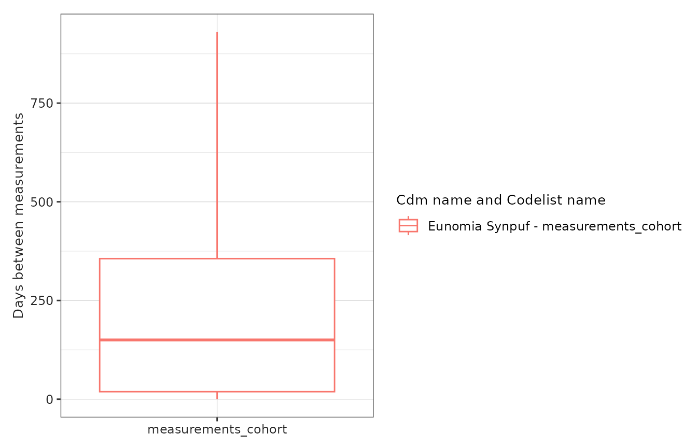

# Codelist diagnostics

## Introduction

In this example we’re going to summarise the characteristics of
individuals with an ankle sprain, ankle fracture, forearm fracture, a
hip fracture and different measurements using the Eunomia synthetic
data.

We’ll begin by creating our study cohorts.

``` r
library(CDMConnector)
library(CohortConstructor)
library(CodelistGenerator)
library(PhenotypeR)
library(MeasurementDiagnostics)
library(dplyr)
library(ggplot2)

con <- DBI::dbConnect(duckdb::duckdb(), 
                      CDMConnector::eunomiaDir("synpuf-1k", "5.3"))
cdm <- CDMConnector::cdmFromCon(con = con, 
                                cdmName = "Eunomia Synpuf",
                                cdmSchema   = "main",
                                writeSchema = "main", 
                                achillesSchema = "main")

cdm$injuries <- conceptCohort(cdm = cdm,
  conceptSet = list(
    "ankle_sprain" = 81151,
    "ankle_fracture" = 4059173,
    "forearm_fracture" = 4278672,
    "hip_fracture" = 4230399,
    "measurements_cohort" = c(40660437L, 2617206L, 4034850L,  2617239L, 4098179L)
  ),
  name = "injuries")
cdm$injuries |> 
  glimpse()
#> Rows: ??
#> Columns: 4
#> Database: DuckDB 1.4.2 [unknown@Linux 6.11.0-1018-azure:R 4.5.2//tmp/RtmpvPSWrx/file1fdf7153f97f.duckdb]
#> $ cohort_definition_id <int> 5, 5, 5, 5, 5, 5, 5, 5, 5, 5, 5, 5, 5, 5, 5, 5, 5…
#> $ subject_id           <int> 197, 955, 29, 361, 426, 428, 559, 678, 412, 853, …
#> $ cohort_start_date    <date> 2008-02-22, 2010-02-05, 2008-04-22, 2009-08-11, …
#> $ cohort_end_date      <date> 2008-02-22, 2010-02-05, 2008-04-22, 2009-08-11, …
```

## Summarising code use

To get a good understanding of the codes we’ve used to define our
cohorts we can use the
[`codelistDiagnostics()`](https://ohdsi.github.io/PhenotypeR/reference/codelistDiagnostics.md)
function.

``` r
code_diag <- codelistDiagnostics(cdm$injuries)
```

Codelist diagnostics builds on
[CodelistGenerator](https://darwin-eu.github.io/CodelistGenerator/) and
[MeasurementDiagnostics](https://ohdsi.github.io/MeasurementDiagnostics/)
R packages to perform the following analyses:

- **Achilles code use:** Which summarises the counts of our codes in our
  database based on achilles results using
  [summariseAchillesCodeUse()](https://darwin-eu.github.io/CodelistGenerator/reference/summariseAchillesCodeUse.html).
- **Orphan code use:** Orphan codes refer to codes that we did not
  include in our cohort definition, but that have any relationship with
  the codes in our codelist. So, although many can be false positives,
  we may identify some codes that we may want to use in our cohort
  definitions. This analysis uses
  [summariseOrphanCodes()](https://darwin-eu.github.io/CodelistGenerator/reference/summariseOrphanCodes.html).
- **Cohort code use:** Summarises the cohort code use in our cohort
  using
  [summariseCohortCodeUse()](https://darwin-eu.github.io/CodelistGenerator/reference/summariseCohortCodeUse.html).
- **Measurement diagnostics:** If any of the concepts used in our
  codelist is a measurement, it summarises its code use using
  [summariseCohortMeasurementUse()](https://ohdsi.github.io/MeasurementDiagnostics/reference/summariseCohortMeasurementUse.html).

The output of a function is a summarised result table.

### Add codelist attribute

Some cohorts that may be created manually may not have the codelists
recorded in the `cohort_codelist` attribute. The package has a utility
function to record a codelist in a `cohort_table` object:

``` r
cohortCodelist(cdm$injuries, cohortId = 1)
#> 
#> - ankle_fracture (1 codes)
cdm$injuries <- cdm$injuries |>
  addCodelistAttribute(codelist = list(new_codelist = c(1L, 2L)), cohortName = "ankle_fracture")
cohortCodelist(cdm$injuries, cohortId = 1)
#> 
#> - new_codelist (2 codes)
```

## Visualise the results

We will now use different functions to visualise the results generated
by CohortDiagnostics. Notice that these functions are from
[CodelistGenerator](https://darwin-eu.github.io/CodelistGenerator/) and
[MeasurementDiagnostics](https://ohdsi.github.io/MeasurementDiagnostics/)
R packages packages.

### Achilles code use

``` r
tableAchillesCodeUse(code_diag)
```

[TABLE]

### Orphan code use

``` r
tableOrphanCodes(code_diag)
```

[TABLE]

### Cohort code use

``` r
tableCohortCodeUse(code_diag)
```

[TABLE]

### Measurement timings

``` r
tableMeasurementTimings(code_diag)
```

| CDM name            | Cohort name         | Variable name            | Estimate name        | Estimate value       |
|---------------------|---------------------|--------------------------|----------------------|----------------------|
| measurements_cohort |                     |                          |                      |                      |
| Eunomia Synpuf      | measurements_cohort | Number records           | N                    | 364                  |
|                     |                     | Number subjects          | N                    | 255                  |
|                     |                     | Time (days)              | Median \[Q25 - Q75\] | 150 \[19 - 356\]     |
|                     |                     |                          | Range                | 0 to 930             |
|                     |                     | Measurements per subject | Median \[Q25 - Q75\] | 2.00 \[1.00 - 2.00\] |
|                     |                     |                          | Range                | 1.00 to 10.00        |

``` r
plotMeasurementTimings(code_diag)
```



### Measurement value as concept

``` r
tableMeasurementValueAsConcept(code_diag)
```

| CDM name            | Cohort name         | Concept name                                                                                                                                                                                                                  | Concept ID | Domain ID   | Variable name         | Value as concept name | Value as concept ID | Estimate name | Estimate value |
|---------------------|---------------------|-------------------------------------------------------------------------------------------------------------------------------------------------------------------------------------------------------------------------------|------------|-------------|-----------------------|-----------------------|---------------------|---------------|----------------|
| measurements_cohort |                     |                                                                                                                                                                                                                               |            |             |                       |                       |                     |               |                |
| Eunomia Synpuf      | measurements_cohort | overall                                                                                                                                                                                                                       | overall    | overall     | Value as concept name | No matching concept   | 0                   | N (%)         | 364 (100.00%)  |
|                     |                     | Screening cytopathology, cervical or vaginal (any reporting system), collected in preservative fluid, automated thin layer preparation, with screening by automated system and manual rescreening under physician supervision | 2617239    | Measurement | Value as concept name | No matching concept   | 0                   | N (%)         | 52 (100.00%)   |
|                     |                     | Laboratory test                                                                                                                                                                                                               | 4034850    | Measurement | Value as concept name | No matching concept   | 0                   | N (%)         | 101 (100.00%)  |
|                     |                     | Prostate cancer screening; prostate specific antigen test (psa)                                                                                                                                                               | 2617206    | Measurement | Value as concept name | No matching concept   | 0                   | N (%)         | 146 (100.00%)  |
|                     |                     | Immunology laboratory test                                                                                                                                                                                                    | 4098179    | Measurement | Value as concept name | No matching concept   | 0                   | N (%)         | 20 (100.00%)   |
|                     |                     | Drug screen, qualitative; multiple drug classes by high complexity test method (e.g., immunoassay, enzyme assay), per patient encounter                                                                                       | 40660437   | Measurement | Value as concept name | No matching concept   | 0                   | N (%)         | 45 (100.00%)   |

``` r
plotMeasurementValueAsConcept(code_diag)
```


### Measurement value as numeric

``` r
tableMeasurementValueAsNumeric(code_diag)
```

| CDM name            | Cohort name         | Concept name                                                                                                                                                                                                                  | Concept ID | Domain ID   | Unit concept name   | Unit concept ID | Estimate name        | Estimate value |
|---------------------|---------------------|-------------------------------------------------------------------------------------------------------------------------------------------------------------------------------------------------------------------------------|------------|-------------|---------------------|-----------------|----------------------|----------------|
| measurements_cohort |                     |                                                                                                                                                                                                                               |            |             |                     |                 |                      |                |
| Eunomia Synpuf      | measurements_cohort | overall                                                                                                                                                                                                                       | overall    | overall     | No matching concept | 0               | N                    | 364            |
|                     |                     |                                                                                                                                                                                                                               |            |             |                     |                 | Median \[Q25 - Q75\] | –              |
|                     |                     |                                                                                                                                                                                                                               |            |             |                     |                 | Q05 - Q95            | –              |
|                     |                     |                                                                                                                                                                                                                               |            |             |                     |                 | Q01 - Q99            | –              |
|                     |                     |                                                                                                                                                                                                                               |            |             |                     |                 | Range                | –              |
|                     |                     |                                                                                                                                                                                                                               |            |             |                     |                 | Missing value, N (%) | 364 (100.00%)  |
|                     |                     | Prostate cancer screening; prostate specific antigen test (psa)                                                                                                                                                               | 2617206    | Measurement | No matching concept | 0               | N                    | 146            |
|                     |                     |                                                                                                                                                                                                                               |            |             |                     |                 | Median \[Q25 - Q75\] | –              |
|                     |                     |                                                                                                                                                                                                                               |            |             |                     |                 | Q05 - Q95            | –              |
|                     |                     |                                                                                                                                                                                                                               |            |             |                     |                 | Q01 - Q99            | –              |
|                     |                     |                                                                                                                                                                                                                               |            |             |                     |                 | Range                | –              |
|                     |                     |                                                                                                                                                                                                                               |            |             |                     |                 | Missing value, N (%) | 146 (100.00%)  |
|                     |                     | Laboratory test                                                                                                                                                                                                               | 4034850    | Measurement | No matching concept | 0               | N                    | 101            |
|                     |                     |                                                                                                                                                                                                                               |            |             |                     |                 | Median \[Q25 - Q75\] | –              |
|                     |                     |                                                                                                                                                                                                                               |            |             |                     |                 | Q05 - Q95            | –              |
|                     |                     |                                                                                                                                                                                                                               |            |             |                     |                 | Q01 - Q99            | –              |
|                     |                     |                                                                                                                                                                                                                               |            |             |                     |                 | Range                | –              |
|                     |                     |                                                                                                                                                                                                                               |            |             |                     |                 | Missing value, N (%) | 101 (100.00%)  |
|                     |                     | Screening cytopathology, cervical or vaginal (any reporting system), collected in preservative fluid, automated thin layer preparation, with screening by automated system and manual rescreening under physician supervision | 2617239    | Measurement | No matching concept | 0               | N                    | 52             |
|                     |                     |                                                                                                                                                                                                                               |            |             |                     |                 | Median \[Q25 - Q75\] | –              |
|                     |                     |                                                                                                                                                                                                                               |            |             |                     |                 | Q05 - Q95            | –              |
|                     |                     |                                                                                                                                                                                                                               |            |             |                     |                 | Q01 - Q99            | –              |
|                     |                     |                                                                                                                                                                                                                               |            |             |                     |                 | Range                | –              |
|                     |                     |                                                                                                                                                                                                                               |            |             |                     |                 | Missing value, N (%) | 52 (100.00%)   |
|                     |                     | Drug screen, qualitative; multiple drug classes by high complexity test method (e.g., immunoassay, enzyme assay), per patient encounter                                                                                       | 40660437   | Measurement | No matching concept | 0               | N                    | 45             |
|                     |                     |                                                                                                                                                                                                                               |            |             |                     |                 | Median \[Q25 - Q75\] | –              |
|                     |                     |                                                                                                                                                                                                                               |            |             |                     |                 | Q05 - Q95            | –              |
|                     |                     |                                                                                                                                                                                                                               |            |             |                     |                 | Q01 - Q99            | –              |
|                     |                     |                                                                                                                                                                                                                               |            |             |                     |                 | Range                | –              |
|                     |                     |                                                                                                                                                                                                                               |            |             |                     |                 | Missing value, N (%) | 45 (100.00%)   |
|                     |                     | Immunology laboratory test                                                                                                                                                                                                    | 4098179    | Measurement | No matching concept | 0               | N                    | 20             |
|                     |                     |                                                                                                                                                                                                                               |            |             |                     |                 | Median \[Q25 - Q75\] | –              |
|                     |                     |                                                                                                                                                                                                                               |            |             |                     |                 | Q05 - Q95            | –              |
|                     |                     |                                                                                                                                                                                                                               |            |             |                     |                 | Q01 - Q99            | –              |
|                     |                     |                                                                                                                                                                                                                               |            |             |                     |                 | Range                | –              |
|                     |                     |                                                                                                                                                                                                                               |            |             |                     |                 | Missing value, N (%) | 20 (100.00%)   |

``` r
plotMeasurementValueAsNumeric(code_diag)
```


