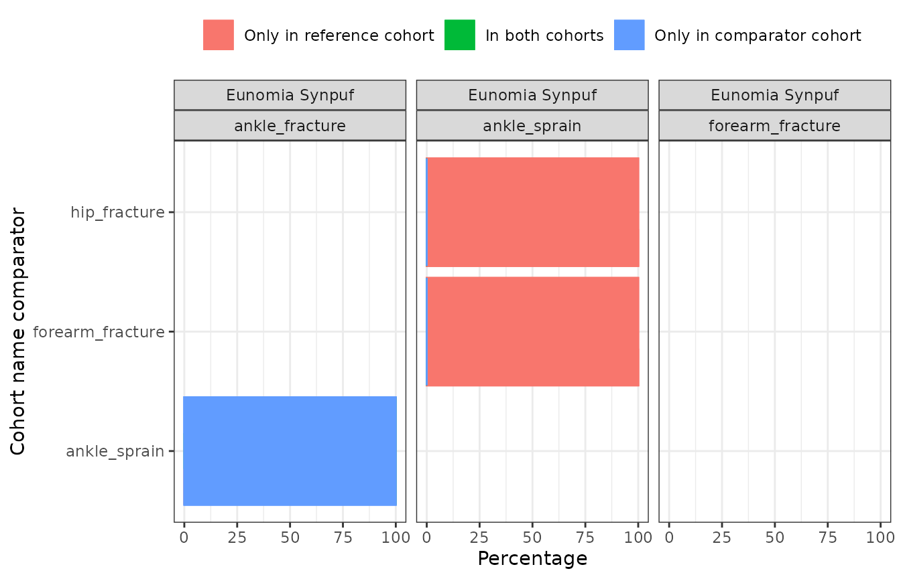
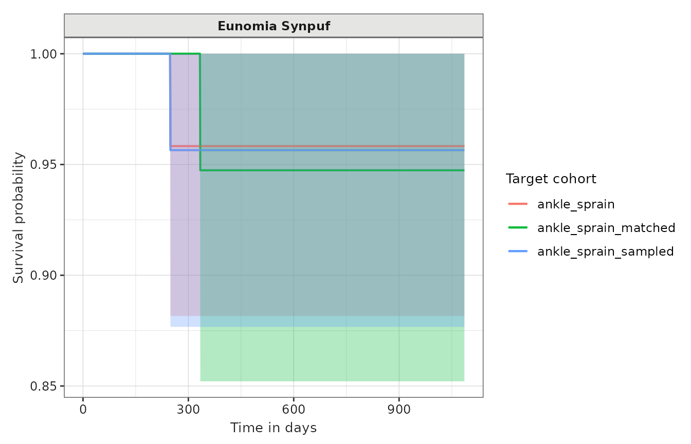

# Cohort diagnostics

## Introduction

In this example we’re going to summarise cohort diagnostics results for
cohorts of individuals with an ankle sprain, ankle fracture, forearm
fracture, or a hip fracture using the Eunomia synthetic data.

Again, we’ll begin by creating our study cohorts.

``` r
library(CDMConnector)
library(CohortConstructor)
library(CodelistGenerator)
library(CohortCharacteristics)
library(CohortSurvival)
library(PhenotypeR)
library(dplyr)
library(ggplot2)

con <- DBI::dbConnect(duckdb::duckdb(), 
                      CDMConnector::eunomiaDir("synpuf-1k", "5.3"))
cdm <- CDMConnector::cdmFromCon(con = con, 
                                cdmName = "Eunomia Synpuf",
                                cdmSchema   = "main",
                                writeSchema = "main", 
                                achillesSchema = "main")

cdm$injuries <- conceptCohort(cdm = cdm,
  conceptSet = list(
    "ankle_sprain" = 81151,
    "ankle_fracture" = 4059173,
    "forearm_fracture" = 4278672,
    "hip_fracture" = 4230399
  ),
  name = "injuries")
```

## Cohort diagnostics

We can run cohort diagnostics analyses for each of our overall cohorts
like so:

``` r
cohort_diag <- cohortDiagnostics(cdm$injuries, 
                                 cohortSample = NULL,
                                 matchedSample = NULL,
                                 survival = TRUE)
```

Cohort diagnostics builds on
[CohortCharacteristics](https://darwin-eu.github.io/CohortCharacteristics/)
and [CohortSurvival](https://darwin-eu-dev.github.io/CohortSurvival/) R
packages to perform the following analyses on our cohorts:

- **Cohort count:** Summarises the number of records and persons in each
  one of the cohorts using
  [summariseCohortCount()](https://darwin-eu.github.io/CohortCharacteristics/reference/summariseCohortCount.html).
- **Cohort attrition:** Summarises the attrition associated with the
  cohorts using
  [summariseCohortAttrition()](https://darwin-eu.github.io/CohortCharacteristics/reference/summariseCohortAttrition.html).
- **Cohort characteristics:** Summarises cohort baseline characteristics
  using
  [summariseCharacteristics()](https://darwin-eu.github.io/CohortCharacteristics/reference/summariseCharacteristics.html).
  Results are stratified by sex and by age group (0 to 17, 18 to 64, 65
  to 150). Age groups cannot be modified.
- **Cohort large scale characteristics:** Summarises cohort large scale
  characteristics using
  [summariseLargeScaleCharacteristics()](https://darwin-eu.github.io/CohortCharacteristics/reference/summariseLargeScaleCharacteristics.html).
  Results are stratified by sex and by age group (0 to 17, 18 to 64, 65
  to 150). Time windows (relative to cohort entry) included are: -Inf to
  -1, -Inf to -366, -365 to -31, -30 to -1, 0, 1 to 30, 31 to 365, 366
  to Inf, and 1 to Inf. The analysis is perform at standard and source
  code level.
- **Cohort overlap:** If there is more than one cohort in the cohort
  table supplied, summarises the overlap between them using
  [summariseCohortOverlap()](https://darwin-eu.github.io/CohortCharacteristics/reference/summariseCohortOverlap.html).
- **Cohort timing:** If there is more than one cohort in the cohort
  table supplied, summarises the timing between them using
  [summariseCohortTiming()](https://darwin-eu.github.io/CohortCharacteristics/reference/summariseCohortTiming.html).
- **Cohort survival:** If `survival = TRUE`, summarises the survival
  until the event of death (if death table is present in the cdm)
  using  
  [estimateSingleEventSurvival()](https://darwin-eu-dev.github.io/CohortSurvival/reference/estimateSingleEventSurvival.html).

The analyses **cohort characteristics**, **cohort age distribution**,
**cohort large scale characteristics**, and **cohort survival** will
also be performed (by default) in a matched cohort. The matched cohort
will be created based on year of birth and sex (see
[matchCohorts()](https://ohdsi.github.io/CohortConstructor/reference/matchCohorts.html)
function in CohortConstructor package). This can help us to compare the
results in our cohorts to those obtain in the matched cohort,
representing the general population. Notice that the analysis will be
performed in: (1) the original cohort, (2) individuals in the original
cohorts that have a match (named the sampled cohort), and (3) the
matched cohort.

As the matched process can be computationally expensive, specially when
the cohorts are very big, we can reduce the matching analysis to a
subset of participants from the original cohort using the
`matchedSample` parameter. Alternatively, if we do not want to create
the matched cohorts, we can use `matchedSample = 0`.

The output of
[`cohortDiagnostics()`](https://ohdsi.github.io/PhenotypeR/reference/cohortDiagnostics.md)
will be a summarised result table.

## Visualise cohort diagnostics results

We will now use different functions to visualise the results generated
by CohortDiagnostics. Notice that these functions are from
[CohortCharacteristics](https://darwin-eu.github.io/CohortCharacteristics/)
and [CohortSurvival](https://darwin-eu-dev.github.io/CohortSurvival/) R
packages packages. \### Cohort counts

``` r
tableCohortCount(cohort_diag)
```

[TABLE]

### Cohort attrition

``` r
tableCohortAttrition(cohort_diag)
```

[TABLE]

``` r
plotCohortAttrition(cohort_diag)
```

### Cohort characteristics

``` r
tableCharacteristics(cohort_diag)
```

[TABLE]

### Cohort large scale characteristics

``` r
tableLargeScaleCharacteristics(cohort_diag)
```

### Cohort overlap

``` r
tableCohortOverlap(cohort_diag)
```

[TABLE]

``` r
plotCohortOverlap(cohort_diag)
```

 \###
Cohort timing

``` r
tableCohortTiming(cohort_diag)
```

|                   |
|-------------------|
| Table has no data |

``` r
plotCohortTiming(cohort_diag)
```

 \###
Cohort survival

``` r
tableSurvival(cohort_diag, header = "estimate_name")
```

[TABLE]

``` r
plotSurvival(cohort_diag, colour = "target_cohort", facet = "cdm_name")
```


