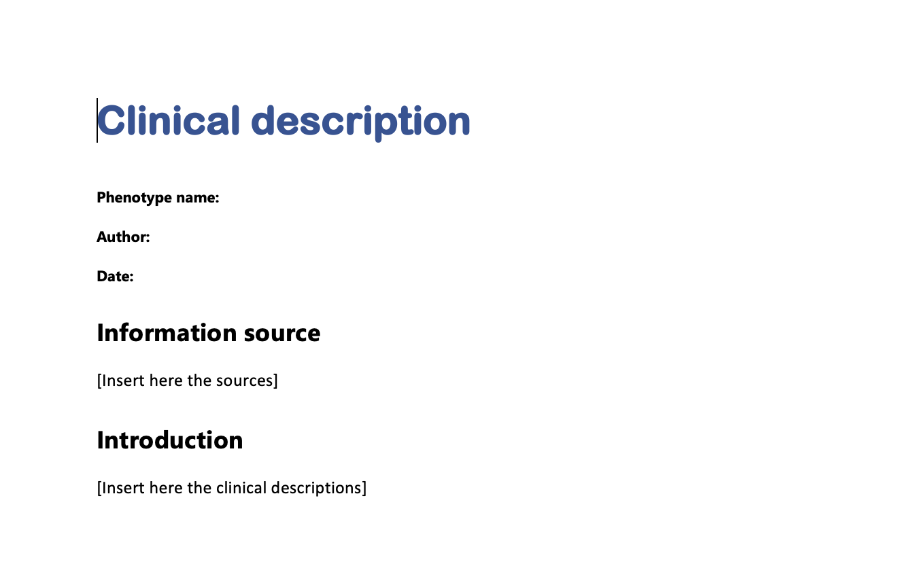

# CreateDescriptions

## Introduction: Create descriptions

There are two main elements in PhenotypeR that may need additional
context when we share the shiny app results: (1) the databases and (2)
the cohorts.

PhenotypeR provides two different functions to download templates that
can be filled manually with the most impotant details for each element.
The main purpose of these templates are to be uploaded in the PhenotypeR
Shiny App. In this vignette, we are going to show how to download these
templates and things to bear in mind.

### Database Descriptions

We can use the function
[`downloadDatabaseDescriptionTemplate()`](https://ohdsi.github.io/PhenotypeR/reference/downloadDatabaseDescriptionTemplate.md)
to download the template to be used for a database description:

``` r

library(PhenotypeR)
library(here)
downloadDatabaseDescriptionTemplate(directory = here(),
                                     name = "GiBleed")
```

The function will download a docx file in the specified directory and
with the name specified. **Important**, the name of the file has have
the same name as your database. You can check the name of your database
using the command
[`cdmName()`](https://darwin-eu.github.io/omopgenerics/reference/cdmName.html)
from [omopgenerics](https://darwin-eu.github.io/omopgenerics/index.html)
R Package.

The template has the following structure:

 It’s
important that you **do not remove** any text outside the brackets.
While italics, underline, and bold formatting are supported, lists
(including itemized formats) are not supported by ShinyDiagnostics, so
they should be avoided.

### Clinical Descriptions

We can use the function
[`downloadClinicalDescriptionTemplate()`](https://ohdsi.github.io/PhenotypeR/reference/downloadClinicalDescriptionTemplate.md)
to download the template to be used for a clinical description:

``` r

library(PhenotypeR)
library(here)
downloadClinicalDescriptionTemplate(directory = here(),
                                    name = "acetaminophen")
```

Similarly as when downloading a database description, the function will
download a docx file in the specified directory and with the name
specified. **Important**, the name of the file has have the same name as
your cohort. You can check the name of your cohorts using the command
`getCohortName()` on your cohort from
[omopgenerics](https://darwin-eu.github.io/omopgenerics/index.html) R
Package.

The template has the following structure:

 As
before, it’s crucial that you **do not remove** any text outside the
brackets. While italics, underline, and bold formatting are supported,
lists (including itemized formats) are not supported by
ShinyDiagnostics, so they should be avoided.

#### Generate clinical descriptions using LLMs

Instead of filling the template manually, PhenotypeR allows you to
create a **first draft** for a clinical description using LLMs.

Notice that you’ll need to first create a chat with LLM model using
ellmer R Package (see here the documentation:
<https://aistudio.google.com/app/apikey>) and then add the API in your R
environment:

``` r

usethis::edit_r_environ()

# Add your API in your R environment:
GEMINI_API_KEY = "your API"

# Restrart R
```

``` r

library(ellmer)
chat <- ellmer::chat("mistral")
getClinicalDescription(chat, 
                       name = "acetaminophen_users", 
                       outputDir = here())
```

**Important**: It is important to note the importance of a descriptive
cohort name. These are the names passed to the LLM and so the more
informative the name, the better we can expect the LLM to do when
generating our descriptions In general to make them amenable to the LLM
workflow when naming cohorts we should:

- avoid abbreviations as they could be misinterpreted
- indicate type of cohort
  (e.g. “incident_diagnosis_of_knee_osteoarthritis”,
  “routine_measurement_of_creatine”, “new_user_of_paracetamol”)
- include key eligibility criteria
  (e.g. “new_user_of_paracetamol_under_age_21”)

It should also go without saying that we should not treat the output of
the LLM as the unequivocal truth. While LLM descriptions may well prove
a useful starting point, clinical judgement and knowledge of the data
source at hand will still be vital in appropriately interpreting our
results. Our typical workflow may well be using LLMs to help generate
clinical descriptions for review by a clinical expert which should save
them time while ensuring we have an appropriate set to compare our
results against.
